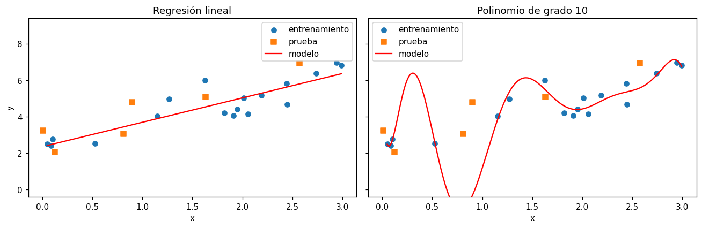

# Comparar métricas entre conjuntos

Una métrica calculada en un solo conjunto dice poco. Comparar el [R²](r2.md), el [MAE](mae.md)
y el [RMSE](rmse.md) en el [conjunto de entrenamiento](../glosario.md#conjunto-entrenamiento),
el de [validación](../glosario.md#conjunto-validacion) y el de
[prueba](../glosario.md#conjunto-prueba) muestra si el modelo generaliza a datos que no vio
(vea [división de datos](division-datos.md)).

## Función auxiliar

```python
import numpy as np
from sklearn.metrics import r2_score, mean_absolute_error, mean_squared_error

def metricas(y_real, y_predicho):
    return {
        "R2": r2_score(y_real, y_predicho),
        "MAE": mean_absolute_error(y_real, y_predicho),
        "RMSE": np.sqrt(mean_squared_error(y_real, y_predicho)),
    }
```

`metricas` recibe los valores reales (`y_real`) y las predicciones (`y_predicho`) de un conjunto
y devuelve un diccionario con las tres métricas.

## Tabla comparativa

```python
import pandas as pd

tabla = pd.DataFrame({
    "entrenamiento": metricas(y_train, modelo.predict(X_train)),
    "validación": metricas(y_val, modelo.predict(X_val)),
    "prueba": metricas(y_test, modelo.predict(X_test)),
})
print(tabla.round(3))
```

`modelo` es el modelo ya entrenado con `fit` sobre `X_train` y `y_train`; `X_val`, `y_val`,
`X_test` y `y_test` son los conjuntos de validación y de prueba. La tabla pone una columna por
conjunto para compararlos lado a lado. Si no usa conjunto de validación, elimine esa columna.

## Cómo interpretarla

| Situación | Interpretación |
|-----------|----------------|
| R² alto y errores pequeños en todos los conjuntos | El modelo predice bien y generaliza |
| R² cercano a 0 | El modelo apenas mejora a predecir siempre la media |
| Entrenamiento mucho mejor que validación y prueba | [Sobreajuste](../glosario.md#sobreajuste): el modelo memorizó los datos de entrenamiento |
| Todos los conjuntos con métricas malas y parecidas | [Subajuste](../glosario.md#subajuste): el modelo es demasiado simple o le faltan variables relevantes |

Es normal que el entrenamiento salga un poco mejor que los demás conjuntos; lo que indica
sobreajuste es una diferencia **grande**.

## Compromiso sesgo-varianza

Estas situaciones son los dos extremos del
[compromiso sesgo-varianza](../glosario.md#compromiso-sesgo-varianza):

- Un modelo **demasiado simple** tiene sesgo alto: no captura la forma real de los datos y se
  equivoca de manera parecida en todos los conjuntos (subajuste).
- Un modelo **demasiado flexible** tiene varianza alta: se adapta incluso al ruido del
  entrenamiento, cambia mucho según los datos con que se entrene y falla en registros nuevos
  (sobreajuste).

El mejor modelo está en un punto intermedio. Para encontrarlo, compare modelos o
[hiperparámetros](../glosario.md#hiperparametro) (por ejemplo, el grado de una
[regresión polinomial](regresion-polinomial.md)) con las métricas de **validación**, y use el
conjunto de prueba una sola vez, al final.

!!! warning "No elija el modelo con el conjunto de prueba"
    Si compara muchos modelos con el conjunto de prueba y se queda con el mejor, la métrica de
    prueba deja de ser una estimación honesta del desempeño en datos nuevos.

## Ejemplo

Con solo 30 registros generados con una relación lineal y ruido, se entrenan una regresión
lineal y un polinomio de grado 10:

```python
import numpy as np
import pandas as pd
import matplotlib.pyplot as plt
from sklearn.model_selection import train_test_split
from sklearn.linear_model import LinearRegression
from sklearn.preprocessing import PolynomialFeatures
from sklearn.pipeline import make_pipeline
from sklearn.metrics import r2_score, mean_absolute_error, mean_squared_error

rng = np.random.default_rng(0)
n = 30
x = rng.uniform(0, 3, n)
y = 2 + 1.5 * x + rng.normal(0, 0.8, n)
X = x.reshape(-1, 1)

# 60 % entrenamiento, 20 % validación, 20 % prueba
X_train, X_temp, y_train, y_temp = train_test_split(X, y, test_size=0.4, random_state=44)
X_val, X_test, y_val, y_test = train_test_split(X_temp, y_temp, test_size=0.5, random_state=44)

def metricas(y_real, y_predicho):
    return {
        "R2": r2_score(y_real, y_predicho),
        "MAE": mean_absolute_error(y_real, y_predicho),
        "RMSE": np.sqrt(mean_squared_error(y_real, y_predicho)),
    }

def comparar(modelo):
    return pd.DataFrame({
        "entrenamiento": metricas(y_train, modelo.predict(X_train)),
        "validación": metricas(y_val, modelo.predict(X_val)),
        "prueba": metricas(y_test, modelo.predict(X_test)),
    })

modelo_lineal = LinearRegression().fit(X_train, y_train)
modelo_polinomial = make_pipeline(PolynomialFeatures(degree=10), LinearRegression())
modelo_polinomial.fit(X_train, y_train)

print("Regresión lineal")
print(comparar(modelo_lineal).round(3))
print()
print("Polinomio de grado 10")
print(comparar(modelo_polinomial).round(3))

malla = np.linspace(X_train.min(), X_train.max(), 300).reshape(-1, 1)
fig, axes = plt.subplots(1, 2, figsize=(12, 4), sharey=True)
for ax, modelo, titulo in [(axes[0], modelo_lineal, "Regresión lineal"),
                           (axes[1], modelo_polinomial, "Polinomio de grado 10")]:
    ax.scatter(X_train, y_train, label="entrenamiento")
    ax.scatter(X_test, y_test, marker="s", label="prueba")
    ax.plot(malla, modelo.predict(malla), color="red", label="modelo")
    ax.set_title(titulo)
    ax.set_xlabel("x")
    ax.set_ylim(y.min() - 2, y.max() + 2)
    ax.legend()
axes[0].set_ylabel("y")
plt.tight_layout()
plt.show()
```

Salida:

```text
Regresión lineal
      entrenamiento  validación  prueba
R2            0.789       0.735   0.728
MAE           0.516       0.929   0.770
RMSE          0.646       1.020   0.838

Polinomio de grado 10
      entrenamiento  validación  prueba
R2            0.942       0.008  -2.052
MAE           0.266       1.491   2.150
RMSE          0.338       1.972   2.805
```



`X_temp` y `y_temp` son el 40 % de los datos que se separa primero y luego se divide en partes
iguales entre validación y prueba. `comparar` arma la tabla de un modelo cualquiera, y `malla`
es una secuencia de valores de `x` para dibujar la curva de cada modelo.

La regresión lineal tiene métricas parecidas en los tres conjuntos: generaliza. El polinomio de
grado 10 obtiene un R² de 0,94 en entrenamiento, mejor que la recta, pero cae a 0,01 en
validación y a −2,05 en prueba, peor que predecir siempre la media. La figura muestra por qué:
la curva pasa cerca de los puntos de entrenamiento, pero oscila con fuerza entre ellos y se
aleja de los puntos de prueba. Es un caso claro de sobreajuste.
