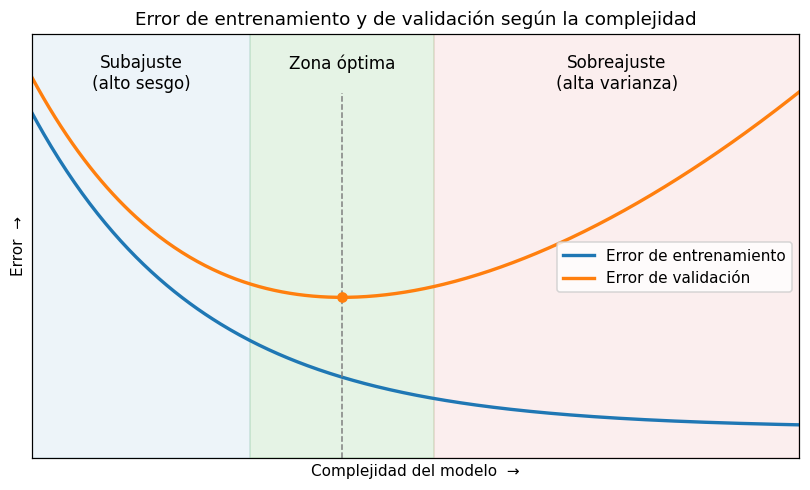

# Compromiso sesgo-varianza

El [compromiso sesgo-varianza](../glosario.md#compromiso-sesgo-varianza) describe dos fuentes de
error que tiran en direcciones opuestas cuando se elige la complejidad de un modelo. Un modelo
demasiado simple se equivoca de forma sistemática; uno demasiado complejo se ajusta tanto a los
datos de entrenamiento que falla con datos nuevos. Elegir un buen modelo consiste en encontrar el
punto intermedio.

## Sesgo y varianza de un modelo

- **Sesgo**: error que se debe a que el modelo es demasiado simple para capturar la relación real
  entre las variables. Por ejemplo, una recta no puede seguir una relación curva, por muchos datos
  que reciba. Un modelo con alto sesgo cae en [subajuste](../glosario.md#subajuste).
- **Varianza**: cuánto cambian las predicciones del modelo si se entrena con otra muestra de datos
  del mismo problema. Un modelo con alta varianza se adapta a las particularidades y al ruido del
  [conjunto de entrenamiento](../glosario.md#conjunto-entrenamiento), y cae en
  [sobreajuste](../glosario.md#sobreajuste).

!!! note "Dos significados de «sesgo»"
    El sesgo de un modelo no es lo mismo que el [sesgo](../glosario.md#sesgo) de una
    distribución. El primero es un error sistemático de las predicciones; el segundo es la
    asimetría de una variable. Por el contexto suele ser claro de cuál se habla.

## La descomposición del error

El error esperado de un modelo sobre datos nuevos (medido como error cuadrático) se puede
descomponer en tres partes:

\[
\text{Error esperado} = \text{Sesgo}^2 + \text{Varianza} + \text{Ruido irreducible}
\]

- El **sesgo al cuadrado** mide cuánto se aleja, en promedio, la predicción del modelo del valor
  real.
- La **varianza** mide cuánto oscilan las predicciones alrededor de ese promedio al cambiar los
  datos de entrenamiento.
- El **ruido irreducible** es la variabilidad propia de los datos que ningún modelo puede
  explicar (errores de medición, factores no registrados). Fija un piso por debajo del cual el
  error no puede bajar.

Esta fórmula es una idea conceptual: en la práctica no se calculan los tres términos por separado,
sino que se observan sus efectos en las métricas de entrenamiento y validación.

## Cómo la complejidad mueve cada término

Al aumentar la complejidad del modelo, el sesgo baja y la varianza sube. Algunos ejemplos:

| Cambio | Complejidad | Sesgo | Varianza |
|--------|-------------|-------|----------|
| Subir el grado en una [regresión polinomial](../glosario.md#regresion-polinomial) | Aumenta | Baja | Sube |
| Agregar variables o términos de interacción | Aumenta | Baja | Sube |
| Subir `alpha` en la [regularización](../glosario.md#regularizacion) (Ridge, Lasso) | Disminuye | Sube | Baja |
| Quitar variables poco útiles | Disminuye | Sube | Baja |

El grado del polinomio y `alpha` son [hiperparámetros](../glosario.md#hiperparametro): no los
aprende el modelo, sino que usted los elige, idealmente comparando el error en un
[conjunto de validación](../glosario.md#conjunto-validacion) (vea
[selección de hiperparámetros](seleccion-hiperparametros.md)).

## Cómo reconocer cada caso

El diagnóstico se hace comparando el error en entrenamiento con el error en validación (vea
[comparar métricas](comparar-metricas.md)):

| Situación | Error de entrenamiento | Error de validación | Diagnóstico |
|-----------|------------------------|---------------------|-------------|
| Alto sesgo (subajuste) | Alto | Alto y parecido al de entrenamiento | El modelo es demasiado simple |
| Alta varianza (sobreajuste) | Bajo | Mucho más alto que el de entrenamiento | El modelo memorizó el entrenamiento |
| Equilibrio | Bajo o moderado | Cercano al de entrenamiento y el más bajo posible | Complejidad adecuada |

- Que el error de validación sea un poco mayor que el de entrenamiento es normal; lo que indica
  sobreajuste es una **brecha grande** entre ambos.
- Si los dos errores son altos, agregar complejidad suele ayudar; si la brecha es grande, conviene
  simplificar.

## La curva de validación en forma de U

Si se grafica el error frente a la complejidad del modelo, aparece un patrón típico:

- El **error de entrenamiento** baja siempre al aumentar la complejidad: un modelo más flexible
  siempre puede ajustarse mejor a los datos que ya vio.
- El **error de validación** forma una U: primero baja, porque se reduce el sesgo; luego sube,
  porque domina la varianza.
- La **zona óptima** está alrededor del mínimo del error de validación. A la izquierda el modelo
  subajusta; a la derecha, sobreajusta.

Por esto el error de entrenamiento no sirve para elegir la complejidad: siempre favorece al modelo
más complejo. Para que el mínimo de la curva sea confiable, conviene estimar el error de
validación con [validación cruzada](validacion-cruzada.md).

## Remedios para cada lado

**Si hay alto sesgo (subajuste):**

- Aumentar la complejidad del modelo, por ejemplo subir el grado del polinomio (vea
  [regresión polinomial](regresion-polinomial.md)).
- Agregar variables informativas o términos de interacción.
- Reducir la regularización (bajar `alpha`).
- Cambiar a un tipo de modelo más flexible.

**Si hay alta varianza (sobreajuste):**

- Reducir la complejidad del modelo, por ejemplo bajar el grado del polinomio.
- Aumentar la regularización (subir `alpha`).
- Quitar variables que no aportan información.
- Conseguir más datos de entrenamiento: con más datos, el modelo tiene más difícil memorizar el
  ruido.

!!! tip "Más datos no corrigen el subajuste"
    Conseguir más datos reduce la varianza, pero no el sesgo. Si el modelo es demasiado simple,
    seguirá equivocándose de forma sistemática aunque reciba muchos más registros.
