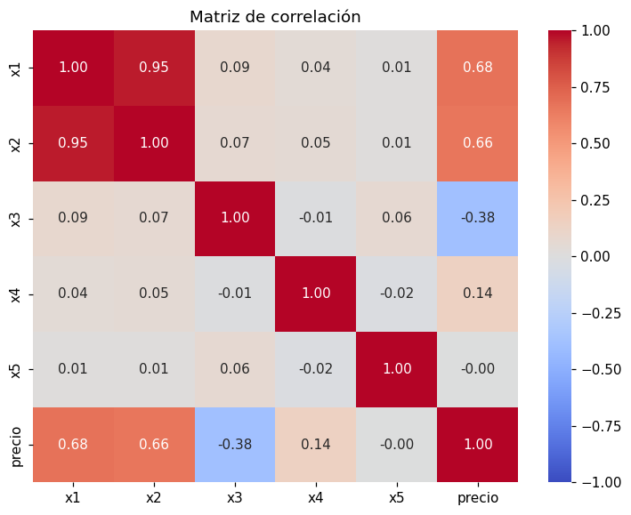

# Matriz de correlación

La [correlación](../glosario.md#correlacion) de Pearson \( r \) mide qué tan cerca están dos
variables de una relación lineal. Va de \( -1 \) a \( 1 \): cerca de \( 1 \) es una relación
lineal positiva fuerte, cerca de \( -1 \) una negativa fuerte y cerca de \( 0 \) indica que no
hay relación lineal (aunque puede haber una relación curva, revísela en el
[gráfico de dispersión](grafico-dispersion.md)).

## Calcular y graficar la matriz

```python
import matplotlib.pyplot as plt
import seaborn as sns

corr = df.corr(numeric_only=True)

plt.figure(figsize=(8, 6))
sns.heatmap(corr, annot=True, fmt=".2f", cmap="coolwarm", vmin=-1, vmax=1)
plt.title("Matriz de correlación")
plt.show()
```

- `numeric_only=True` ignora las columnas de texto.
- `annot=True` escribe el valor de \( r \) en cada celda y `fmt=".2f"` lo redondea a dos decimales.
- `vmin=-1, vmax=1` fija la escala de colores: rojo para correlaciones positivas, azul para
  negativas y blanco cerca de cero.

## Correlación de cada variable con el objetivo

```python
corr_objetivo = corr["columna_objetivo"].drop("columna_objetivo")
corr_objetivo = corr_objetivo.reindex(corr_objetivo.abs().sort_values(ascending=False).index)
print(corr_objetivo)
```

`columna_objetivo` es el nombre de la variable que quiere predecir. La lista queda ordenada por
el valor absoluto de \( r \): primero las variables con relación más fuerte, sea positiva o
negativa.

## Seleccionar variables

```python
umbral = 0.3
seleccionadas = corr_objetivo[corr_objetivo.abs() >= umbral].index.tolist()
print(seleccionadas)
```

`umbral` es el valor mínimo de \( |r| \) con el objetivo para conservar una variable. Use un
valor según el problema; 0,3 es un punto de partida común.

## Detectar multicolinealidad

Hay [multicolinealidad](../glosario.md#multicolinealidad) cuando dos variables independientes
están muy correlacionadas entre sí: aportan casi la misma información y los coeficientes de la
regresión se vuelven inestables.

```python
import numpy as np

corr_x = df[seleccionadas].corr().abs()
superior = corr_x.where(np.triu(np.ones(corr_x.shape, dtype=bool), k=1))
pares = superior.stack()
print(pares[pares > 0.7].sort_values(ascending=False))
```

- `np.triu(..., k=1)` conserva solo la mitad superior de la matriz, para no repetir cada par
  ni comparar una variable consigo misma.
- `stack()` convierte la matriz en una lista de pares `(variable_a, variable_b)`.

De cada par con \( |r| > 0{,}7 \) conserve solo una variable: normalmente la que tiene mayor
correlación con el objetivo.

```python
eliminar = []
for (a, b), valor in pares[pares > 0.7].items():
    if a in eliminar or b in eliminar:
        continue
    eliminar.append(b if abs(corr_objetivo[a]) >= abs(corr_objetivo[b]) else a)

seleccionadas = [c for c in seleccionadas if c not in eliminar]
```

!!! warning "Correlación no es causalidad"
    Una correlación alta indica que dos variables se mueven juntas, no que una cause la otra.

## Ejemplo

Suponga un dataset sintético de 400 registros con cinco variables independientes (`x1` a `x5`)
y el objetivo `precio`. El precio depende con fuerza de `x1` (de forma positiva), de `x3` (de
forma negativa) y levemente de `x4`; `x5` no tiene relación con él. Además, `x2` es casi una
copia de `x1` con un poco de ruido.



- **Correlación con el objetivo.** En la fila de `precio`, `x1` (\( r \approx 0{,}68 \)) y `x2`
  (\( r \approx 0{,}66 \)) tienen una correlación positiva moderada a fuerte, y `x3`
  (\( r \approx -0{,}38 \)) una negativa moderada. Las tres superan el umbral de 0,3.
- **Variables cerca de 0.** `x4` (\( r \approx 0{,}14 \)) queda por debajo del umbral y `x5`
  (\( r \approx 0{,}00 \)) no muestra relación lineal con `precio`. Entre las variables
  independientes, casi todas las celdas están cerca de 0.
- **Multicolinealidad.** `x1` y `x2` tienen \( r \approx 0{,}95 \) entre sí: aportan casi la
  misma información. Basta con conservar `x1`, que tiene mayor correlación con `precio`.

Las variables finales serían `x1` y `x3`.
