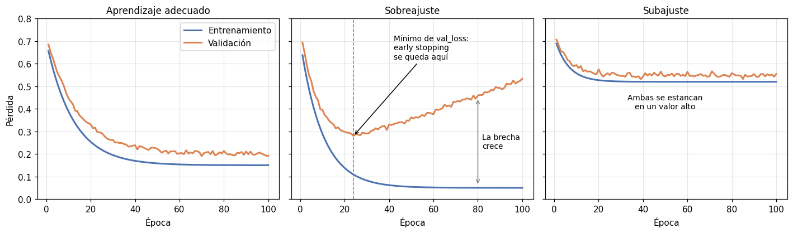

# Curva de aprendizaje

La curva de aprendizaje muestra cómo cambian la pérdida (y, si se quiere, una métrica) a lo largo
de las [épocas](../glosario.md#epoca) de entrenamiento de una
[red neuronal](red-neuronal.md), tanto en el
[conjunto de entrenamiento](../glosario.md#conjunto-entrenamiento) como en el
[conjunto de validación](../glosario.md#conjunto-validacion). Comparar ambas curvas permite ver
si la red está aprendiendo, si empezó a memorizar el entrenamiento
([sobreajuste](../glosario.md#sobreajuste)) o si no logra aprender lo suficiente
([subajuste](../glosario.md#subajuste)).



## Código básico

`model.fit` de Keras devuelve un objeto (aquí `historia`) cuyo atributo `history` guarda, para
cada época, la pérdida y las métricas en entrenamiento y en validación:

```python
import matplotlib.pyplot as plt

epocas = range(1, len(historia.history["loss"]) + 1)

fig, axes = plt.subplots(1, 2, figsize=(11, 4))

axes[0].plot(epocas, historia.history["loss"], label="Entrenamiento")
axes[0].plot(epocas, historia.history["val_loss"], label="Validación")
axes[0].set_xlabel("Época")
axes[0].set_ylabel("Pérdida (binary cross-entropy)")
axes[0].set_title("Pérdida")
axes[0].legend()

axes[1].plot(epocas, historia.history["auc"], label="Entrenamiento")
axes[1].plot(epocas, historia.history["val_auc"], label="Validación")
axes[1].set_xlabel("Época")
axes[1].set_ylabel("AUC")
axes[1].set_title("AUC")
axes[1].legend()

plt.tight_layout()
plt.show()
```

- `historia` es lo que devuelve `model.fit(..., validation_data=(X_val, y_val))` (vea
  [red neuronal densamente conectada](red-neuronal.md)). Sin `validation_data`, el historial no
  tiene las claves `"val_..."`.
- `historia.history["loss"]` y `historia.history["val_loss"]` son listas con la pérdida de cada
  época en entrenamiento y en validación.
- `"auc"` y `"val_auc"` existen porque el modelo se compiló con
  `keras.metrics.AUC(name="auc")`. Las claves disponibles se ven con
  `historia.history.keys()`; use la métrica que haya definido en `metrics` (por ejemplo,
  `"recall"` y `"val_recall"`).
- `epocas` empieza en 1 para que el eje horizontal muestre el número de época.

Para identificar la mejor época (la que conserva `EarlyStopping` con
`restore_best_weights=True`):

```python
import numpy as np

mejor_epoca = int(np.argmin(historia.history["val_loss"])) + 1
print("Mejor época:", mejor_epoca)
print("Pérdida de validación mínima:", min(historia.history["val_loss"]))
```

- `np.argmin` devuelve la posición (desde 0) de la menor pérdida de validación; se suma 1 para
  obtener el número de época.
- Con *early stopping*, el entrenamiento termina `patience` épocas después de esta mejor época.

## Cómo interpretarla

| Patrón | Qué indica | Qué hacer |
|--------|-----------|-----------|
| Ambas curvas bajan y se estabilizan cerca una de la otra | La red está aprendiendo y generaliza bien | Mantener la configuración; si siguen bajando al final, aumentar `epochs` |
| La pérdida de entrenamiento sigue bajando, pero la de validación llega a un mínimo y luego **sube** | [Sobreajuste](../glosario.md#sobreajuste): la red empieza a memorizar el entrenamiento | Usar [early stopping](../glosario.md#early-stopping) (`EarlyStopping` con `restore_best_weights=True`), aumentar `Dropout`, reducir capas o neuronas |
| Ambas curvas se estancan pronto en un valor **alto** | [Subajuste](../glosario.md#subajuste): la red no tiene capacidad suficiente o no termina de aprender | Agregar capas o neuronas, reducir `Dropout`, entrenar más épocas o revisar la tasa de aprendizaje y el preprocesamiento |
| Las curvas oscilan mucho de una época a otra | Actualizaciones demasiado grandes o ruidosas | Reducir la tasa de aprendizaje o aumentar `batch_size` |

- Lo que importa es la curva de **validación**: la de entrenamiento casi siempre baja, aunque el
  modelo esté sobreajustando.
- Una brecha pequeña y estable entre ambas curvas es normal. Con `Dropout`, la pérdida de
  entrenamiento puede incluso quedar **por encima** de la de validación, porque el *dropout* solo
  se aplica al entrenar.
- Si usó `class_weight`, la pérdida de entrenamiento está ponderada y la de validación no, así
  que sus niveles no son directamente comparables; fíjese en la **forma** de las curvas y en la
  métrica (por ejemplo, el AUC), que no depende de los pesos.
- Revise también la métrica: a veces `val_loss` empieza a subir mientras `val_auc` se mantiene
  casi igual. Elegir la época por `val_loss` es lo habitual, pero puede vigilar la métrica con
  `EarlyStopping(monitor="val_auc", mode="max", ...)` si es la que le interesa.
