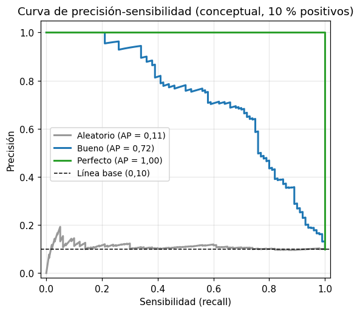

# Curva de precisión-sensibilidad

La [curva de precisión-sensibilidad](../glosario.md#curva-precision-sensibilidad) muestra cómo
cambian la [precisión](precision.md) y la [sensibilidad](sensibilidad.md) de un clasificador
binario al mover el [umbral de decisión](../glosario.md#umbral-decision). Se concentra en la
clase positiva, por eso es más informativa que la [curva ROC](curva-roc.md) cuando hay
[desbalance de clases](../glosario.md#desbalance-de-clases).

## Qué se grafica

- **Eje horizontal, sensibilidad**: proporción de positivos reales que el modelo detecta,
  \( VP / (VP + FN) \).
- **Eje vertical, precisión**: proporción de predicciones positivas que son correctas,
  \( VP / (VP + FP) \).

Cada punto de la curva es un umbral distinto. Con un umbral alto el modelo predice positivo
pocas veces: la sensibilidad es baja y la precisión suele ser alta (izquierda de la curva). Al
bajar el umbral detecta más positivos, pero también comete más falsas alarmas: la sensibilidad
sube y la precisión baja (derecha de la curva).

{ width="460" }

## La precisión promedio (AP) y la línea base

La **precisión promedio** (AP, *average precision*) resume la curva en un solo número, de forma
parecida al área bajo ella. Va de 0 a 1 y mayor es mejor.

La **línea base** es la proporción de la clase positiva en los datos. Un modelo que predice al
azar tiene una precisión igual a esa proporción para cualquier sensibilidad, de modo que su
curva es una línea horizontal a esa altura. Por eso, a diferencia del [AUC](../glosario.md#auc),
el valor de referencia de la AP **no es 0,5**: si solo el 10 % de los registros es positivo, una
AP de 0,4 ya es cuatro veces mejor que el azar.

```python
linea_base = (y_val == 1).mean()
```

## Calcularla y graficarla

Para un solo modelo y un solo conjunto:

```python
import matplotlib.pyplot as plt
from sklearn.metrics import PrecisionRecallDisplay, average_precision_score

fig, ax = plt.subplots(figsize=(6, 5))
PrecisionRecallDisplay.from_estimator(modelo, X_val, y_val, ax=ax, name="Modelo")
ax.axhline(linea_base, color="k", linestyle="--", label="Línea base")
ax.legend()
plt.show()

y_prob = modelo.predict_proba(X_val)[:, 1]
ap = average_precision_score(y_val, y_prob)
```

`modelo` es un clasificador ya entrenado que tiene `predict_proba` o `decision_function`,
`X_val` y `y_val` son las variables y la clase real del
[conjunto de validación](../glosario.md#conjunto-validacion), y `y_prob` la probabilidad
estimada de la clase positiva. La leyenda muestra la AP de cada curva. Si ya tiene las probabilidades, o si el modelo no es de scikit-learn, vea
[graficarla desde las predicciones](#desde-predicciones).

## Comparar varios modelos en entrenamiento y validación

```python
modelos = {
    "Regresión logística": modelo_1,
    "Árbol de decisión": modelo_2,
    "KNN": modelo_3,
}

fig, axes = plt.subplots(1, 2, figsize=(12, 5), sharey=True)
conjuntos = [("Entrenamiento", X_train, y_train), ("Validación", X_val, y_val)]

for ax, (titulo, X, y) in zip(axes, conjuntos):
    for nombre, modelo in modelos.items():
        PrecisionRecallDisplay.from_estimator(modelo, X, y, ax=ax, name=nombre)
    ax.axhline((y == 1).mean(), color="k", linestyle="--", label="Línea base")
    ax.set_title(titulo)
    ax.legend(loc="lower left")

plt.tight_layout()
plt.show()
```

`modelos` es un diccionario con los clasificadores ya entrenados (por ejemplo una
[regresión logística](regresion-logistica.md), un [árbol de decisión](arbol-decision.md) y un
[KNN](knn.md)) y el nombre de cada uno en la leyenda. `X_train` y `y_train` son los datos del
[conjunto de entrenamiento](../glosario.md#conjunto-entrenamiento).

## Graficarla desde las predicciones { #desde-predicciones }

`from_estimator` solo funciona con modelos de scikit-learn, porque calcula las probabilidades
internamente. `from_predictions` recibe las clases reales y las probabilidades que usted ya
calculó, así que funciona con **cualquier** modelo, por ejemplo, una
[red neuronal](red-neuronal.md) de Keras.

La curva recorre todos los [umbrales de decisión](../glosario.md#umbral-decision), así que
necesita la **probabilidad de la clase positiva**, no la clase predicha:

| Modelo | Cómo obtener las probabilidades |
|--------|---------------------------------|
| Clasificador de scikit-learn | `modelo.predict_proba(X)[:, 1]` |
| Red neuronal de Keras con salida sigmoide | `modelo.predict(X, verbose=0).ravel()` |

!!! warning "No use las clases predichas"
    Con `modelo.predict(X)` de scikit-learn se obtienen clases 0 o 1, no probabilidades. La curva
    queda reducida a un solo punto y la AP pierde sentido. Pase también siempre `ax=ax`: sin
    ese parámetro, cada llamada crea una figura nueva y las curvas no quedan en sus gráficos.

```python
modelos = {
    "Red de 1 capa": modelo_1,
    "Red de 2 capas": modelo_2,
}

fig, axes = plt.subplots(1, 2, figsize=(12, 5), sharey=True)
conjuntos = [("Entrenamiento", X_train, y_train), ("Validación", X_val, y_val)]

for ax, (titulo, X, y) in zip(axes, conjuntos):
    for nombre, modelo in modelos.items():
        y_prob = modelo.predict(X, verbose=0).ravel()
        PrecisionRecallDisplay.from_predictions(y, y_prob, ax=ax, name=nombre)
    ax.axhline((y == 1).mean(), color="k", linestyle="--", label="Línea base")
    ax.set_title(titulo)
    ax.legend(loc="lower left")

plt.tight_layout()
plt.show()
```

- `y_prob` es la probabilidad de la clase positiva de cada registro. La línea corresponde a una
  red de Keras; con un modelo de scikit-learn, cámbiela por `y_prob = modelo.predict_proba(X)[:, 1]`.
- `PrecisionRecallDisplay.from_predictions(y, y_prob, ...)` recibe primero las clases reales y luego las
  probabilidades. El resto (`ax`, `name`, la leyenda con la AP) funciona igual que con
  `from_estimator`.

## Cómo interpretarla

- **Más cerca de la esquina superior derecha es mejor**: ese punto (sensibilidad 1,
  precisión 1) es un modelo que detecta todos los positivos sin falsas alarmas.
- **Compare con la línea base**: una curva pegada a ella no aporta nada frente al azar.
- **Compare modelos con el gráfico de validación**: el modelo con la curva más alta (y mayor AP)
  logra más precisión para la misma sensibilidad.
- **Una brecha grande entre entrenamiento y validación indica
  [sobreajuste](../glosario.md#sobreajuste)** (vea [comparar métricas](comparar-metricas.md)).
- **La curva suele ser escalonada e irregular**, sobre todo con pocos positivos; no es un error.
