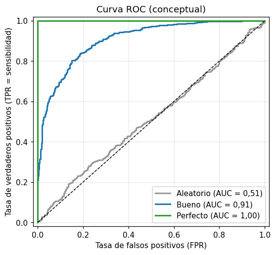

# Curva ROC

La [curva ROC](../glosario.md#curva-roc) muestra cómo cambia el desempeño de un clasificador
binario al mover el [umbral de decisión](../glosario.md#umbral-decision) desde 1 hasta 0. Para
cada umbral grafica la tasa de verdaderos positivos frente a la tasa de falsos positivos. A
diferencia de la [matriz de confusión](matriz-confusion.md), no depende de un umbral concreto:
evalúa todos a la vez.

## Qué se grafica

\[
\text{TPR} = \frac{VP}{VP + FN} \qquad\qquad \text{FPR} = \frac{FP}{FP + VN}
\]

- **Eje vertical, TPR** (tasa de verdaderos positivos): es la [sensibilidad](sensibilidad.md),
  la proporción de positivos reales que el modelo detecta.
- **Eje horizontal, FPR** (tasa de falsos positivos): la proporción de negativos reales que el
  modelo marca como positivos por error.

Con un umbral muy alto el modelo casi nunca predice positivo y la curva empieza en (0, 0); con
un umbral muy bajo predice positivo para todos y termina en (1, 1). Entre esos extremos, cada
punto es un umbral distinto.

{ width="460" }

## El AUC

El [AUC](../glosario.md#auc) es el área bajo la curva ROC. Resume la curva en un solo número:

| Valor del AUC | Interpretación |
|---------------|----------------|
| 1 | Clasificador perfecto: existe un umbral que separa todas las clases sin errores |
| Entre 0,5 y 1 | El modelo ordena mejor que el azar; cuanto más cerca de 1, mejor |
| 0,5 | Equivale a adivinar al azar (la diagonal punteada) |
| Menor que 0,5 | Peor que el azar; suele indicar clases o probabilidades invertidas |

El AUC también puede leerse como la probabilidad de que, al tomar un positivo y un negativo al
azar, el modelo le asigne mayor probabilidad al positivo.

## Calcularla y graficarla

Para un solo modelo y un solo conjunto:

```python
import matplotlib.pyplot as plt
from sklearn.metrics import RocCurveDisplay, roc_auc_score

fig, ax = plt.subplots(figsize=(6, 5))
RocCurveDisplay.from_estimator(modelo, X_val, y_val, ax=ax, name="Modelo")
ax.plot([0, 1], [0, 1], "k--", label="Azar (AUC = 0,5)")
ax.legend()
plt.show()

y_prob = modelo.predict_proba(X_val)[:, 1]
auc = roc_auc_score(y_val, y_prob)
```

`modelo` es un clasificador ya entrenado que tiene `predict_proba` o `decision_function` (por
ejemplo una [regresión logística](regresion-logistica.md), un
[árbol de decisión](arbol-decision.md) o un [KNN](knn.md)). `X_val` y `y_val` son las variables
y la clase real del [conjunto de validación](../glosario.md#conjunto-validacion), y `y_prob` la
probabilidad estimada de la clase positiva (la segunda columna de `predict_proba`). La curva y
el AUC usan probabilidades, no las clases de `predict`. La leyenda muestra el AUC de cada curva.

Si ya tiene las probabilidades, o si el modelo no es de scikit-learn, vea
[graficarla desde las predicciones](#desde-predicciones).

## Comparar varios modelos en entrenamiento y validación

Dibuje una curva por modelo en dos gráficos lado a lado, uno por conjunto:

```python
modelos = {
    "Regresión logística": modelo_1,
    "Árbol de decisión": modelo_2,
    "KNN": modelo_3,
}

fig, axes = plt.subplots(1, 2, figsize=(12, 5), sharey=True)
conjuntos = [("Entrenamiento", X_train, y_train), ("Validación", X_val, y_val)]

for ax, (titulo, X, y) in zip(axes, conjuntos):
    for nombre, modelo in modelos.items():
        RocCurveDisplay.from_estimator(modelo, X, y, ax=ax, name=nombre)
    ax.plot([0, 1], [0, 1], "k--", label="Azar")
    ax.set_title(titulo)
    ax.legend(loc="lower right")

plt.tight_layout()
plt.show()
```

`modelos` es un diccionario con los clasificadores ya entrenados y el nombre que tendrá cada uno
en la leyenda. `X_train` y `y_train` son los datos del
[conjunto de entrenamiento](../glosario.md#conjunto-entrenamiento). `sharey=True` hace que los
dos gráficos compartan el eje vertical para compararlos a simple vista.

## Graficarla desde las predicciones { #desde-predicciones }

`from_estimator` solo funciona con modelos de scikit-learn, porque calcula las probabilidades
internamente. `from_predictions` recibe las clases reales y las probabilidades que usted ya
calculó, así que funciona con **cualquier** modelo, por ejemplo, una
[red neuronal](red-neuronal.md) de Keras.

La curva recorre todos los [umbrales de decisión](../glosario.md#umbral-decision), así que
necesita la **probabilidad de la clase positiva**, no la clase predicha:

| Modelo | Cómo obtener las probabilidades |
|--------|---------------------------------|
| Clasificador de scikit-learn | `modelo.predict_proba(X)[:, 1]` |
| Red neuronal de Keras con salida sigmoide | `modelo.predict(X, verbose=0).ravel()` |

!!! warning "No use las clases predichas"
    Con `modelo.predict(X)` de scikit-learn se obtienen clases 0 o 1, no probabilidades. La curva
    queda reducida a un solo punto y el AUC pierde sentido. Pase también siempre `ax=ax`: sin
    ese parámetro, cada llamada crea una figura nueva y las curvas no quedan en sus gráficos.

```python
modelos = {
    "Red de 1 capa": modelo_1,
    "Red de 2 capas": modelo_2,
}

fig, axes = plt.subplots(1, 2, figsize=(12, 5), sharey=True)
conjuntos = [("Entrenamiento", X_train, y_train), ("Validación", X_val, y_val)]

for ax, (titulo, X, y) in zip(axes, conjuntos):
    for nombre, modelo in modelos.items():
        y_prob = modelo.predict(X, verbose=0).ravel()
        RocCurveDisplay.from_predictions(y, y_prob, ax=ax, name=nombre)
    ax.plot([0, 1], [0, 1], "k--", label="Azar")
    ax.set_title(titulo)
    ax.legend(loc="lower right")

plt.tight_layout()
plt.show()
```

- `y_prob` es la probabilidad de la clase positiva de cada registro. La línea corresponde a una
  red de Keras; con un modelo de scikit-learn, cámbiela por `y_prob = modelo.predict_proba(X)[:, 1]`.
- `RocCurveDisplay.from_predictions(y, y_prob, ...)` recibe primero las clases reales y luego las
  probabilidades. El resto (`ax`, `name`, la leyenda con el AUC) funciona igual que con
  `from_estimator`.

## Cómo interpretarla

- **Más cerca de la esquina superior izquierda es mejor**: ese punto (FPR = 0, TPR = 1) es un
  modelo que detecta todos los positivos sin ninguna falsa alarma.
- **La diagonal es el azar**: una curva pegada a ella no distingue las clases.
- **Compare modelos con el gráfico de validación**: el modelo con la curva más alta (y mayor
  AUC) ordena mejor los registros. Si dos curvas se cruzan, cada modelo es mejor en una zona de
  umbrales distinta.
- **Una brecha grande entre entrenamiento y validación indica
  [sobreajuste](../glosario.md#sobreajuste)**: un modelo con AUC cercano a 1 en entrenamiento y
  bastante menor en validación memorizó los datos de entrenamiento. Es típico de un árbol de
  decisión sin limitar su profundidad o de un KNN con muy pocos vecinos (vea
  [comparar métricas](comparar-metricas.md)).
- **El AUC no depende del umbral**: dice qué tan bien ordena el modelo, no qué tan buenas son
  sus predicciones con el umbral que finalmente use. Para eso revise la
  [matriz de confusión](matriz-confusion.md) con el umbral elegido.

!!! warning "Con desbalance de clases la curva ROC puede verse optimista"
    Con [desbalance de clases](../glosario.md#desbalance-de-clases), hay tantos negativos que
    incluso muchos falsos positivos producen una FPR pequeña, y la curva ROC se ve muy bien
    aunque la mayoría de las predicciones positivas sean errores. En ese caso use también la
    [curva de precisión-sensibilidad](curva-precision-sensibilidad.md), que sí refleja ese
    problema.
