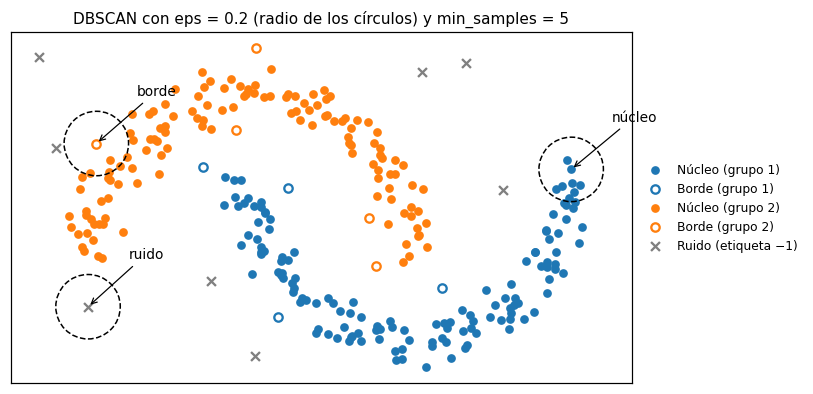

# DBSCAN

[DBSCAN](../glosario.md#dbscan) es un método de [agrupación](../glosario.md#agrupacion) basado
en densidad: un grupo es una región donde los registros están muy juntos, separada de otras
regiones por zonas con pocos registros. A diferencia de K-medias, no hay que indicar el número de
grupos: DBSCAN lo descubre a partir de los datos, y además marca como
[ruido](../glosario.md#ruido) los registros que no pertenecen a ninguna región densa.

## Cómo funciona

DBSCAN usa dos [hiperparámetros](../glosario.md#hiperparametro):

- `eps`: el radio del vecindario de cada registro. Dos registros son vecinos si la distancia
  entre ellos es como máximo `eps`.
- `min_samples`: el número mínimo de vecinos (contando el propio registro) que debe haber dentro
  de ese radio para considerar que la zona es densa.

Con ellos, cada registro queda en una de tres categorías:

| Tipo de punto | Condición | Resultado |
|---------------|-----------|-----------|
| **Núcleo** | Tiene al menos `min_samples` vecinos a una distancia de `eps` o menos | Forma parte de un grupo y lo extiende |
| **Borde** | No es núcleo, pero está a `eps` o menos de algún punto núcleo | Se une al grupo de ese núcleo |
| **Ruido** | No es núcleo ni está cerca de un núcleo | Recibe la etiqueta **−1** |

Un grupo se forma uniendo puntos núcleo que son vecinos entre sí, en cadena, y agregando los
puntos borde que los rodean. Por eso los grupos pueden tener formas arbitrarias (alargadas,
curvas, en anillo), algo que K-medias no logra porque siempre forma grupos más o menos esféricos
alrededor de un centro.



El ruido no es un grupo: es el conjunto de registros aislados, que a menudo coinciden con
[valores atípicos](../glosario.md#outlier). Revíselos aparte en lugar de tratarlos como un grupo
más.

!!! warning "Escale antes de agrupar"
    `eps` es una distancia, así que el resultado depende de la escala de las variables. Una
    variable medida en miles dominaría a otra medida en unidades.
    [Escale las variables](escalar-variables.md) (por ejemplo, con
    [estandarización](../glosario.md#estandarizacion)) antes de usar DBSCAN. En esta página,
    `X_esc` son los datos ya escalados.

## Ventajas y limitaciones

**Ventajas:**

- No necesita el número de grupos.
- Encuentra grupos de forma arbitraria.
- Separa explícitamente el ruido, en lugar de forzar cada registro dentro de un grupo.

**Limitaciones:**

- Usa un solo `eps` para todos los datos. Si hay grupos de densidades muy distintas, un `eps`
  pequeño deja como ruido al grupo disperso y uno grande fusiona los grupos densos cercanos. En
  ese caso, considere [HDBSCAN](hdbscan.md).
- En muchas dimensiones las distancias entre registros se parecen cada vez más y es difícil
  encontrar un `eps` que separe zonas densas de zonas vacías. Con muchas variables, conviene
  reducir antes la dimensión o usar solo las variables relevantes.
- El resultado es muy sensible a `eps`: un cambio pequeño puede pasar de muchos grupos diminutos
  a un único grupo gigante.

## Elegir `min_samples`

Una regla práctica es usar `min_samples` ≈ 2 × número de variables (con un mínimo de alrededor de
4). Valores más altos exigen zonas más densas para formar un grupo, producen grupos más robustos y
marcan más registros como ruido; valores más bajos producen más grupos pequeños.

## Elegir `eps` con el gráfico de distancia k

Fijado `min_samples`, el **gráfico de distancia k** ayuda a elegir `eps`:

1. Para cada registro, calcule la distancia a su vecino número `min_samples` (contando el propio
   registro como el primero).
2. Ordene esas distancias de menor a mayor y grafíquelas.
3. Busque el **codo**: el punto donde la curva, plana al principio, empieza a subir con fuerza.

Los registros a la izquierda del codo están en zonas densas (su vecino número `min_samples` está
cerca); los de la derecha están aislados. La distancia en el codo es un buen valor inicial para
`eps`. El codo rara vez es nítido, así que úselo como punto de partida y pruebe valores
alrededor de él.

## Comparar varias configuraciones

Como el resultado cambia mucho con los hiperparámetros, pruebe una cuadrícula pequeña de valores
de `eps` (alrededor del codo) y de `min_samples`, y registre para cada combinación:

- el número de grupos;
- el porcentaje de ruido;
- el porcentaje de registros (sin ruido) que cae en el grupo más grande;
- el [coeficiente de silueta](silueta.md) y el [índice de Davies-Bouldin](davies-bouldin.md).

La silueta y Davies-Bouldin se calculan **sin los puntos de ruido**: el ruido no es un grupo y,
si se incluyera con la etiqueta −1, se trataría como si lo fuera. Esas métricas solo existen
cuando quedan al menos dos grupos. La [inercia](inercia.md) no se usa con DBSCAN, porque los
grupos no tienen un centro.

!!! warning "Una buena silueta no basta"
    Al excluir el ruido, una configuración puede obtener una silueta alta simplemente porque dejó
    fuera los registros difíciles. Descarte configuraciones como estas aunque sus métricas se vean
    bien:

    - un único grupo gigante que contiene casi todos los registros, más algo de ruido;
    - un porcentaje de ruido muy alto (por ejemplo, la mitad de los datos);
    - decenas de grupos diminutos.

    Prefiera configuraciones con un número razonable de grupos, poco ruido y buenas métricas, y
    confirme que los grupos tienen sentido [interpretándolos](interpretar-grupos.md).

## Código: agrupar con DBSCAN

```python
import numpy as np
import pandas as pd
from sklearn.cluster import DBSCAN

eps = 0.3
min_samples = 6

etiquetas = DBSCAN(eps=eps, min_samples=min_samples).fit_predict(X_esc)

n_grupos = len(set(etiquetas)) - (1 if -1 in etiquetas else 0)
pct_ruido = 100 * np.mean(etiquetas == -1)
print(f"Grupos: {n_grupos}, ruido: {pct_ruido:.1f} %")
print(pd.Series(etiquetas).value_counts().sort_index())
```

- `X_esc` son las variables ya [escaladas](escalar-variables.md).
- `eps` es el radio del vecindario y `min_samples`, el número mínimo de vecinos para que un
  registro sea núcleo.
- `etiquetas` tiene un número de grupo (0, 1, 2, …) por registro; el ruido tiene la etiqueta −1.
- `n_grupos` cuenta los grupos sin contar el ruido y `pct_ruido` es el porcentaje de registros
  marcados como ruido.
- `value_counts()` muestra cuántos registros hay en cada grupo y en el ruido (fila −1).

## Código: gráfico de distancia k

```python
import numpy as np
import matplotlib.pyplot as plt
from sklearn.neighbors import NearestNeighbors

min_samples = 6

vecinos = NearestNeighbors(n_neighbors=min_samples).fit(X_esc)
distancias, _ = vecinos.kneighbors(X_esc)
k_distancias = np.sort(distancias[:, -1])

plt.plot(k_distancias)
plt.xlabel("Registros ordenados por distancia")
plt.ylabel(f"Distancia al vecino número {min_samples}")
plt.grid(alpha=0.3)
plt.show()
```

- `min_samples` debe ser el mismo valor que usará en DBSCAN.
- `kneighbors(X_esc)` devuelve, para cada registro, las distancias a sus `min_samples` vecinos más
  cercanos. Como se consulta con los mismos datos del ajuste, el primer vecino es el propio
  registro (distancia 0), igual que en el conteo de DBSCAN.
- `distancias[:, -1]` es la distancia al último de esos vecinos, es decir, al vecino número
  `min_samples`.
- `k_distancias` son esas distancias ordenadas de menor a mayor. El valor en el codo de la curva
  es un buen punto de partida para `eps`.

## Código: comparar varias configuraciones

```python
import numpy as np
import pandas as pd
from sklearn.cluster import DBSCAN
from sklearn.metrics import silhouette_score, davies_bouldin_score

valores_eps = [0.1, 0.15, 0.2, 0.3, 0.5]
valores_min_samples = [4, 6, 10]

resultados = []
for eps in valores_eps:
    for min_samples in valores_min_samples:
        etiquetas = DBSCAN(eps=eps, min_samples=min_samples).fit_predict(X_esc)
        sin_ruido = etiquetas != -1
        n_grupos = len(set(etiquetas[sin_ruido]))
        fila = {
            "eps": eps,
            "min_samples": min_samples,
            "n_grupos": n_grupos,
            "pct_ruido": 100 * np.mean(~sin_ruido),
            "pct_grupo_mayor": np.nan,
            "silueta": np.nan,
            "davies_bouldin": np.nan,
        }
        if n_grupos >= 1:
            tamanos = pd.Series(etiquetas[sin_ruido]).value_counts(normalize=True)
            fila["pct_grupo_mayor"] = 100 * tamanos.max()
        if n_grupos >= 2:
            fila["silueta"] = silhouette_score(X_esc[sin_ruido], etiquetas[sin_ruido])
            fila["davies_bouldin"] = davies_bouldin_score(X_esc[sin_ruido], etiquetas[sin_ruido])
        resultados.append(fila)

tabla = pd.DataFrame(resultados)
print(tabla.round(3))
```

- `valores_eps` y `valores_min_samples` son los valores a probar; elija los de `eps` alrededor
  del codo del gráfico de distancia k.
- `sin_ruido` vale `True` en los registros que pertenecen a algún grupo; con él se excluye el
  ruido de las métricas.
- `pct_ruido` es el porcentaje de ruido y `pct_grupo_mayor`, el porcentaje de registros (sin
  ruido) que cae en el grupo más grande.
- `silueta` (más alta es mejor) y `davies_bouldin` (más bajo es mejor) quedan vacías (`NaN`)
  cuando hay menos de dos grupos.
- `tabla` tiene una fila por combinación. Descarte primero las filas con demasiado ruido, con un
  grupo gigante o con muchos grupos diminutos, y compare las métricas solo entre las restantes.

Para describir los grupos de la configuración elegida, vea
[interpretar grupos](interpretar-grupos.md).
