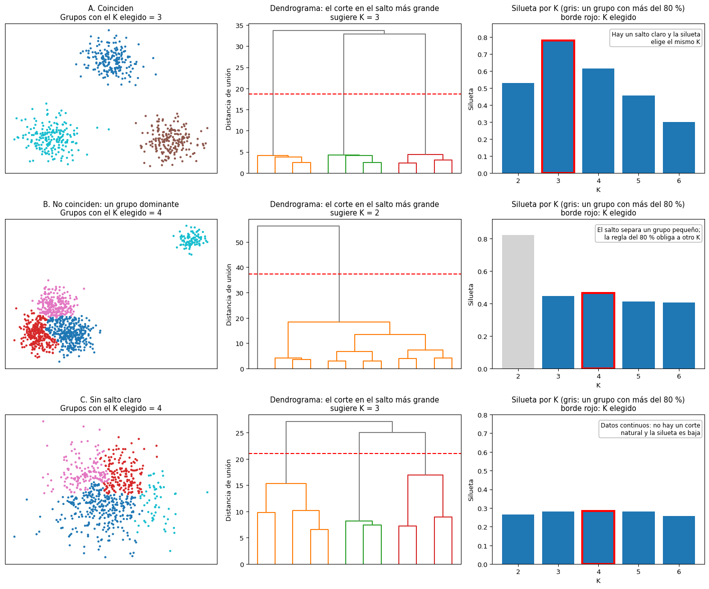
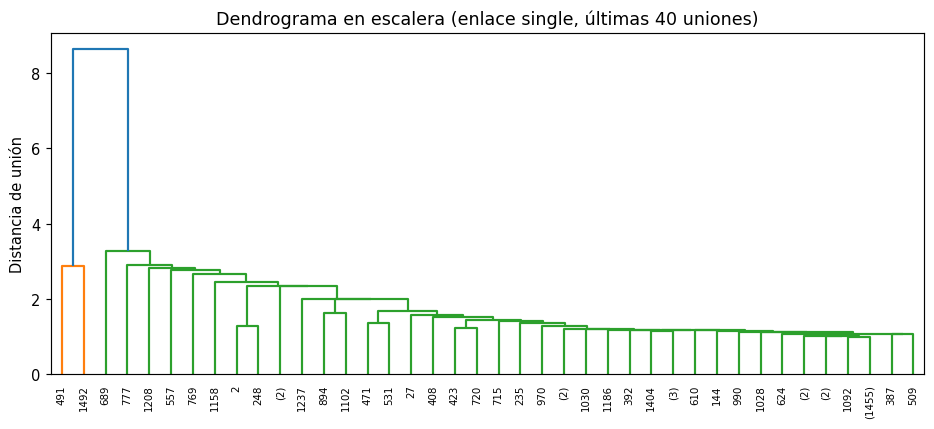

# Dendrograma

Un [dendrograma](../glosario.md#dendrograma) es un diagrama en forma de árbol que muestra todas
las uniones de una [agrupación jerárquica](../glosario.md#agrupacion-jerarquica), como la
[agrupación aglomerativa](agrupacion-aglomerativa.md). Permite ver cómo se van formando los grupos
y ayuda a decidir cuántos conservar.

## Cómo leerlo

- **Hojas** (abajo): cada hoja es un registro o, si el dendrograma está resumido, un grupo
  pequeño de registros.
- **Uniones**: cada línea horizontal une dos grupos. Su **altura** es la distancia entre esos
  grupos en el momento de unirlos, según el criterio de [enlace](../glosario.md#enlace) usado.
- **Líneas verticales**: van desde un grupo hasta la unión siguiente. Una línea vertical **larga**
  indica que el grupo se mantuvo separado durante mucho tiempo: para unirlo con otro hubo que
  aceptar una distancia mucho mayor.

Los registros que se unen abajo son muy parecidos entre sí; los grupos que solo se unen arriba
son muy distintos.


En la figura, los registros forman tres grupos que se unen a poca altura. Después, las uniones
ocurren mucho más arriba: hay un **salto grande** de altura. La línea discontinua corta el árbol
dentro de ese salto y cruza tres líneas verticales, así que deja tres grupos.

## Cómo elegir el número de grupos

1. Busque la zona donde las líneas verticales son más largas, es decir, el mayor salto de altura
   entre una unión y la siguiente.
2. Trace una línea horizontal a una altura dentro de ese salto.
3. El número de líneas verticales que cruza la línea horizontal es el número de grupos.

Si hay varios saltos parecidos, pruebe los números de grupos correspondientes y compárelos con
la [silueta](silueta.md) y el [índice de Davies-Bouldin](davies-bouldin.md), y revise si los
grupos tienen sentido para su problema. Con `"ward"`, la altura de las uniones
está relacionada con el aumento de la [inercia](inercia.md), así que un salto grande en el
dendrograma equivale al codo de la curva de inercia.

## Comparar con el K de la silueta

El número de grupos que sugiere el dendrograma no siempre coincide con el que elige una métrica
como la [silueta](silueta.md). La figura muestra tres escenarios típicos con datos sintéticos. En
cada fila aparecen los datos agrupados con el K elegido por la silueta (sin aceptar un grupo con
más del 80 % de los registros), el dendrograma con el corte en el salto más grande y la silueta
para cada K:



- **A. Coinciden.** Hay un salto muy grande en el dendrograma y la silueta es máxima en el mismo
  K. La elección es confiable.
- **B. No coinciden por un grupo dominante.** El salto más grande solo separa un grupo pequeño y
  alejado del resto, así que sugiere K = 2. Pero con K = 2 casi todos los registros quedan en un
  mismo grupo, que no sirve. Se elige un K mayor, que divide el bloque grande, aunque su
  separación sea menos marcada.
- **C. No hay salto claro.** Los datos son continuos: ningún salto se destaca y la silueta es
  baja y casi plana. Ninguno de los dos números es confiable; la conclusión es que los datos no
  tienen una estructura de grupos clara.

## Dendrograma en escalera

A veces el dendrograma no une grupos de tamaño parecido, sino que cada unión agrega uno o pocos
registros a un mismo bloque grande. El resultado tiene forma de escalera:



- **Las hojas con un registro** se van uniendo de a una al bloque, cada vez a una altura un poco
  mayor. El número entre paréntesis de las hojas muestra que una sola, con 1455 registros, tiene
  casi todos los datos.
- **No hay grupos que separar.** Las alturas suben de forma gradual. Cortar el árbol en cualquier
  punto deja un grupo gigante y varios «grupos» de uno o pocos registros, que en realidad son
  valores atípicos.
- **Un salto grande puede engañar.** En la figura, el salto más alto separa solo dos registros.
  Antes de aceptar un corte, revise cuántos registros quedan en cada grupo.
- **Los colores no son grupos.** SciPy colorea por defecto las ramas que quedan por debajo del
  70 % de la altura máxima; esos colores no indican una partición útil.

La escalera es el **efecto de encadenamiento**: aparece con el enlace `single`, y también con
`average` o `complete` cuando hay valores atípicos que se unen al final. Para obtener grupos útiles
pruebe el enlace `ward`, o controle antes los valores extremos (por ejemplo, con un
[clipping](valores-atipicos.md) o aplicando `np.log1p` a las variables muy sesgadas).

## Muchos registros

Con cientos o miles de registros, las hojas se amontonan y el dendrograma no se puede leer. Hay
dos opciones:

- **Resumir el dendrograma** con `truncate_mode="lastp"` y `p=30`: muestra solo las últimas 30
  uniones, es decir, las de la parte alta del árbol, que son las que importan para elegir el
  número de grupos. Cada hoja es entonces un grupo, y el número entre paréntesis indica cuántos
  registros contiene. Resumir no cambia la altura de las uniones que se muestran: la parte
  alta del árbol se dibuja igual que en el dendrograma completo. Solo oculta cortes que dejen más
  de `p` grupos, así que use un `p` bastante mayor que el número de grupos que quiere evaluar.
- **Usar una muestra aleatoria** de los registros, por ejemplo 1000 o 2000. Además, calcular la
  jerarquía tiene un costo de memoria que crece con el cuadrado del número de registros (vea la
  advertencia en [agrupación aglomerativa](agrupacion-aglomerativa.md)).

## SciPy y scikit-learn

scikit-learn no dibuja dendrogramas; se usan las funciones de `scipy.cluster.hierarchy`.
`linkage` de SciPy calcula la misma jerarquía que `AgglomerativeClustering` de scikit-learn con
el mismo criterio de enlace, así que cortar el dendrograma en \( k \) grupos da la misma
partición que `AgglomerativeClustering(n_clusters=k)` (solo cambia la numeración de los grupos).

Para obtener las etiquetas de los grupos después de elegir el corte, puede usar
`AgglomerativeClustering` con ese número de grupos o con `distance_threshold` igual a la altura
de corte. SciPy ofrece también la función `fcluster`, que corta la jerarquía a una altura o en un
número de grupos dado; tenga en cuenta que numera los grupos desde 1, no desde 0.

## Código: dibujar el dendrograma

```python
import matplotlib.pyplot as plt
from scipy.cluster.hierarchy import linkage, dendrogram

Z = linkage(X_esc, method="ward")

plt.figure(figsize=(10, 5))
dendrogram(Z, truncate_mode="lastp", p=30)
plt.xlabel("Grupos (entre paréntesis, número de registros)")
plt.ylabel("Distancia de unión")
plt.show()
```

- `X_esc` son las variables ya [escaladas](escalar-variables.md). Con muchos registros, use una
  muestra, por ejemplo `X_esc[:2000]` si las filas están en orden aleatorio.
- `method` es el criterio de enlace: `"ward"`, `"complete"`, `"average"` o `"single"`.
- `Z` guarda la jerarquía completa: una fila por unión, con los dos grupos unidos, la distancia
  de la unión y el número de registros del grupo resultante.
- `truncate_mode="lastp"` y `p=30` muestran solo las últimas 30 uniones. Con pocos registros
  (menos de unos 50) puede quitar ambos para ver todas las hojas.
- Para ver cuántos registros tiene cada hoja resumida, agregue `show_leaf_counts=True` (es el
  valor por defecto con `truncate_mode`): el número aparece entre paréntesis bajo la hoja.

## Referencias

- SciPy. [`scipy.cluster.hierarchy.dendrogram`](https://docs.scipy.org/doc/scipy/reference/generated/scipy.cluster.hierarchy.dendrogram.html):
  significado de la altura de las uniones y del modo `truncate_mode="lastp"`.
- Mojena, R. (1977). Hierarchical grouping methods and stopping rules: an evaluation.
  _The Computer Journal_, 20(4), 359–363. Reglas para elegir el número de grupos según los saltos
  en la altura de las uniones.
- James, G., Witten, D., Hastie, T. y Tibshirani, R. (2021). _An Introduction to Statistical
  Learning_ (2.ª ed.), cap. 12. Springer. Interpretación del dendrograma y del corte.
- Hastie, T., Tibshirani, R. y Friedman, J. (2009). _The Elements of Statistical Learning_
  (2.ª ed.), sección 14.3.12. Springer. Agrupación jerárquica y criterios de enlace.
