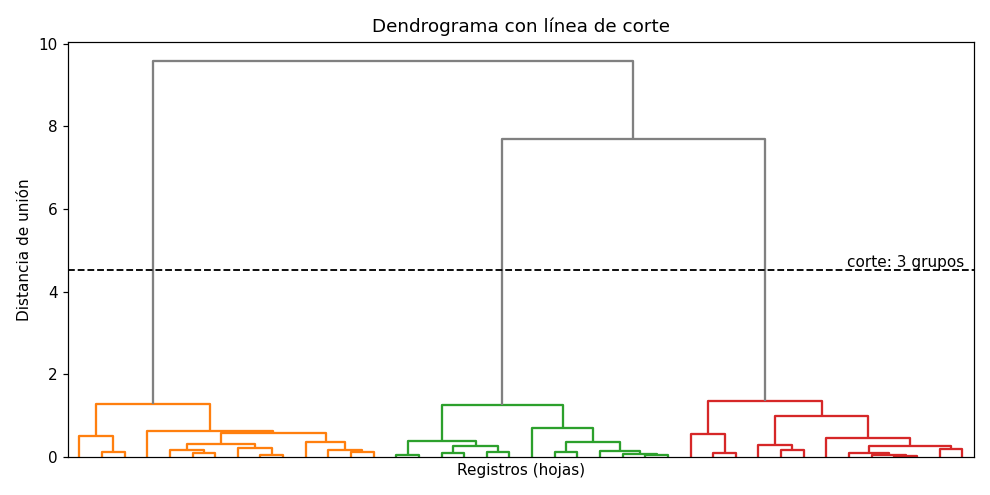

# Dendrograma

Un [dendrograma](../glosario.md#dendrograma) es un diagrama en forma de árbol que muestra todas
las uniones de una [agrupación jerárquica](../glosario.md#agrupacion-jerarquica), como la
[agrupación aglomerativa](agrupacion-aglomerativa.md). Permite ver cómo se van formando los grupos
y ayuda a decidir cuántos conservar.

## Cómo leerlo

- **Hojas** (abajo): cada hoja es un registro o, si el dendrograma está resumido, un grupo
  pequeño de registros.
- **Uniones**: cada línea horizontal une dos grupos. Su **altura** es la distancia entre esos
  grupos en el momento de unirlos, según el criterio de [enlace](../glosario.md#enlace) usado.
- **Líneas verticales**: van desde un grupo hasta la unión siguiente. Una línea vertical **larga**
  indica que el grupo se mantuvo separado durante mucho tiempo: para unirlo con otro hubo que
  aceptar una distancia mucho mayor.

Los registros que se unen abajo son muy parecidos entre sí; los grupos que solo se unen arriba
son muy distintos.



En la figura, los registros forman tres grupos que se unen a poca altura. Después, las uniones
ocurren mucho más arriba: hay un **salto grande** de altura. La línea discontinua corta el árbol
dentro de ese salto y cruza tres líneas verticales, así que deja tres grupos.

## Cómo elegir el número de grupos

1. Busque la zona donde las líneas verticales son más largas, es decir, el mayor salto de altura
   entre una unión y la siguiente.
2. Trace una línea horizontal a una altura dentro de ese salto.
3. El número de líneas verticales que cruza la línea horizontal es el número de grupos.

Si hay varios saltos parecidos, pruebe los números de grupos correspondientes y compárelos con
la [silueta](silueta.md) y el [índice de Davies-Bouldin](davies-bouldin.md), y revise si los
grupos tienen sentido para su problema. Con `"ward"`, la altura de las uniones
está relacionada con el aumento de la [inercia](inercia.md), así que un salto grande en el
dendrograma equivale al codo de la curva de inercia.

## Muchos registros

Con cientos o miles de registros, las hojas se amontonan y el dendrograma no se puede leer. Hay
dos opciones:

- **Resumir el dendrograma** con `truncate_mode="lastp"` y `p=30`: muestra solo las últimas 30
  uniones, es decir, las de la parte alta del árbol, que son las que importan para elegir el
  número de grupos. Cada hoja es entonces un grupo, y el número entre paréntesis indica cuántos
  registros contiene.
- **Usar una muestra aleatoria** de los registros, por ejemplo 1000 o 2000. Además, calcular la
  jerarquía tiene un costo de memoria que crece con el cuadrado del número de registros (vea la
  advertencia en [agrupación aglomerativa](agrupacion-aglomerativa.md)).

## SciPy y scikit-learn

scikit-learn no dibuja dendrogramas; se usan las funciones de `scipy.cluster.hierarchy`.
`linkage` de SciPy calcula la misma jerarquía que `AgglomerativeClustering` de scikit-learn con
el mismo criterio de enlace, así que cortar el dendrograma en \( k \) grupos da la misma
partición que `AgglomerativeClustering(n_clusters=k)` (solo cambia la numeración de los grupos).

Para obtener las etiquetas de los grupos después de elegir el corte, puede usar
`AgglomerativeClustering` con ese número de grupos o con `distance_threshold` igual a la altura
de corte. SciPy ofrece también la función `fcluster`, que corta la jerarquía a una altura o en un
número de grupos dado; tenga en cuenta que numera los grupos desde 1, no desde 0.

## Código: dibujar el dendrograma

```python
import matplotlib.pyplot as plt
from scipy.cluster.hierarchy import linkage, dendrogram

Z = linkage(X_esc, method="ward")

plt.figure(figsize=(10, 5))
dendrogram(Z, truncate_mode="lastp", p=30)
plt.xlabel("Grupos (entre paréntesis, número de registros)")
plt.ylabel("Distancia de unión")
plt.show()
```

- `X_esc` son las variables ya [escaladas](escalar-variables.md). Con muchos registros, use una
  muestra, por ejemplo `X_esc[:2000]` si las filas están en orden aleatorio.
- `method` es el criterio de enlace: `"ward"`, `"complete"`, `"average"` o `"single"`.
- `Z` guarda la jerarquía completa: una fila por unión, con los dos grupos unidos, la distancia
  de la unión y el número de registros del grupo resultante.
- `truncate_mode="lastp"` y `p=30` muestran solo las últimas 30 uniones. Con pocos registros
  (menos de unos 50) puede quitar ambos para ver todas las hojas.
