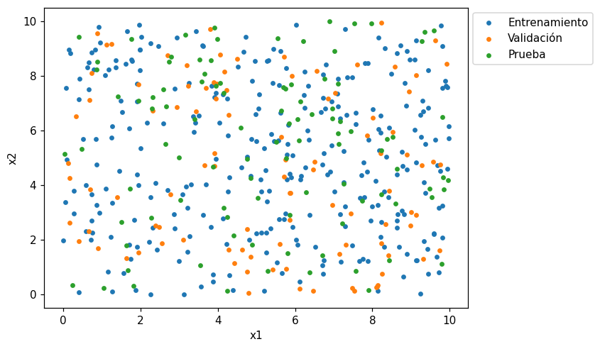

# Dividir en entrenamiento y prueba

Un modelo siempre se ajusta bien a los datos con los que se entrenó. Para saber si funciona con
datos **nuevos**, se reserva una parte de los registros que el modelo no ve durante el
entrenamiento:

- el [conjunto de entrenamiento](../glosario.md#conjunto-entrenamiento) se usa para ajustar el
  modelo;
- el [conjunto de prueba](../glosario.md#conjunto-prueba) se usa para evaluarlo con datos que
  no vio.

Si el modelo funciona mucho mejor en entrenamiento que en prueba, hay
[sobreajuste](../glosario.md#sobreajuste): memorizó los datos en lugar de aprender el patrón.

## Dividir con `train_test_split`

```python
from sklearn.model_selection import train_test_split

X = df[["columna1", "columna2", "columna3"]]
y = df["columna_objetivo"]

X_train, X_test, y_train, y_test = train_test_split(X, y, test_size=0.2, random_state=42)
```

- `X` contiene las variables independientes y `y` la
  [variable objetivo](../glosario.md#variable-objetivo); `columna_objetivo` es su nombre.
- `X_train` y `y_train` forman el conjunto de entrenamiento; `X_test` y `y_test`, el de prueba.
  La función devuelve los cuatro en ese orden.
- `test_size=0.2` reserva el 20 % de los registros para prueba (el 80 % restante queda para
  entrenamiento).
- `random_state=42` fija la semilla de la división aleatoria: con el mismo número, cada
  ejecución produce la misma división y los resultados son reproducibles.
- `shuffle=True` (valor por defecto) mezcla los registros antes de dividir. Así, si el dataset
  viene ordenado (por ejemplo, por fecha o por precio), los dos conjuntos no quedan con
  registros de rangos distintos.

## Proporciones típicas

| Entrenamiento | Prueba | Cuándo usarla |
|---------------|--------|---------------|
| 80 % | 20 % | La opción más común |
| 70 % | 30 % | Datasets pequeños, para tener una prueba más confiable |
| 90 % | 10 % | Datasets muy grandes, donde el 10 % ya son muchos registros |

!!! tip "Divida antes de transformar"
    Haga la división antes de calcular medias, medianas u otros valores a partir de los datos
    (por ejemplo, para imputar nulos o escalar). Si los calcula con todo el dataset, la
    información del conjunto de prueba se filtra al entrenamiento.

## Entrenamiento, validación y prueba { #validacion }

Cuando hay que **elegir** entre varios modelos o entre valores de un
[hiperparámetro](../glosario.md#hiperparametro) (por ejemplo, el grado de una
[regresión polinomial](../glosario.md#regresion-polinomial)), se necesita un tercer conjunto: el
[conjunto de validación](../glosario.md#conjunto-validacion). Se obtiene llamando dos veces a
`train_test_split`:

```python
X_temp, X_test, y_temp, y_test = train_test_split(X, y, test_size=0.2, random_state=42)
X_train, X_val, y_train, y_val = train_test_split(X_temp, y_temp, test_size=0.25, random_state=42)
```

- La primera llamada separa el 20 % para prueba (`X_test`, `y_test`) y deja el 80 % en
  `X_temp` y `y_temp`.
- La segunda divide ese 80 %: `test_size=0.25` toma la cuarta parte (25 % de 80 % = 20 % del
  total) para validación (`X_val`, `y_val`). El resultado es 60 % / 20 % / 20 %.

Cada conjunto tiene un papel distinto:

| Conjunto | Papel |
|----------|-------|
| Entrenamiento | Ajustar cada modelo candidato (`fit`) |
| Validación | Comparar los candidatos y elegir el modelo o los hiperparámetros |
| Prueba | Evaluar **una sola vez**, al final, el modelo elegido |

!!! warning "No use el conjunto de prueba para elegir"
    Si compara modelos con el conjunto de prueba y se queda con el mejor, la elección se adapta
    a esos datos y la métrica de prueba deja de ser una estimación honesta del desempeño con
    datos nuevos. Elija siempre con validación y use prueba solo al final.

## Ejemplo

Con un dataset de 500 registros con dos variables y un objetivo:

```python
import numpy as np
import pandas as pd
import matplotlib.pyplot as plt
from sklearn.model_selection import train_test_split

rng = np.random.default_rng(0)
n = 500
df = pd.DataFrame({
    "x1": rng.uniform(0, 10, n),
    "x2": rng.uniform(0, 10, n),
})
df["y"] = 20 + 5 * df["x1"] - 2 * df["x2"] + rng.normal(0, 5, n)

X = df[["x1", "x2"]]
y = df["y"]

X_temp, X_test, y_temp, y_test = train_test_split(X, y, test_size=0.2, random_state=42)
X_train, X_val, y_train, y_val = train_test_split(X_temp, y_temp, test_size=0.25, random_state=42)

print("Entrenamiento:", X_train.shape)
print("Validación:   ", X_val.shape)
print("Prueba:       ", X_test.shape)

fig, ax = plt.subplots(figsize=(7, 5))
ax.scatter(X_train["x1"], X_train["x2"], s=12, label="Entrenamiento")
ax.scatter(X_val["x1"], X_val["x2"], s=12, label="Validación")
ax.scatter(X_test["x1"], X_test["x2"], s=12, label="Prueba")
ax.set_xlabel("x1")
ax.set_ylabel("x2")
ax.legend(loc="upper left", bbox_to_anchor=(1, 1))
plt.show()
```

Salida:

```text
Entrenamiento: (300, 2)
Validación:    (100, 2)
Prueba:        (100, 2)
```



Los 500 registros quedan repartidos en 300 / 100 / 100 (60 % / 20 % / 20 %). Como la división es
aleatoria, los tres conjuntos cubren todo el rango de `x1` y `x2`: ninguno queda concentrado en
una zona, y por eso validación y prueba representan bien los datos que el modelo no vio.
