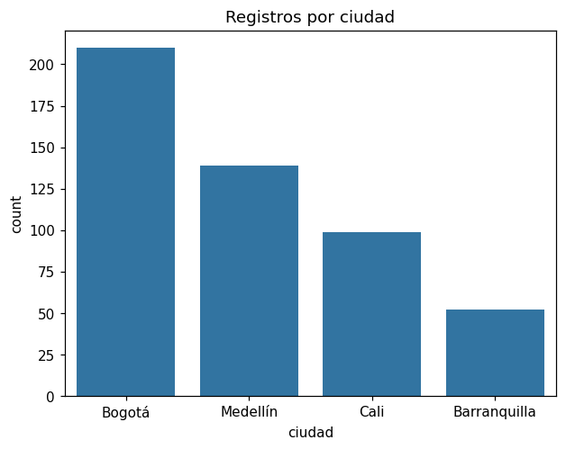

# Gráfico de barras

El gráfico de barras muestra cuántos registros hay en cada categoría de una
[variable categórica](glosario.md#variable-categorica).

```python
import matplotlib.pyplot as plt
import seaborn as sns

sns.countplot(x="columna", data=df)
plt.show()
```

`columna` es el nombre de la variable categórica que quiere graficar.

## Ordenar las barras

```python
# De la categoría más frecuente a la menos frecuente
sns.countplot(x="columna", data=df, order=df["columna"].value_counts().index)

# En un orden propio, por ejemplo días de la semana
sns.countplot(x="columna", data=df, order=["lun", "mar", "mié", "jue", "vie", "sáb", "dom"])
```

## Tabla de frecuencias

Para ver los conteos como números en vez de barras:

```python
df["columna"].value_counts()                  # conteo de cada categoría
df["columna"].value_counts(normalize=True)    # proporción de cada categoría (suma 1)
```

## Ejemplo

Con un dataset de 500 personas y su ciudad:

```python
import numpy as np
import pandas as pd
import matplotlib.pyplot as plt
import seaborn as sns

rng = np.random.default_rng(0)
df = pd.DataFrame({
    "ciudad": rng.choice(["Bogotá", "Medellín", "Cali", "Barranquilla"], 500, p=[.4, .3, .2, .1]),
})

sns.countplot(x="ciudad", data=df, order=df["ciudad"].value_counts().index)
plt.title("Registros por ciudad")
plt.show()
```

{ width="480" }

Las categorías no están balanceadas: Bogotá tiene cuatro veces más registros que Barranquilla.
