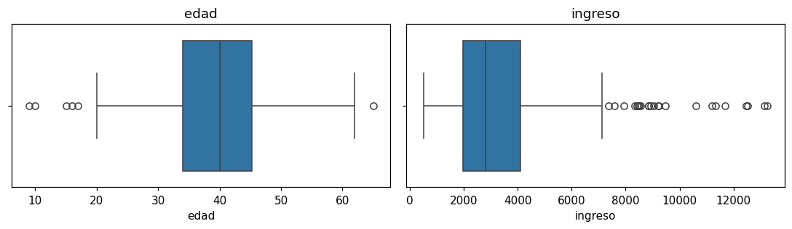

# Gráfico de cajas

El gráfico de cajas (_boxplot_) resume una [variable continua](glosario.md#variable-continua):

- la **caja** va del primer cuartil (25 %) al tercer cuartil (75 %);
- la **línea** dentro de la caja es la mediana;
- los **bigotes** llegan hasta 1,5 veces el rango intercuartílico;
- los **puntos** fuera de los bigotes son [valores atípicos](glosario.md#outlier).

```python
import matplotlib.pyplot as plt
import seaborn as sns

sns.boxplot(x=df["columna"])
plt.title("columna")
plt.show()
```

`columna` es el nombre de la variable continua que quiere graficar.

## Varias columnas a la vez

`plt.subplots(filas, columnas)` crea una cuadrícula de gráficos. Cada gráfico se dibuja en un
eje (`ax`) distinto:

```python
columnas = ["columna1", "columna2", "columna3"]

fig, axes = plt.subplots(1, len(columnas), figsize=(5 * len(columnas), 3))
for ax, columna in zip(axes, columnas):
    sns.boxplot(x=df[columna], ax=ax)
    ax.set_title(columna)
plt.tight_layout()
plt.show()
```

## Ejemplo

Con un dataset de 500 personas con su edad e ingreso:

```python
import numpy as np
import pandas as pd
import matplotlib.pyplot as plt
import seaborn as sns

rng = np.random.default_rng(0)
df = pd.DataFrame({
    "edad": rng.normal(40, 8, 500).round(),
    "ingreso": rng.lognormal(8, 0.6, 500),
})

fig, axes = plt.subplots(1, 2, figsize=(10, 3))
for ax, columna in zip(axes, ["edad", "ingreso"]):
    sns.boxplot(x=df[columna], ax=ax)
    ax.set_title(columna)
plt.tight_layout()
plt.show()
```



La caja de `edad` es simétrica y tiene pocos atípicos. La de `ingreso` está cargada a la
izquierda y tiene muchos atípicos a la derecha, lo que indica [sesgo](glosario.md#sesgo)
a la derecha.
