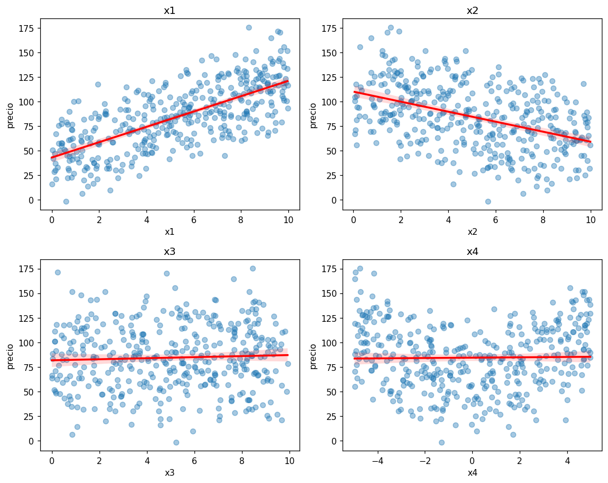

# Gráfico de dispersión

El gráfico de dispersión (_scatter plot_) dibuja un punto por registro, con una variable en el
eje x y otra en el eje y. Úselo para revisar si una variable tiene una relación lineal con la
[variable objetivo](../glosario.md#variable-objetivo) antes de usarla en una
[regresión lineal](regresion-lineal.md).

```python
import matplotlib.pyplot as plt
import seaborn as sns

sns.scatterplot(data=df, x="columna", y="columna_objetivo", alpha=0.5)
plt.title("columna vs. columna_objetivo")
plt.show()
```

- `columna` es la [variable continua](../glosario.md#variable-continua) que quiere revisar.
- `columna_objetivo` es el nombre de la variable que quiere predecir.
- `alpha=0.5` vuelve los puntos semitransparentes para ver dónde se acumulan.

## Agregar una línea de tendencia

`sns.regplot` dibuja los puntos y además la recta que mejor se ajusta a ellos:

```python
sns.regplot(data=df, x="columna", y="columna_objetivo",
            scatter_kws={"alpha": 0.4}, line_kws={"color": "red"})
plt.show()
```

La franja sombreada alrededor de la recta es el intervalo de confianza de la tendencia.

## Varias columnas a la vez

```python
columnas = ["columna1", "columna2", "columna3", "columna4"]

fig, axes = plt.subplots(2, 2, figsize=(10, 8))
for ax, columna in zip(axes.flat, columnas):
    sns.regplot(data=df, x=columna, y="columna_objetivo", ax=ax,
                scatter_kws={"alpha": 0.4}, line_kws={"color": "red"})
    ax.set_title(columna)
plt.tight_layout()
plt.show()
```

`axes.flat` recorre la cuadrícula de 2 × 2 como si fuera una sola lista. Ajuste el número de
filas y columnas de `plt.subplots` a la cantidad de variables.

## Cómo leerlo

| Forma de la nube de puntos | Interpretación |
|----------------------------|----------------|
| Sube de izquierda a derecha, alrededor de una recta | Relación lineal **positiva** |
| Baja de izquierda a derecha, alrededor de una recta | Relación lineal **negativa** |
| Nube sin dirección, recta casi horizontal | **Sin relación** |
| Curva (forma de U, de arco, etc.) | Relación **no lineal**: la recta no la describe bien |

Mientras más angosta es la nube alrededor de la recta, más fuerte es la relación. Para medirla
con un número use la [matriz de correlación](correlacion.md).

!!! warning "La recta siempre aparece"
    `regplot` dibuja una recta aunque la relación sea curva o no exista. Mire la forma de los
    puntos, no solo la inclinación de la recta.

## Ejemplo

Con un dataset de 400 registros con cuatro variables y un precio:

```python
import numpy as np
import pandas as pd
import matplotlib.pyplot as plt
import seaborn as sns

rng = np.random.default_rng(0)
n = 400
df = pd.DataFrame({
    "x1": rng.uniform(0, 10, n),
    "x2": rng.uniform(0, 10, n),
    "x3": rng.uniform(0, 10, n),
    "x4": rng.uniform(-5, 5, n),
})
df["precio"] = (50 + 8 * df["x1"] - 5 * df["x2"] + 2 * df["x4"] ** 2
                + rng.normal(0, 10, n))

fig, axes = plt.subplots(2, 2, figsize=(10, 8))
for ax, columna in zip(axes.flat, ["x1", "x2", "x3", "x4"]):
    sns.regplot(data=df, x=columna, y="precio", ax=ax,
                scatter_kws={"alpha": 0.4}, line_kws={"color": "red"})
    ax.set_title(columna)
plt.tight_layout()
plt.show()
```



`x1` tiene una relación lineal positiva y `x2` una negativa. `x3` no muestra relación: la nube
no tiene dirección. `x4` tiene una relación en forma de U que la recta casi horizontal no
captura; una regresión lineal no aprovecharía esa variable tal como está.
