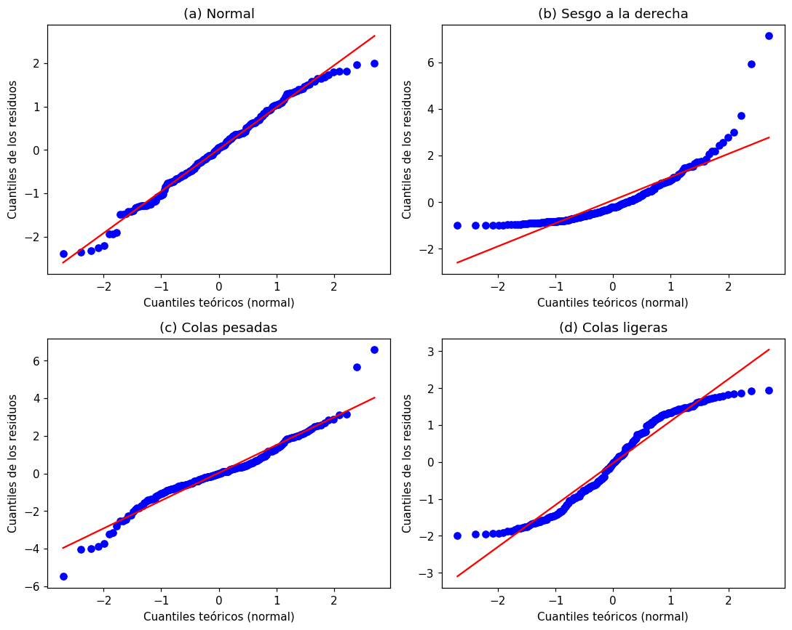

# Gráfico Q-Q

El gráfico Q-Q (cuantil-cuantil) compara los cuantiles de los
[residuos](../glosario.md#residuo) con los cuantiles que tendrían si siguieran una
distribución normal. Sirve para revisar el supuesto de [normalidad](../glosario.md#normalidad)
de la [regresión lineal](regresion-lineal.md) y muestra con más detalle que el histograma
**dónde** se alejan los residuos de la normal.

```python
import matplotlib.pyplot as plt
from scipy import stats

residuos = y_test - y_pred

stats.probplot(residuos, dist="norm", plot=plt)
plt.xlabel("Cuantiles teóricos (normal)")
plt.ylabel("Cuantiles de los residuos")
plt.show()
```

`y_test` son los valores reales del [conjunto de prueba](../glosario.md#conjunto-prueba) y
`y_pred` las predicciones del modelo. `stats.probplot` ordena los residuos, los dibuja contra
los cuantiles de una normal y agrega en rojo la recta que tendrían si fueran normales.

También puede usar statsmodels:

```python
import statsmodels.api as sm

sm.qqplot(residuos, line="45", fit=True)
plt.show()
```

`fit=True` estandariza los residuos y `line="45"` dibuja la diagonal de referencia.

## Cómo interpretarlo

| Patrón | Qué indica |
|--------|------------|
| Los puntos siguen la recta | Residuos aproximadamente normales |
| Curva que se dobla hacia arriba en el extremo derecho (y queda por encima de la recta en el izquierdo) | [Sesgo](../glosario.md#sesgo) a la derecha: hay errores positivos más grandes de lo esperado |
| Curva que se dobla hacia abajo en el extremo izquierdo | Sesgo a la izquierda |
| Forma de S: el extremo izquierdo por debajo de la recta y el derecho por encima | **Colas pesadas**: hay más errores extremos de los que permite la normal |
| Forma de S invertida: los extremos se aplanan hacia la recta horizontal | **Colas ligeras**: los errores extremos son menos frecuentes que en una normal |

- Pequeñas desviaciones en los dos o tres puntos de cada extremo son normales, incluso con
  residuos que vienen de una distribución normal. Fíjese en patrones que afectan a muchos puntos.
- Uno o dos puntos muy lejos de la recta suelen ser [valores atípicos](../glosario.md#outlier).

!!! tip "Combine el gráfico con una prueba"
    El gráfico Q-Q muestra la forma de la desviación; las pruebas de Shapiro–Wilk o
    D'Agostino–Pearson dan un resultado numérico. Vea
    [normalidad de los residuos](normalidad-residuos.md).

## Ejemplo

Con cuatro conjuntos de 200 residuos sintéticos que siguen distribuciones distintas:

```python
import numpy as np
import matplotlib.pyplot as plt
from scipy import stats

rng = np.random.default_rng(0)
n = 200
casos = {
    "(a) Normal": rng.normal(0, 1, n),
    "(b) Sesgo a la derecha": rng.exponential(1, n) - 1,
    "(c) Colas pesadas": rng.standard_t(3, n),
    "(d) Colas ligeras": rng.uniform(-2, 2, n),
}

fig, axes = plt.subplots(2, 2, figsize=(10, 8))
for ax, (titulo, residuos) in zip(axes.flat, casos.items()):
    stats.probplot(residuos, dist="norm", plot=ax)
    ax.set_title(titulo)
    ax.set_xlabel("Cuantiles teóricos (normal)")
    ax.set_ylabel("Cuantiles de los residuos")
plt.tight_layout()
plt.show()
```



- **(a) Normal:** los puntos siguen la recta casi en todo el rango; solo se separan un poco en
  los extremos.
- **(b) Sesgo a la derecha:** el extremo izquierdo queda plano por encima de la recta (no hay
  residuos muy negativos) y el derecho se dobla hacia arriba (hay residuos positivos muy
  grandes).
- **(c) Colas pesadas:** los puntos siguen la recta en el centro, pero el extremo izquierdo
  cae por debajo y el derecho sube por encima: hay más errores extremos que en una normal.
- **(d) Colas ligeras:** los extremos se aplanan y quedan dentro de la recta: los residuos
  nunca se alejan tanto del centro como en una normal.

Revise también la varianza de los residuos con el gráfico de
[residuos vs. valores predichos](residuos-vs-predichos.md).
