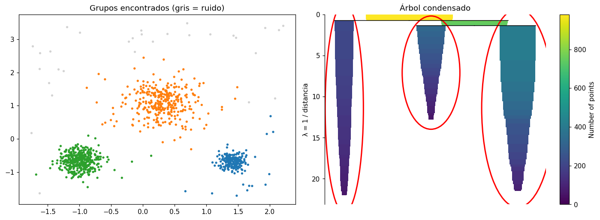

# HDBSCAN

[HDBSCAN](../glosario.md#hdbscan) es una extensión jerárquica de [DBSCAN](dbscan.md) para
[agrupación](../glosario.md#agrupacion) por densidad. En lugar de fijar un único radio `eps`,
HDBSCAN recorre **todos los niveles de densidad** posibles: construye una jerarquía en la que los
grupos aparecen, se dividen y desaparecen a medida que se exige más densidad, y al final se queda
con los grupos más **estables**, es decir, los que se mantienen a lo largo de un rango amplio de
niveles. Los puntos que no quedan en ningún grupo estable se marcan como
[ruido](../glosario.md#ruido).

## Ventajas frente a DBSCAN

- **No necesita `eps`.** En DBSCAN, elegir `eps` suele ser lo más difícil: un valor pequeño deja
  casi todo como ruido y uno grande une grupos distintos. HDBSCAN no usa ese radio.
- **Maneja grupos de densidades distintas.** Con un solo `eps`, DBSCAN no puede capturar a la vez
  un grupo compacto y uno disperso. HDBSCAN evalúa cada grupo en el nivel de densidad que le
  corresponde, así que puede encontrar ambos.
- Al igual que DBSCAN, **no hay que indicar el número de grupos** y los grupos pueden tener
  formas no esféricas.

## Hiperparámetros

| [Hiperparámetro](../glosario.md#hiperparametro) | Qué controla | Efecto al aumentarlo |
|---|---|---|
| `min_cluster_size` | Tamaño mínimo para que un conjunto de puntos se considere un grupo | Menos grupos y más grandes; los grupos pequeños pasan a ser ruido o se unen a otros |
| `min_samples` | Qué tan conservador es el algoritmo al estimar la densidad (por defecto, igual a `min_cluster_size`) | Más puntos marcados como ruido; los grupos quedan limitados a las zonas más densas |
| `cluster_selection_method` | Cómo se eligen los grupos dentro de la jerarquía | `"eom"` (por defecto) prefiere pocos grupos grandes y estables; `"leaf"` toma las hojas de la jerarquía y da grupos más pequeños y homogéneos |

Empiece con `min_cluster_size` según el tamaño mínimo de grupo que tendría sentido en su
problema (por ejemplo, el 1 % o el 2 % de los registros) y ajuste `min_samples` si hay demasiado
o muy poco ruido.

## Ruido y probabilidades

- Los puntos de ruido reciben la etiqueta **−1**. No son un grupo: son registros que no
  pertenecen con claridad a ninguno.
- `probabilities_` da, para cada punto, un valor entre 0 y 1 que indica con cuánta fuerza
  pertenece a su grupo. Los puntos del centro denso tienen valores cercanos a 1, los del borde
  valores menores y los de ruido valen 0.

Un porcentaje de ruido moderado es normal. Si supera, por ejemplo, el 30 % o 40 % de los
registros, los hiperparámetros probablemente son demasiado exigentes.

## Cómo evaluar los grupos

Calcule la [silueta](silueta.md) y el [índice de Davies-Bouldin](davies-bouldin.md) **sin los
puntos de ruido**: el ruido no es un grupo y, si lo incluye, distorsiona ambas métricas. Por eso,
además de las métricas, revise siempre el número de grupos y el porcentaje de ruido: una silueta
alta con el 60 % de los datos como ruido describe solo una pequeña parte de los datos.

Para elegir los hiperparámetros, pruebe varias combinaciones de `min_cluster_size` y
`min_samples` (por ejemplo, tres valores de cada uno) y registre para cada una el número de
grupos, el porcentaje de ruido, la silueta y el índice de Davies-Bouldin. Recuerde que estas dos
métricas necesitan al menos dos grupos. Busque una silueta alta, un índice de Davies-Bouldin bajo
y un porcentaje de ruido razonable, y prefiera combinaciones vecinas que den resultados
parecidos: indican una solución estable.

No compare la [inercia](inercia.md) entre HDBSCAN y K-means: la inercia mide qué tan compactos
son los grupos alrededor de un centro, y HDBSCAN no busca grupos con esa forma.

## Graficar la jerarquía: el árbol condensado

HDBSCAN construye una jerarquía de grupos para todos los niveles de densidad y luego la
**condensa**: descarta las divisiones en que solo se desprenden unos pocos registros y deja las
ramas que de verdad representan grupos. El resultado se grafica como un **árbol condensado**, que
cumple el papel del [dendrograma](dendrograma.md) en HDBSCAN.

El `HDBSCAN` de scikit-learn no permite graficarlo. Para hacerlo use el paquete independiente
`hdbscan` (`pip install hdbscan`), que tiene los mismos hiperparámetros y da resultados muy
parecidos.

Cómo leerlo:

- **Eje vertical (λ = 1 / distancia):** hacia abajo, la densidad exigida es mayor. Arriba están
  todos los registros juntos.
- **Ancho de cada rama:** el número de registros que siguen en ella. A medida que λ crece, los
  registros que se desprenden pasan a ser [ruido](../glosario.md#ruido) y la rama se angosta.
- **Divisiones:** una línea horizontal marca el nivel de densidad en que un grupo se separa en
  dos.
- **Grupos elegidos (círculos rojos):** HDBSCAN elige las ramas más **estables**, las que conservan
  muchos registros a lo largo de un tramo largo de λ. Una rama que dura poco antes de dividirse o
  desaparecer se descarta.

### Ejemplo del gráfico

Árbol condensado de un conjunto de datos sintético con tres grupos de densidades distintas y
algunos registros dispersos, agrupado con `min_cluster_size=50` y `min_samples=10`:



- Arriba del árbol están los casi 1.000 registros juntos. Muy pronto (λ ≈ 1) se separa la rama de
  la izquierda, y poco después (λ ≈ 1,4) el resto se divide en las ramas del centro y la derecha.
- El ancho de cada rama corresponde al tamaño de cada grupo: la de la izquierda tiene unos 200
  registros (el grupo azul, el más compacto), la del centro unos 300 (el grupo naranja, el más
  disperso) y la de la derecha unos 400 (el grupo verde).
- La rama del centro termina antes (λ ≈ 13) que las otras dos (λ ≈ 22): su grupo es menos denso,
  así que se deshace con una exigencia de densidad menor.
- Las tres ramas están en círculos rojos: son los grupos que HDBSCAN eligió. Los registros que se
  desprendieron de las ramas en el camino son los 30 puntos grises de ruido.

## Código: agrupar con HDBSCAN

```python
import numpy as np
from sklearn.cluster import HDBSCAN

modelo = HDBSCAN(min_cluster_size=50, min_samples=10)
etiquetas = modelo.fit_predict(X_esc)

n_grupos = len(set(etiquetas)) - (1 if -1 in etiquetas else 0)
porc_ruido = np.mean(etiquetas == -1) * 100
print(f"Número de grupos: {n_grupos}")
print(f"Ruido: {porc_ruido:.1f} % de los registros")
```

- `X_esc` son las variables ya [escaladas](escalar-variables.md).
- `min_cluster_size` y `min_samples` son los hiperparámetros descritos arriba.
- `etiquetas` tiene el grupo de cada registro: 0, 1, 2, ... y −1 para el ruido.
- `n_grupos` cuenta los grupos sin contar el ruido.
- `porc_ruido` es el porcentaje de registros marcados como ruido.

## Código: graficar el árbol condensado

```python
import hdbscan
import matplotlib.pyplot as plt

modelo = hdbscan.HDBSCAN(min_cluster_size=50, min_samples=10).fit(X_esc)
etiquetas = modelo.labels_

modelo.condensed_tree_.plot(select_clusters=True)
plt.show()
```

- `hdbscan.HDBSCAN` es la versión del paquete `hdbscan`; se usa con los mismos hiperparámetros que
  la de scikit-learn.
- `modelo.labels_` tiene el grupo de cada registro; el ruido tiene la etiqueta −1.
- `condensed_tree_.plot` dibuja el árbol condensado y `select_clusters=True` encierra en círculos
  rojos los grupos elegidos.
