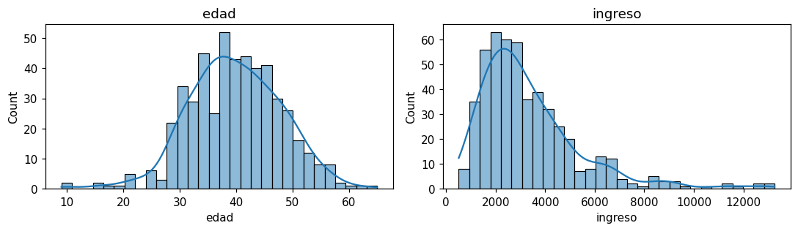

# Histograma

El histograma muestra la [distribución](glosario.md#distribucion) de una
[variable continua](glosario.md#variable-continua): divide el rango de valores en intervalos
(_bins_) y dibuja una barra con la cantidad de registros que cae en cada uno.

```python
import matplotlib.pyplot as plt
import seaborn as sns

sns.histplot(df["columna"], bins=30, kde=True)
plt.show()
```

- `columna` es el nombre de la variable continua que quiere graficar.
- `bins` es el número de intervalos. Con pocos se pierde detalle; con muchos, el gráfico se vuelve ruidoso.
- `kde=True` añade una curva suavizada de la distribución.

## Varias columnas a la vez

```python
columnas = ["columna1", "columna2", "columna3"]

fig, axes = plt.subplots(1, len(columnas), figsize=(5 * len(columnas), 3))
for ax, columna in zip(axes, columnas):
    sns.histplot(df[columna], bins=30, kde=True, ax=ax)
    ax.set_title(columna)
plt.tight_layout()
plt.show()
```

## Ejemplo

Con un dataset de 500 personas con su edad e ingreso:

```python
import numpy as np
import pandas as pd
import matplotlib.pyplot as plt
import seaborn as sns

rng = np.random.default_rng(0)
df = pd.DataFrame({
    "edad": rng.normal(40, 8, 500).round(),
    "ingreso": rng.lognormal(8, 0.6, 500),
})

fig, axes = plt.subplots(1, 2, figsize=(10, 3))
for ax, columna in zip(axes, ["edad", "ingreso"]):
    sns.histplot(df[columna], bins=30, kde=True, ax=ax)
    ax.set_title(columna)
plt.tight_layout()
plt.show()
```



`edad` tiene forma de campana y es simétrica. `ingreso` se concentra en valores bajos y tiene
una cola larga hacia la derecha ([sesgo](glosario.md#sesgo) a la derecha).

!!! tip "Distribuciones muy sesgadas"
    Si casi todos los valores se concentran cerca de cero, grafique el logaritmo:
    `sns.histplot(np.log1p(df["columna"]))`. La función `np.log1p(x)` calcula `log(1 + x)`
    y admite ceros.
