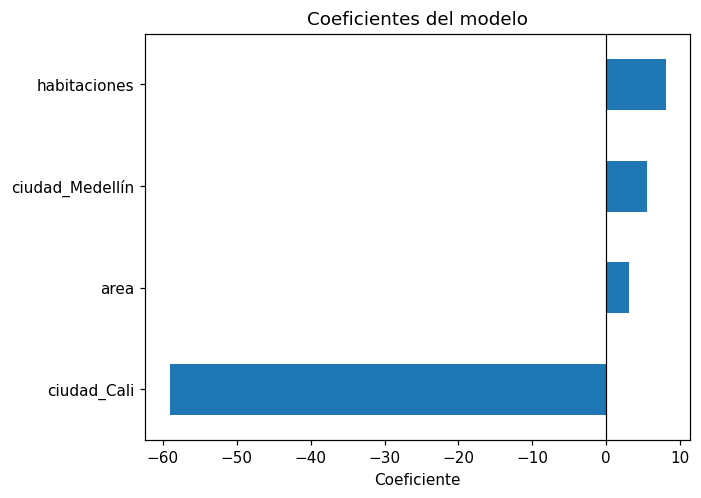

# Interpretar los coeficientes

En una [regresión lineal](../glosario.md#regresion-lineal) la predicción es:

\[
\hat{y} = \beta_0 + \beta_1 x_1 + \beta_2 x_2 + \dots + \beta_p x_p
\]

- El **intercepto** \( \beta_0 \) es la predicción cuando todas las variables valen 0. Muchas
  veces no tiene un significado práctico (por ejemplo, una vivienda de 0 m²), pero es necesario
  para ubicar la recta.
- Cada [**coeficiente**](../glosario.md#coeficiente) \( \beta_j \) es cuánto cambia la
  predicción cuando \( x_j \) aumenta en **una unidad** y las demás variables se mantienen
  **constantes**.
- El **signo** indica la dirección: positivo, la predicción aumenta; negativo, disminuye.
- Las **unidades** del coeficiente son las de la variable objetivo por unidad de la variable
  (por ejemplo, millones de pesos por m²).

## Ver los coeficientes

```python
import pandas as pd
import matplotlib.pyplot as plt

print("Intercepto:", modelo.intercept_)
coeficientes = pd.Series(modelo.coef_, index=X.columns).sort_values()
print(coeficientes)

coeficientes.plot.barh()
plt.axvline(0, color="black", linewidth=0.8)
plt.xlabel("Coeficiente")
plt.title("Coeficientes del modelo")
plt.show()
```

- `modelo` es la `LinearRegression` ya entrenada y `X` el `DataFrame` de variables con el que
  se entrenó.
- `modelo.coef_` tiene un coeficiente por columna de `X`, en el mismo orden; la `Series` los
  etiqueta con el nombre de cada columna y `sort_values()` los ordena de menor a mayor.
- `modelo.intercept_` es el intercepto \( \beta_0 \).
- El gráfico de barras horizontales muestra a la izquierda de la línea en 0 los coeficientes
  negativos y a la derecha los positivos.

## Variables con codificación one-hot

Con la [codificación one-hot](one-hot.md) y `drop_first=True` se elimina una categoría de cada
variable: la **categoría de referencia**. El coeficiente de cada columna dummy es la
**diferencia** en la predicción entre esa categoría y la de referencia, con las demás variables
fijas. La categoría de referencia no tiene coeficiente: su efecto queda incluido en el
intercepto.

## Comparar magnitudes

El tamaño de un coeficiente depende de las unidades de su variable. Un coeficiente pequeño en
una variable con un rango amplio (por ejemplo, un área entre 40 y 200 m²) puede pesar más que
uno grande en una variable que solo toma valores entre 1 y 5. Por eso **no compare
directamente** coeficientes de variables con escalas distintas. Para compararlos:

- **Multiplique cada coeficiente por la desviación estándar de su variable**: el resultado es
  el cambio en la predicción cuando la variable aumenta una desviación estándar.

    ```python
    (coeficientes * X.std()).sort_values()
    ```

- O **estandarice las variables** y vuelva a entrenar el modelo; los coeficientes quedan en la
  misma escala (cambio por cada desviación estándar):

    ```python
    from sklearn.preprocessing import StandardScaler
    from sklearn.linear_model import LinearRegression

    X_estandar = pd.DataFrame(StandardScaler().fit_transform(X), columns=X.columns)
    modelo_estandar = LinearRegression().fit(X_estandar, y)
    pd.Series(modelo_estandar.coef_, index=X.columns).sort_values()
    ```

    `X_estandar` contiene las mismas variables con media 0 y desviación estándar 1, e `y` es la
    variable objetivo.

!!! warning "Coeficiente no es causalidad"
    Un coeficiente describe una asociación en los datos, no prueba que la variable **cause**
    el cambio en la variable objetivo. Además, con
    [multicolinealidad](../glosario.md#multicolinealidad) (variables muy
    [correlacionadas](correlacion.md) entre sí) los coeficientes son inestables: pueden cambiar
    mucho de tamaño o incluso de signo con pequeños cambios en los datos.

## Ejemplo

Con un dataset de 300 viviendas con su área (m²), número de habitaciones, ciudad y precio (en
millones):

```python
import numpy as np
import pandas as pd
import matplotlib.pyplot as plt
from sklearn.linear_model import LinearRegression

rng = np.random.default_rng(0)
n = 300
df = pd.DataFrame({
    "area": rng.uniform(40, 200, n),
    "habitaciones": rng.integers(1, 6, n),
    "ciudad": rng.choice(["Bogotá", "Cali", "Medellín"], n),
})
df["precio"] = (80 + 3 * df["area"] + 10 * df["habitaciones"]
                - 60 * (df["ciudad"] == "Cali") + rng.normal(0, 30, n))
df = pd.get_dummies(df, columns=["ciudad"], drop_first=True, dtype=int)

X = df.drop(columns=["precio"])
y = df["precio"]
modelo = LinearRegression()
modelo.fit(X, y)

coeficientes = pd.Series(modelo.coef_, index=X.columns).sort_values()
print("Intercepto:", round(modelo.intercept_, 2))
print(coeficientes.round(2))
print((coeficientes * X.std()).sort_values().round(2))

coeficientes.plot.barh()
plt.axvline(0, color="black", linewidth=0.8)
plt.xlabel("Coeficiente")
plt.title("Coeficientes del modelo")
plt.show()
```

Salida:

```text
Intercepto: 79.16
ciudad_Cali       -59.08
area                3.03
ciudad_Medellín     5.47
habitaciones        8.03
dtype: float64
ciudad_Cali        -28.87
ciudad_Medellín      2.46
habitaciones        11.28
area               144.37
dtype: float64
```



- `area = 3.03`: con las habitaciones y la ciudad fijas, cada m² adicional aumenta el precio
  predicho en unos 3 millones.
- `habitaciones = 8.03`: cada habitación adicional, con la misma área y ciudad, suma unos 8
  millones.
- `ciudad_Cali = -59.08`: una vivienda en Cali se predice unos 59 millones más barata que una
  igual en Bogotá (la categoría de referencia). `ciudad_Medellín` es cercano a 0: casi no se
  diferencia de Bogotá.

!!! tip "La magnitud engaña"
    En el gráfico `area` tiene el coeficiente más pequeño, pero al multiplicarlo por su
    desviación estándar (unos 48 m²) es la variable que más mueve la predicción: 144 millones
    por desviación estándar, frente a 11 de `habitaciones`.
