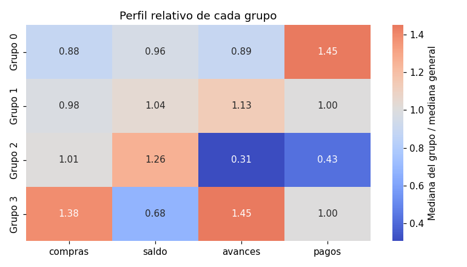

# Interpretar los grupos

Un algoritmo de [agrupación](../glosario.md#agrupacion) solo entrega una etiqueta por registro
(0, 1, 2, …). Esa etiqueta no dice nada por sí sola: el trabajo de interpretación consiste en
**describir cada grupo en términos del negocio**, es decir, construir un **perfil** de cada
segmento (qué lo caracteriza, en qué se diferencia de los demás) y darle un nombre que cualquier
persona pueda entender. Los pasos de esta página sirven para cualquier algoritmo:
[k-medias](k-medias.md), [agrupación aglomerativa](agrupacion-aglomerativa.md),
[DBSCAN](dbscan.md) o [HDBSCAN](hdbscan.md).

## Interpretar en las unidades originales

Para entrenar el algoritmo normalmente se [escalan las variables](escalar-variables.md) (por
ejemplo, con [estandarización](../glosario.md#estandarizacion)). Pero un perfil que dice "el
saldo de este grupo es 1,3" no se entiende: 1,3 desviaciones estándar no es una cantidad del
negocio. Por eso, para interpretar:

- use los datos **originales**, sin escalar, en sus unidades (pesos, número de compras, días);
- agregue las etiquetas como una columna nueva del DataFrame original
  (`df["grupo"] = etiquetas`). Las etiquetas están en el mismo orden que las filas con las que
  se entrenó el algoritmo, así que corresponden fila a fila.

Los datos escalados solo se usan para la vista en dos dimensiones (más abajo), porque esa vista
debe reflejar lo mismo que vio el algoritmo.

## Tamaño de cada grupo

Antes de describir los grupos, cuente cuántos registros tiene cada uno, en número y en
porcentaje:

- Un **grupo muy pequeño** (por ejemplo, menos del 1 % o 2 % de los registros) puede ser un
  conjunto de valores atípicos más que un segmento útil. Revise si tiene
  sentido para el negocio o si conviene cambiar los hiperparámetros.
- Un **grupo enorme** que concentra casi todos los registros indica que el algoritmo casi no
  separó los datos: el resultado aporta poco.
- En [DBSCAN](dbscan.md) y [HDBSCAN](hdbscan.md) los registros con etiqueta **−1** son
  [ruido](../glosario.md#ruido): no pertenecen a ningún grupo. Trátelos como una categoría
  aparte, repórtelos en la tabla de tamaños y no los mezcle con los grupos al describir los
  perfiles. Si el ruido es una fracción grande de los datos, revise los hiperparámetros.

## Tabla de perfiles

El perfil de cada grupo es un resumen de cada variable dentro del grupo:

- La **mediana** es la opción más segura, porque los valores atípicos la afectan poco.
- La **media** también sirve y coincide con el [centroide](../glosario.md#centroide) en
  [k-medias](k-medias.md) (calculado en las unidades originales), pero se distorsiona con
  valores extremos.

Agregue una fila con el valor **general** (de todos los registros) como referencia: un grupo
solo se caracteriza por una variable si su valor es claramente distinto del general.

## Perfil relativo

Con muchas variables en escalas distintas, la tabla de perfiles es difícil de leer. El
**perfil relativo** compara cada grupo con el total para ver de un vistazo qué lo distingue.
Hay dos formas de calcularlo:

| Perfil relativo | Cálculo | Cómo se lee | Centro del color |
|-----------------|---------|-------------|------------------|
| Razón | valor del grupo / valor general | 1,45 = un 45 % más alto que el general; 0,31 = un 69 % más bajo | 1 |
| Diferencia estandarizada | (media del grupo − media general) / desviación estándar general | +1 = una desviación estándar por encima del general | 0 |

La razón es más fácil de explicar a personas del negocio, pero solo tiene sentido con variables
positivas y con un valor general lejos de 0. Si alguna variable tiene valores negativos o un
valor general cercano a 0, use la diferencia estandarizada.

Muestre el perfil relativo como un **mapa de calor** con el color centrado en el valor neutro
(1 para la razón, 0 para la diferencia estandarizada): las celdas rojas son variables en las que
el grupo está por encima del general, las azules por debajo y las grises cerca del general. Las
celdas de colores intensos son las que definen el grupo.



En la figura, el grupo 3 tiene compras y avances muy por encima del general y saldo por debajo;
el grupo 2 tiene avances y pagos muy por debajo del general; el grupo 1 está cerca del general
en todas las variables.

## Gráficos de cajas por grupo

La mediana resume el grupo en un solo número y oculta cuánto varían los registros. Un
[gráfico de cajas](grafico-cajas.md) de cada variable importante por grupo muestra:

- si las cajas de los grupos se separan (la variable distingue bien los grupos) o se solapan
  casi por completo (la variable no los distingue);
- si un grupo es homogéneo (caja estrecha) o muy disperso (caja ancha);
- si hay valores atípicos dentro de un grupo.

Elija las variables que destacaron en el perfil relativo.

## Vista en dos dimensiones

Para ver si los grupos están separados, proyecte los datos **escalados** en dos dimensiones con
análisis de componentes principales (PCA) y coloree cada punto según su grupo. Grupos que
aparecen como nubes separadas indican una agrupación clara; nubes que se mezclan indican grupos
poco definidos.

!!! warning "Es solo una proyección"
    PCA comprime todas las variables en dos ejes y pierde parte de la información. Revise la
    varianza explicada por los dos componentes: si es baja (por ejemplo, menos del 50 %), dos
    grupos que se ven mezclados en el gráfico pueden estar bien separados en las dimensiones
    originales, y al revés. Para medir la separación use métricas como la
    [silueta](silueta.md), el [índice de Davies-Bouldin](davies-bouldin.md) o la
    [inercia](inercia.md).

## Nombrar cada segmento

Con el perfil relativo y los gráficos de cajas, dé a cada grupo una **etiqueta corta y
descriptiva** basada en las variables que lo distinguen, por ejemplo "compradores frecuentes",
"usuarios de avances en efectivo" o "clientes de bajo saldo". Para que los nombres sean útiles:

- Base cada nombre en **dos o tres variables** con diferencias claras respecto al general, no
  en diferencias pequeñas.
- **Compruebe que los datos respaldan el nombre**: si llama a un grupo "compradores
  frecuentes", su mediana de compras debe estar claramente por encima de la general y su caja
  de compras debe separarse de la de los otros grupos.
- Si no encuentra ninguna variable que distinga a un grupo, dígalo: puede ser un grupo
  "promedio" o una señal de que sobran grupos.
- Acompañe el nombre con el tamaño del grupo y sus valores típicos en unidades originales.

## Comparar agrupaciones

Distintos algoritmos (o el mismo algoritmo con otros hiperparámetros) pueden producir grupos
distintos. Para comparar dos agrupaciones de los mismos registros use una **tabla cruzada** de
las etiquetas: cada celda cuenta cuántos registros quedaron en el grupo de la fila según un
algoritmo y en el grupo de la columna según el otro.

- Si cada fila tiene casi todos sus registros en una sola columna, las dos agrupaciones
  coinciden (aunque los números de las etiquetas sean distintos: el grupo 0 de un algoritmo
  puede ser el grupo 2 del otro).
- Si los registros de una fila se reparten en varias columnas, los algoritmos dividen los datos
  de forma diferente.

El **índice de Rand ajustado** (ARI) resume la coincidencia en un número: 1 indica
agrupaciones idénticas (sin importar los números de las etiquetas) y valores cercanos a 0, una
coincidencia como la del azar. Grupos que aparecen con varios algoritmos son más confiables que
grupos que solo aparecen con uno.

!!! warning "Los grupos no son la verdad"
    Una agrupación es una forma útil de resumir los datos, no una propiedad real de los
    clientes. Los grupos que se obtienen dependen de las **variables** elegidas, de la
    **forma de escalarlas** y de los **hiperparámetros** del algoritmo (número de grupos,
    distancia, tamaño mínimo). Con otras decisiones saldrían otros grupos. Juzgue el resultado
    por si los segmentos son claros, estables y útiles para el negocio.

## Código: tamaño de cada grupo

```python
import pandas as pd

df["grupo"] = etiquetas

tamanos = pd.DataFrame({
    "registros": df["grupo"].value_counts().sort_index(),
    "porcentaje": (df["grupo"].value_counts(normalize=True).sort_index() * 100).round(1),
})
print(tamanos)
```

- `df` es el DataFrame con los datos originales, en sus unidades, sin escalar.
- `etiquetas` es el arreglo de etiquetas de grupo que entregó el algoritmo (por ejemplo, el
  resultado de `fit_predict`), en el mismo orden que las filas de `df`.
- `tamanos` tiene una fila por grupo con el número de registros y el porcentaje. Con DBSCAN o
  HDBSCAN aparece también la fila −1 (ruido).

## Código: tabla de perfiles

```python
perfil = df.groupby("grupo")[columnas].median()
perfil.loc["general"] = df[columnas].median()
print(perfil.round(2))
```

- `columnas` es la lista de variables que quiere describir, por ejemplo
  `["columna1", "columna2", "columna3"]`.
- `perfil` tiene una fila por grupo y una columna por variable con la mediana; la última fila,
  `general`, es la mediana de todos los registros. Cambie `.median()` por `.mean()` para usar
  la media.
- Si hay ruido (−1) y no quiere verlo en la tabla, use `df[df["grupo"] != -1]` en lugar de
  `df` en la primera línea.

## Código: perfil relativo

```python
import seaborn as sns
import matplotlib.pyplot as plt

perfil_relativo = df.groupby("grupo")[columnas].median() / df[columnas].median()

sns.heatmap(perfil_relativo, annot=True, fmt=".2f", cmap="coolwarm", center=1)
plt.title("Mediana de cada grupo / mediana general")
plt.show()
```

- `perfil_relativo` divide la mediana de cada grupo entre la mediana general: 1 es igual al
  general, más de 1 es mayor y menos de 1 es menor.
- `annot=True` escribe el valor en cada celda y `fmt=".2f"` lo muestra con dos decimales.
- `cmap="coolwarm"` usa azul para valores bajos y rojo para valores altos, y `center=1` pone el
  gris en 1.

Para la diferencia estandarizada:

```python
perfil_z = (df.groupby("grupo")[columnas].mean() - df[columnas].mean()) / df[columnas].std()

sns.heatmap(perfil_z, annot=True, fmt=".2f", cmap="coolwarm", center=0)
plt.title("Diferencia estandarizada respecto al promedio general")
plt.show()
```

- `perfil_z` es, para cada grupo y variable, la diferencia entre la media del grupo y la media
  general, en desviaciones estándar. `center=0` pone el gris en 0.

## Código: gráficos de cajas por grupo

```python
import seaborn as sns
import matplotlib.pyplot as plt

fig, ejes = plt.subplots(1, len(columnas), figsize=(4 * len(columnas), 4))
for eje, columna in zip(ejes, columnas):
    sns.boxplot(x="grupo", y=columna, data=df, ax=eje)
    eje.set_title(columna)
plt.tight_layout()
plt.show()
```

- Se dibuja un gráfico de cajas por cada variable de `columnas`, con un grupo en cada caja.
- `columnas` debe tener al menos dos variables; para una sola use
  `sns.boxplot(x="grupo", y="columna", data=df)`, donde `columna` es el nombre de la variable.

## Código: vista en dos dimensiones

```python
import seaborn as sns
import matplotlib.pyplot as plt
from sklearn.decomposition import PCA

pca = PCA(n_components=2)
componentes = pca.fit_transform(X_esc)
print("Varianza explicada:", pca.explained_variance_ratio_.round(2))

plt.figure(figsize=(6, 5))
sns.scatterplot(x=componentes[:, 0], y=componentes[:, 1],
                hue=df["grupo"].astype(str), palette="tab10", s=20)
plt.xlabel("Componente 1")
plt.ylabel("Componente 2")
plt.title("Grupos en dos componentes principales")
plt.legend(title="Grupo")
plt.show()
```

- `X_esc` son los datos **escalados** con los que se entrenó el algoritmo, en el mismo orden
  que las filas de `df`.
- `componentes` tiene dos columnas: las coordenadas de cada registro en los dos componentes
  principales.
- `explained_variance_ratio_` es la proporción de la varianza que explica cada componente; su
  suma indica cuánta información conserva el gráfico.
- `hue=df["grupo"].astype(str)` colorea cada punto según su grupo, tratando la etiqueta como
  categoría.

## Código: nombrar los segmentos

```python
nombres = {
    0: "nombre del grupo 0",
    1: "nombre del grupo 1",
    2: "nombre del grupo 2",
}
df["segmento"] = df["grupo"].map(nombres)
print(df["segmento"].value_counts())
```

- `nombres` asigna a cada etiqueta el nombre descriptivo que eligió a partir del perfil (por
  ejemplo, `"compradores frecuentes"`). Incluya una entrada por cada grupo y, si hay ruido,
  una para `-1` (por ejemplo, `"sin grupo"`).
- `df["segmento"]` contiene el nombre del segmento de cada registro.

## Código: comparar agrupaciones

```python
import pandas as pd
from sklearn.metrics import adjusted_rand_score

print(pd.crosstab(etiquetas_a, etiquetas_b,
                  rownames=["algoritmo A"], colnames=["algoritmo B"]))
print("ARI:", round(adjusted_rand_score(etiquetas_a, etiquetas_b), 3))
```

- `etiquetas_a` y `etiquetas_b` son las etiquetas de dos agrupaciones de los mismos registros,
  en el mismo orden (por ejemplo, de k-medias y de agrupación aglomerativa).
- La tabla cruzada tiene una fila por grupo del algoritmo A y una columna por grupo del
  algoritmo B.
- `adjusted_rand_score` es el índice de Rand ajustado: 1 indica agrupaciones idénticas y
  valores cercanos a 0, una coincidencia como la del azar.
