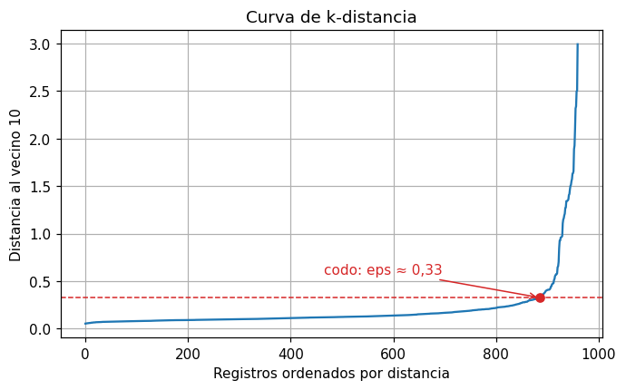

# Curva de k-distancia

La curva de k-distancia ayuda a elegir el radio `eps` de [DBSCAN](dbscan.md). Muestra, para cada
registro, qué tan lejos está su vecino número k: los registros en zonas densas tienen vecinos
cerca y los registros aislados, lejos.

## Cómo se construye

1. Fije `min_samples`, el mismo valor que usará en DBSCAN.
2. Para cada registro, calcule la distancia a su vecino número `min_samples`, contando el propio
   registro como el primero.
3. Ordene esas distancias de menor a mayor y grafíquelas.

## Cómo leerla

La curva suele ser plana al principio y subir con fuerza al final:

- Los registros de la **parte plana** están en zonas densas: su vecino número `min_samples` está
  cerca.
- Los de la **subida final** están aislados: son los candidatos a [ruido](../glosario.md#ruido).
- El **codo**, el punto donde la curva pasa de plana a empinada, marca la distancia que separa
  ambos casos. Ese valor es un buen punto de partida para `eps`.

El codo rara vez es nítido, así que úselo como valor inicial y pruebe valores cercanos. Si elige
un `eps` mucho menor que el codo, buena parte de los datos quedará como ruido; si elige uno mucho
mayor, los grupos se unirán en uno solo.

## Ejemplo del gráfico

Curva de k-distancia con `min_samples = 10` para un conjunto de datos sintético con tres zonas
densas y algunos registros dispersos:



Casi todos los registros tienen su décimo vecino a menos de 0,3 unidades: es la parte plana. Los
últimos 70 registros, aproximadamente, están mucho más lejos de sus vecinos y forman la subida.
El codo está cerca de 0,33, así que valores de `eps` entre 0,3 y 0,4 son un buen punto de
partida. La línea roja y la marca del codo se agregaron solo para la ilustración.

## Código: graficar la curva de k-distancia

```python
import numpy as np
import matplotlib.pyplot as plt
from sklearn.neighbors import NearestNeighbors

min_samples = 10

vecinos = NearestNeighbors(n_neighbors=min_samples).fit(X_esc)
distancias, _ = vecinos.kneighbors(X_esc)
distancia_k = np.sort(distancias[:, -1])

plt.plot(distancia_k)
plt.xlabel("Registros ordenados por distancia")
plt.ylabel(f"Distancia al vecino {min_samples}")
plt.title("Curva de k-distancia")
plt.grid(True)
plt.show()
```

- `X_esc` son las variables ya [escaladas](escalar-variables.md), las mismas que usará en DBSCAN.
- `min_samples` es el mismo valor que usará en DBSCAN.
- `kneighbors` devuelve, para cada registro, las distancias a sus `min_samples` vecinos más
  cercanos. Como se consulta con los mismos datos del ajuste, el primer vecino de cada registro
  es él mismo, a distancia 0.
- `distancias[:, -1]` toma la distancia al último de esos vecinos (el número `min_samples`) y
  `np.sort` las ordena de menor a mayor.
