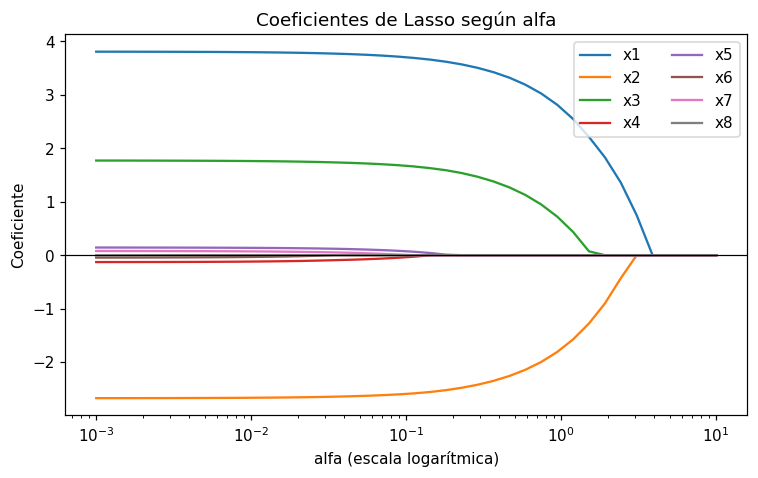

# Regresión Lasso

La regresión [Lasso](../glosario.md#lasso) es una [regresión lineal](regresion-lineal.md) con
[regularización](../glosario.md#regularizacion) L1: además de reducir el error, penaliza la suma
de los valores absolutos de los [coeficientes](../glosario.md#coeficiente):

\[
\min_\beta \sum_{i=1}^{n} (y_i - \hat{y}_i)^2 + \alpha \sum_{j=1}^{p} |\beta_j|
\]

- El primer término es la suma de los [residuos](../glosario.md#residuo) al cuadrado, el mismo
  que minimiza la regresión lineal.
- El segundo término es la **penalización**: crece con el tamaño de los coeficientes. El
  intercepto \( \beta_0 \) no se penaliza.
- \( \alpha \) (alfa) es un [hiperparámetro](../glosario.md#hiperparametro) que controla cuánto
  pesa la penalización.

En scikit-learn el primer término se divide por \( 2n \) (\( \frac{1}{2n} \sum (y_i - \hat{y}_i)^2 \)).
La idea es la misma, pero los valores de alfa de scikit-learn no son directamente comparables con
los de otras herramientas.

## Efecto de alfa

- **alfa = 0**: no hay penalización; el resultado es el de la regresión lineal.
- **alfa pequeño**: los coeficientes se reducen un poco.
- **alfa grande**: cada vez más coeficientes valen **exactamente 0**. Esas variables salen del
  modelo, por lo que Lasso hace **selección de variables**.

Al reducir los coeficientes, Lasso disminuye la varianza del modelo y ayuda contra el
[sobreajuste](../glosario.md#sobreajuste), a cambio de algo de sesgo (vea el
[compromiso sesgo-varianza](../glosario.md#compromiso-sesgo-varianza)).

!!! warning "Alfa demasiado grande"
    Con un alfa muy grande todos los coeficientes valen 0 y el modelo predice siempre la media
    de `y_train`: [subajuste](../glosario.md#subajuste). El [R²](r2.md) en prueba se acerca a 0
    (o queda negativo).

!!! warning "Estandarice antes de usar Lasso"
    La penalización depende del tamaño de los coeficientes, y este depende de las unidades de
    cada variable. Sin [estandarizar](estandarizar.md), Lasso elimina primero las variables con
    coeficientes pequeños solo por su escala, no por su importancia.

## Entrenar el modelo

```python
from sklearn.pipeline import make_pipeline
from sklearn.preprocessing import StandardScaler
from sklearn.linear_model import Lasso

modelo = make_pipeline(StandardScaler(), Lasso(alpha=0.1, max_iter=10000))
modelo.fit(X_train, y_train)
y_pred = modelo.predict(X_test)
```

- `X_train`, `y_train` son las variables y la [variable objetivo](../glosario.md#variable-objetivo)
  del [conjunto de entrenamiento](../glosario.md#conjunto-entrenamiento), y `X_test` las variables
  del [conjunto de prueba](../glosario.md#conjunto-prueba).
- `alpha=0.1` es el valor de alfa; cámbielo para probar otros.
- `max_iter=10000` aumenta el número de iteraciones del algoritmo de ajuste. Con el valor por
  defecto (1000), en ocasiones aparece una advertencia `ConvergenceWarning`.
- `make_pipeline` estandariza con la media y la desviación de `X_train` antes de entrenar y
  antes de predecir.

## Ver los coeficientes

```python
import pandas as pd

coef = pd.Series(modelo[-1].coef_, index=X_train.columns)
print(coef.sort_values())
print("Coeficientes en 0:", (coef == 0).sum())
```

- `modelo[-1]` es el último paso del pipeline, el `Lasso` entrenado; `coef_` tiene un
  coeficiente por columna de `X_train`.
- Los coeficientes están en la escala **estandarizada**: cada uno es el cambio en la predicción
  por cada desviación estándar de su variable (vea
  [interpretar los coeficientes](interpretar-coeficientes.md)).
- `(coef == 0).sum()` cuenta las variables que Lasso eliminó.

## Comparar varios valores de alfa

```python
import pandas as pd
from sklearn.metrics import r2_score, mean_absolute_error, mean_squared_error

alfas = [0.01, 0.1, 1, 10]
coeficientes = {}
resultados = []
for alfa in alfas:
    modelo = make_pipeline(StandardScaler(), Lasso(alpha=alfa, max_iter=10000))
    modelo.fit(X_train, y_train)
    y_pred = modelo.predict(X_test)
    coeficientes[alfa] = pd.Series(modelo[-1].coef_, index=X_train.columns)
    resultados.append({
        "alfa": alfa,
        "ceros": (modelo[-1].coef_ == 0).sum(),
        "R2": r2_score(y_test, y_pred),
        "MAE": mean_absolute_error(y_test, y_pred),
        "RMSE": mean_squared_error(y_test, y_pred) ** 0.5,
    })

print(pd.DataFrame(coeficientes).round(3))   # una columna por alfa
print(pd.DataFrame(resultados).round(3))     # una fila por alfa
```

- `alfas` es la lista de valores que quiere probar; `y_test` es la variable objetivo del conjunto
  de prueba.
- `coeficientes` guarda los coeficientes de cada alfa; al convertirlo en `DataFrame` queda una
  fila por variable y una columna por alfa.
- `resultados` guarda, para cada alfa, cuántos coeficientes valen 0 y las métricas
  [R²](r2.md), [MAE](mae.md) y [RMSE](rmse.md) en prueba (vea
  [comparar métricas](comparar-metricas.md)).

!!! tip "Elija alfa con validación, no con el conjunto de prueba"
    Si elige el alfa que mejor resultado da en `X_test`, el conjunto de prueba deja de ser una
    evaluación independiente. Use un [conjunto de validación](../glosario.md#conjunto-validacion)
    o la [validación cruzada](validacion-cruzada.md) para elegir alfa, y evalúe en prueba solo
    el modelo final. Pruebe valores en escala logarítmica, por ejemplo `np.logspace(-3, 1, 20)`.

## Ejemplo

Con 200 registros y 8 variables, de las cuales solo `x1`, `x2` y `x3` influyen en `y`:

```python
import numpy as np
import pandas as pd
import matplotlib.pyplot as plt
from sklearn.model_selection import train_test_split
from sklearn.pipeline import make_pipeline
from sklearn.preprocessing import StandardScaler
from sklearn.linear_model import Lasso
from sklearn.metrics import r2_score, mean_squared_error

rng = np.random.default_rng(0)
n = 200
X = pd.DataFrame(rng.normal(0, 1, (n, 8)), columns=[f"x{i}" for i in range(1, 9)])
y = 4 * X["x1"] - 3 * X["x2"] + 2 * X["x3"] + rng.normal(0, 1.5, n)   # solo x1, x2 y x3 importan

X_train, X_test, y_train, y_test = train_test_split(X, y, test_size=0.2, random_state=42)

alfas = np.logspace(-3, 1, 40)
coeficientes = {}
for alfa in alfas:
    modelo = make_pipeline(StandardScaler(), Lasso(alpha=alfa, max_iter=10000))
    modelo.fit(X_train, y_train)
    coeficientes[alfa] = pd.Series(modelo[-1].coef_, index=X.columns)
coeficientes = pd.DataFrame(coeficientes).T     # una fila por alfa, una columna por variable

resultados = []
for alfa in [0.01, 0.1, 0.5, 1, 3]:
    modelo = make_pipeline(StandardScaler(), Lasso(alpha=alfa, max_iter=10000))
    modelo.fit(X_train, y_train)
    coef = pd.Series(modelo[-1].coef_, index=X.columns)
    y_pred = modelo.predict(X_test)
    resultados.append({
        "alfa": alfa,
        "ceros": (coef == 0).sum(),
        "R2_test": r2_score(y_test, y_pred),
        "RMSE_test": mean_squared_error(y_test, y_pred) ** 0.5,
    })
print(pd.DataFrame(resultados).round(3))

coeficientes.plot(logx=True, figsize=(8, 4.5))
plt.axhline(0, color="black", linewidth=0.8)
plt.xlabel("alfa (escala logarítmica)")
plt.ylabel("Coeficiente")
plt.title("Coeficientes de Lasso según alfa")
plt.legend(ncol=2)
plt.show()
```

Salida:

```text
   alfa  ceros  R2_test  RMSE_test
0  0.01      1    0.902      1.547
1  0.10      2    0.901      1.560
2  0.50      5    0.874      1.757
3  1.00      5    0.793      2.253
4  3.00      7    0.198      4.433
```



- Con alfa pequeño (izquierda del gráfico) los coeficientes son cercanos a los reales (4, −3 y 2)
  y las variables sin efecto tienen coeficientes pequeños pero distintos de 0.
- Entre alfa = 0,1 y 0,5 los coeficientes de `x4` a `x8` llegan a **exactamente 0**: con alfa = 0,5
  quedan 5 ceros y el modelo usa solo `x1`, `x2` y `x3`, con un R² en prueba de 0,87, casi igual
  al del modelo con todas las variables.
- Si alfa sigue creciendo, Lasso también reduce las variables importantes: con alfa = 3 quedan 7
  ceros, el RMSE se triplica y el R² cae a 0,20 (subajuste). Por encima de alfa ≈ 4 todos los
  coeficientes valen 0.

Compare con [Ridge](ridge.md), que reduce los coeficientes sin llevarlos a 0.
