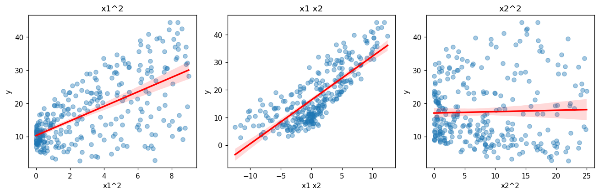

# Revisar la linealidad de los términos polinomiales

Una [regresión polinomial](regresion-polinomial.md) sigue siendo un modelo lineal: supone una
relación **lineal** entre cada término nuevo (al cuadrado o de
[interacción](../glosario.md#termino-interaccion)) y la
[variable objetivo](../glosario.md#variable-objetivo). Antes de confiar en esos términos,
revise con un [gráfico de dispersión](grafico-dispersion.md) si cada uno muestra una tendencia
con `y`.

## Graficar cada término nuevo contra la variable objetivo

```python
import pandas as pd
import matplotlib.pyplot as plt
import seaborn as sns
from sklearn.preprocessing import PolynomialFeatures

continuas = ["columna1", "columna2", "columna3"]
poly = PolynomialFeatures(degree=2, include_bias=False)
terminos = pd.DataFrame(poly.fit_transform(X_train[continuas]),
                        columns=poly.get_feature_names_out(), index=X_train.index)
nuevos = [c for c in terminos.columns if c not in continuas]

fig, axes = plt.subplots(1, len(nuevos), figsize=(4 * len(nuevos), 4))
for ax, columna in zip(axes, nuevos):
    sns.regplot(x=terminos[columna], y=y_train, ax=ax,
                scatter_kws={"alpha": 0.4}, line_kws={"color": "red"})
    ax.set_title(columna)
plt.tight_layout()
plt.show()
```

- `terminos` contiene las columnas originales y los términos generados por `PolynomialFeatures`,
  con sus nombres (`'columna1^2'`, `'columna1 columna2'`, etc.).
- `nuevos` conserva solo los términos generados: los que no estaban en `continuas`.
- `sns.regplot` dibuja los puntos de cada término contra `y_train` y la recta de tendencia.
- Use `X_train` y `y_train`: la revisión se hace con los datos de entrenamiento.
- Con muchos términos, una sola fila queda muy ancha: use una cuadrícula, por ejemplo
  `plt.subplots(2, 3, ...)`, y recorra `axes.flat`.

## Medir la relación con la correlación

Con muchos términos, calcule además la [correlación](correlacion.md) de cada columna con la
variable objetivo y ordénelas por su valor absoluto:

```python
print(terminos.corrwith(y_train).round(3).sort_values(key=abs, ascending=False))
```

`corrwith` calcula la correlación de cada columna de `terminos` con `y_train`.
`sort_values(key=abs, ...)` ordena por la magnitud, sin importar el signo.

## Cómo leerlo

| Lo que se observa | Interpretación |
|-------------------|----------------|
| Los puntos siguen la recta, con una nube angosta | El término tiene una relación lineal con `y`: **aporta** al modelo |
| La correlación del término es mayor que la de las variables originales | El término describe mejor la relación que la variable sola |
| Nube sin dirección, recta casi horizontal, correlación cercana a 0 | El término **aporta poco** y solo agrega complejidad |
| Los puntos forman una curva alrededor de la recta | La relación sigue sin ser lineal: puede requerir otro grado o una transformación |

!!! warning "Los términos están relacionados con las variables originales"
    `columna1^2` y `columna1 columna2` se calculan a partir de `columna1`, por lo que suelen
    estar correlacionados con ella. Un término puede parecer útil solo porque repite la
    información de la variable original. Compare siempre su gráfico y su correlación con los de
    las variables originales.

## Ejemplo

Con 300 registros en los que `y` depende de `x1` al cuadrado y de la interacción entre `x1` y
`x2`:

```python
import numpy as np
import pandas as pd
import matplotlib.pyplot as plt
import seaborn as sns
from sklearn.preprocessing import PolynomialFeatures

rng = np.random.default_rng(0)
n = 300
X = pd.DataFrame({
    "x1": rng.uniform(-3, 3, n),
    "x2": rng.uniform(0, 5, n),
})
y = 10 + 2 * X["x1"] ** 2 + 1.5 * X["x1"] * X["x2"] + rng.normal(0, 2, n)

continuas = ["x1", "x2"]
poly = PolynomialFeatures(degree=2, include_bias=False)
terminos = pd.DataFrame(poly.fit_transform(X[continuas]),
                        columns=poly.get_feature_names_out(), index=X.index)
nuevos = [c for c in terminos.columns if c not in continuas]
print(nuevos)

print(terminos.corrwith(y).round(3).sort_values(key=abs, ascending=False))

fig, axes = plt.subplots(1, len(nuevos), figsize=(4 * len(nuevos), 4))
for ax, columna in zip(axes, nuevos):
    sns.regplot(x=terminos[columna], y=y, ax=ax,
                scatter_kws={"alpha": 0.4}, line_kws={"color": "red"})
    ax.set_xlabel(columna)
    ax.set_ylabel("y")
    ax.set_title(columna)
plt.tight_layout()
plt.show()
```

Salida:

```text
['x1^2', 'x1 x2', 'x2^2']
x1 x2    0.800
x1       0.728
x1^2     0.628
x2^2     0.030
x2       0.017
dtype: float64
```



- **`x1 x2`:** los puntos siguen de cerca la recta y su correlación (0,80) es la más alta, mayor
  que la de `x1` (0,73) y la de `x2` (0,02). El término de interacción aporta información que las
  variables originales no muestran por separado.
- **`x1^2`:** la tendencia es creciente (correlación de 0,63), aunque la nube es más ancha porque
  `y` también depende de `x1 x2`. El término aporta.
- **`x2^2`:** la recta es casi horizontal y la correlación es 0,03: este término no aporta y solo
  agrega una columna más al modelo.
