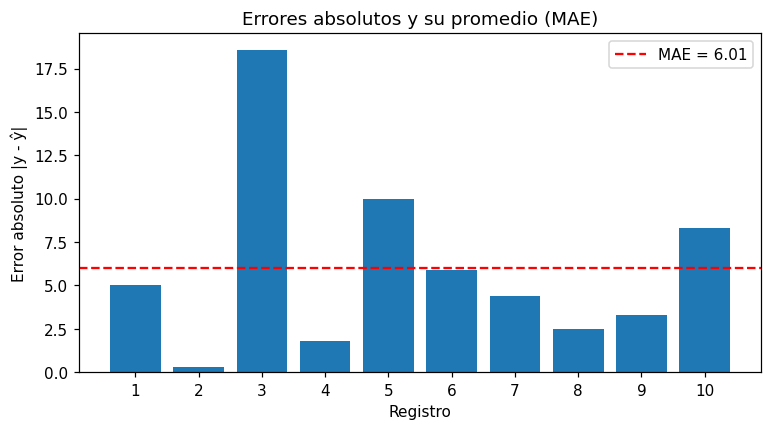

# Error absoluto medio (MAE)

El [MAE](../glosario.md#mae) mide cuánto se equivoca el modelo en promedio, sin importar si el
error es por encima o por debajo del valor real.

## Fórmula

\[
\text{MAE} = \frac{1}{n} \sum_i |y_i - \hat{y}_i|
\]

\( y_i \) es el valor real, \( \hat{y}_i \) la predicción y \( n \) la cantidad de registros. Se
toma el valor absoluto de cada [residuo](../glosario.md#residuo) para que los errores positivos
y negativos no se cancelen.

## Calcularlo

```python
from sklearn.metrics import mean_absolute_error

mae = mean_absolute_error(y_test, y_pred)
```

`y_test` son los valores reales del [conjunto de prueba](../glosario.md#conjunto-prueba) y
`y_pred` las predicciones del modelo para esos mismos registros, por ejemplo
`y_pred = modelo.predict(X_test)` (vea [regresión lineal](regresion-lineal.md)).

## Cómo interpretarlo

- **Rango**: va de 0 (predicciones perfectas) hacia arriba, sin límite. Menor es mejor.
- **Unidades**: las mismas de la [variable objetivo](../glosario.md#variable-objetivo). Si
  predice un precio en millones, un MAE de 2 significa que el modelo se equivoca en unos
  2 millones en promedio.
- **Errores grandes**: cada error pesa en proporción a su tamaño, así que el MAE es menos
  sensible a unos pocos errores muy grandes que el [RMSE](rmse.md). Siempre se cumple
  RMSE ≥ MAE.
- **Comparación con el R²**: el [R²](r2.md) dice qué proporción de la variabilidad explica el
  modelo; el MAE dice cuánto se equivoca en unidades reales. Conviene reportar ambos.

!!! tip "Juzgue el error según el contexto"
    Un MAE de 10 puede ser excelente si la variable objetivo vale miles y pésimo si vale entre 0
    y 20. Compárelo con la media, la desviación estándar o el rango de `y`, por ejemplo con
    `y.describe()`. Si el MAE es parecido a la desviación estándar de `y`, el modelo apenas
    mejora a predecir siempre la media.

## Ejemplo

Con 10 valores reales y sus predicciones:

```python
import numpy as np
import matplotlib.pyplot as plt
from sklearn.metrics import mean_absolute_error

rng = np.random.default_rng(0)
y_test = rng.uniform(100, 200, 10).round(1)
y_pred = (y_test + rng.normal(0, 8, 10)).round(1)

errores = np.abs(y_test - y_pred)
mae = mean_absolute_error(y_test, y_pred)
print(f"MAE: {mae:.2f}")
print(f"Media de y_test: {y_test.mean():.2f}")
print(f"MAE relativo a la media: {mae / y_test.mean():.1%}")

plt.figure(figsize=(8, 4))
plt.bar(range(1, 11), errores)
plt.axhline(mae, color="red", linestyle="--", label=f"MAE = {mae:.2f}")
plt.xticks(range(1, 11))
plt.xlabel("Registro")
plt.ylabel("Error absoluto |y - ŷ|")
plt.title("Errores absolutos y su promedio (MAE)")
plt.legend()
plt.show()
```

Salida:

```text
MAE: 6.01
Media de y_test: 155.06
MAE relativo a la media: 3.9%
```



`errores` contiene el error absoluto de cada registro y `mae` su promedio. Cada barra es un
error y la línea roja es el MAE: el modelo se equivoca en unas 6 unidades en promedio, cerca del
4 % del valor medio de `y_test`. El registro 3 tiene un error de más de 18, pero en el MAE pesa
lo mismo que tres errores de 6.
