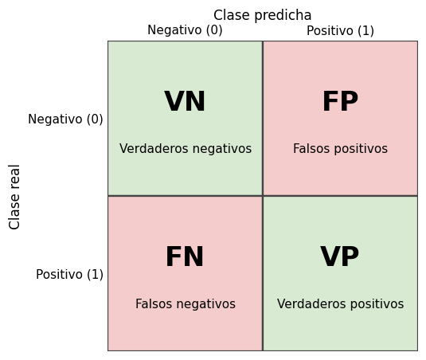

# Matriz de confusión

La [matriz de confusión](../glosario.md#matriz-confusion) cuenta, para un problema de
[clasificación](../glosario.md#clasificacion), cuántos registros de cada clase real fueron
asignados a cada clase predicha. Es el punto de partida de casi todas las métricas de
clasificación: [exactitud](exactitud.md), [precisión](precision.md),
[sensibilidad](sensibilidad.md) y [F1](f1.md).

## Las cuatro casillas

En una clasificación binaria, con la clase **positiva** (1) como la que interesa detectar, la
matriz tiene cuatro casillas:

| | Predicho negativo (0) | Predicho positivo (1) |
|---|---|---|
| **Real negativo (0)** | VN: verdaderos negativos | FP: falsos positivos |
| **Real positivo (1)** | FN: falsos negativos | VP: verdaderos positivos |

{ width="420" }

- **VP**: registros positivos que el modelo predijo como positivos (aciertos).
- **VN**: registros negativos que el modelo predijo como negativos (aciertos).
- **FP**: registros negativos que el modelo predijo como positivos (falsas alarmas).
- **FN**: registros positivos que el modelo predijo como negativos (casos que se le escaparon).

Las filas corresponden a la clase real y las columnas a la clase predicha. Es la convención de
scikit-learn; otras fuentes usan la transpuesta, así que revise siempre los rótulos de los ejes.

## Calcularla

```python
from sklearn.metrics import confusion_matrix

y_pred = modelo.predict(X_val)
matriz = confusion_matrix(y_val, y_pred)
vn, fp, fn, vp = matriz.ravel()
```

`modelo` es un clasificador ya entrenado (por ejemplo una
[regresión logística](regresion-logistica.md), un [árbol de decisión](arbol-decision.md) o un
[KNN](knn.md)), `X_val` y `y_val` son las variables y la clase real del
[conjunto de validación](../glosario.md#conjunto-validacion), y `y_pred` las clases predichas
para esos mismos registros. `matriz.ravel()` devuelve las cuatro casillas en el orden VN, FP,
FN, VP cuando las clases son 0 y 1. Primero van los valores reales y después las predicciones.

## Graficarla

```python
import matplotlib.pyplot as plt
from sklearn.metrics import ConfusionMatrixDisplay

fig, axes = plt.subplots(1, 2, figsize=(10, 4))
ConfusionMatrixDisplay.from_predictions(y_val, y_pred, ax=axes[0])
axes[0].set_title("Conteos")
ConfusionMatrixDisplay.from_predictions(y_val, y_pred, normalize="true", ax=axes[1])
axes[1].set_title("Proporción por clase real")
plt.tight_layout()
plt.show()
```

Con `normalize="true"` cada fila se divide por su total, de modo que cada casilla muestra la
proporción de registros de esa clase real que cayó en cada predicción. La diagonal de la matriz
normalizada es la [sensibilidad](sensibilidad.md) de cada clase.

## Cómo interpretarla

- **La diagonal son los aciertos** (VN y VP); todo lo que está fuera de ella son errores.
- **Mire los conteos y las proporciones**: con
  [desbalance de clases](../glosario.md#desbalance-de-clases), la matriz de conteos puede verse
  bien solo porque la clase mayoritaria domina. La matriz normalizada muestra si el modelo
  reconoce también la clase minoritaria.
- **Un modelo que siempre predice la misma clase** deja una columna entera en cero. Es una señal
  clara de que el modelo no aprendió a distinguir las clases.
- **Los dos tipos de error no cuestan lo mismo**: cuál es peor depende del problema. Si el
  positivo es "el cliente se va a ir", un FN es un cliente que se pierde sin haber intentado
  retenerlo, mientras que un FP es una oferta de retención enviada a alguien que se iba a quedar.
  Si perder un cliente cuesta mucho más que la oferta, conviene reducir los FN aunque aumenten
  los FP; en ese caso importa más la [sensibilidad](sensibilidad.md). Si cada alarma falsa es
  costosa, importa más la [precisión](precision.md).
- **La matriz depende del [umbral de decisión](../glosario.md#umbral-decision)**: `predict`
  usa por defecto un umbral de 0,5 sobre la probabilidad de la clase positiva. Al cambiar el
  umbral, los registros se mueven entre casillas (vea [curva ROC](curva-roc.md) y
  [curva de precisión-sensibilidad](curva-precision-sensibilidad.md)).

!!! tip "Compare la matriz de entrenamiento con la de validación"
    Si la matriz del [conjunto de entrenamiento](../glosario.md#conjunto-entrenamiento) casi no
    tiene errores y la de validación tiene muchos, el modelo presenta
    [sobreajuste](../glosario.md#sobreajuste) (vea [comparar métricas](comparar-metricas.md)).
