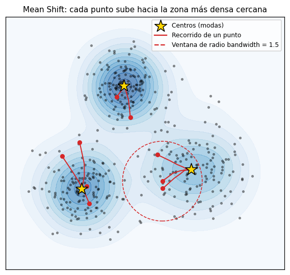

# Mean Shift

[Mean Shift](../glosario.md#mean-shift) es un método de [agrupación](../glosario.md#agrupacion)
basado en densidad. Imagine los datos como un terreno cuya altura es la densidad de registros:
cada registro «sube» paso a paso hacia la cima más cercana, es decir, hacia la zona más densa de
su entorno. Los registros que terminan en la misma cima (una **moda** de la densidad) forman un
grupo. Por eso se dice que Mean Shift **busca modas**. El número de grupos no se indica: resulta
del número de cimas que encuentra.

## Cómo funciona

1. Alrededor de cada punto de partida se dibuja una ventana de radio `bandwidth`.
2. El punto se mueve al **promedio** de los registros que caen dentro de la ventana. Como hay más
   registros del lado más denso, el promedio queda desplazado hacia allí (de ahí el nombre:
   *mean shift*, desplazamiento de la media).
3. Se repite el paso 2 hasta que el punto deja de moverse: ha llegado a una moda.
4. Las modas muy cercanas entre sí se fusionan. Cada moda final es el **centro** de un grupo y
   cada registro se asigna al centro más cercano.



!!! warning "Escale antes de agrupar"
    `bandwidth` es una distancia, así que el resultado depende de la escala de las variables.
    [Escale las variables](escalar-variables.md) (por ejemplo, con
    [estandarización](../glosario.md#estandarizacion)) antes de usar Mean Shift. En esta página,
    `X_esc` son los datos ya escalados.

## El hiperparámetro `bandwidth`

`bandwidth` es el radio de la ventana y es el [hiperparámetro](../glosario.md#hiperparametro) que
más influye en el resultado:

| `bandwidth` | Qué ve la ventana | Resultado |
|-------------|-------------------|-----------|
| Pequeño | Solo detalles locales de la densidad | Muchos grupos, algunos diminutos |
| Grande | La forma general de los datos | Pocos grupos; con un valor muy grande, uno solo |

En lugar de adivinar el valor, scikit-learn lo estima con `estimate_bandwidth`, que calcula la
distancia típica entre cada registro y sus vecinos. El argumento `quantile` (entre 0 y 1) indica
qué fracción de los registros se considera vecina: un `quantile` bajo da un `bandwidth` pequeño
(más grupos) y uno alto, un `bandwidth` grande (menos grupos). Un valor de partida habitual es
`quantile=0.2`; pruebe varios y compare.

## Ventajas y limitaciones

**Ventajas:**

- No necesita el número de grupos.
- Tiene un solo hiperparámetro, que además se puede estimar a partir de los datos.
- Los centros (`cluster_centers_`) son las zonas más densas de cada grupo, útiles para
  describirlos.

**Limitaciones:**

- Es **lento**: en cada paso calcula distancias entre puntos, así que el tiempo crece rápido con
  el número de registros y de variables. `bin_seeding=True` lo acelera mucho, porque en lugar de
  partir de cada registro parte de una cuadrícula de puntos semilla.
  `estimate_bandwidth` también es costoso; `n_samples` limita cuántos registros usa para la
  estimación.
- Como DBSCAN, usa una sola ventana para todos los datos: con grupos de densidades muy distintas,
  un mismo `bandwidth` no sirve bien para todos. En muchas dimensiones, las distancias pierden
  contraste y el método funciona peor.
- A diferencia de [DBSCAN](dbscan.md) y [HDBSCAN](hdbscan.md), asigna **todos** los registros a
  un grupo: no marca [ruido](../glosario.md#ruido). Los [valores atípicos](../glosario.md#outlier)
  pueden terminar formando grupos de uno o dos registros.

## Comparar varios valores de `bandwidth`

Pruebe varios valores de `quantile` y registre para cada uno:

- el `bandwidth` estimado;
- el número de grupos y el tamaño de cada uno;
- el [coeficiente de silueta](silueta.md) (más alto es mejor) y el
  [índice de Davies-Bouldin](davies-bouldin.md) (más bajo es mejor).

Descarte los valores que producen un solo grupo o muchos grupos diminutos, aunque sus métricas
se vean bien. Si varios valores consecutivos de `quantile` dan el mismo número de grupos, esa
solución es estable y suele ser una buena elección. Como en Mean Shift cada grupo tiene un
centro, también puede calcular la [inercia](inercia.md), pero no la use para elegir `bandwidth`:
siempre baja al aumentar el número de grupos.

## Código: agrupar con Mean Shift

```python
import pandas as pd
from sklearn.cluster import MeanShift, estimate_bandwidth

bandwidth = estimate_bandwidth(X_esc, quantile=0.2, n_samples=2000, random_state=42)

modelo = MeanShift(bandwidth=bandwidth, bin_seeding=True)
etiquetas = modelo.fit_predict(X_esc)

print(f"bandwidth = {bandwidth:.3f}, grupos: {len(modelo.cluster_centers_)}")
print(pd.Series(etiquetas).value_counts().sort_index())
```

- `X_esc` son las variables ya [escaladas](escalar-variables.md).
- `quantile` controla el tamaño de la ventana: más bajo, más grupos.
- `n_samples=2000` estima el `bandwidth` con una muestra de 2000 registros para que sea más
  rápido; `random_state=42` hace que esa muestra sea siempre la misma.
- `bin_seeding=True` acelera el ajuste usando una cuadrícula de puntos semilla.
- `etiquetas` tiene el número de grupo (0, 1, 2, …) de cada registro y `value_counts()` muestra
  cuántos registros hay en cada grupo.

## Código: ver los centros en las unidades originales

```python
import pandas as pd

centros = pd.DataFrame(
    escalador.inverse_transform(modelo.cluster_centers_),
    columns=columnas,
)
print(centros.round(2))
```

- `modelo.cluster_centers_` tiene una fila por grupo con las coordenadas de su centro, en la
  escala de `X_esc`.
- `escalador` es el escalador con el que obtuvo `X_esc`; `inverse_transform` devuelve los centros
  a las unidades originales para poder leerlos.
- `columnas` es la lista con los nombres de las variables, en el mismo orden que en `X_esc`.

## Código: comparar varios valores de `quantile`

```python
import numpy as np
import pandas as pd
from sklearn.cluster import MeanShift, estimate_bandwidth
from sklearn.metrics import silhouette_score, davies_bouldin_score

cuantiles = [0.05, 0.1, 0.2, 0.3, 0.5]

resultados = []
for q in cuantiles:
    bandwidth = estimate_bandwidth(X_esc, quantile=q, n_samples=2000, random_state=42)
    etiquetas = MeanShift(bandwidth=bandwidth, bin_seeding=True).fit_predict(X_esc)
    tamanos = pd.Series(etiquetas).value_counts()
    fila = {
        "quantile": q,
        "bandwidth": bandwidth,
        "n_grupos": len(tamanos),
        "tamanos": tamanos.tolist(),
        "silueta": np.nan,
        "davies_bouldin": np.nan,
    }
    if len(tamanos) >= 2:
        fila["silueta"] = silhouette_score(X_esc, etiquetas)
        fila["davies_bouldin"] = davies_bouldin_score(X_esc, etiquetas)
    resultados.append(fila)

tabla = pd.DataFrame(resultados)
print(tabla.round(3))
```

- `cuantiles` son los valores de `quantile` a probar.
- `tamanos` es la lista con el número de registros de cada grupo, de mayor a menor.
- `silueta` y `davies_bouldin` quedan vacías (`NaN`) cuando hay un solo grupo, porque esas
  métricas necesitan al menos dos.
- `tabla` tiene una fila por valor de `quantile`. Con muchos registros, este ciclo puede tardar
  varios minutos.

Para describir los grupos de la configuración elegida, vea
[interpretar grupos](interpretar-grupos.md).
