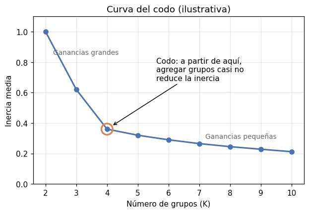

# Método del codo

El [método del codo](../glosario.md#metodo-codo) ayuda a elegir el número de grupos \( K \) de
un algoritmo de [agrupación](../glosario.md#agrupacion). Consiste en agrupar los datos con
varios valores de \( K \), calcular la [inercia](inercia.md) (o la inercia media) de cada
resultado y graficarla contra \( K \). El valor elegido es el «codo» de la curva: el punto a
partir del cual agregar más grupos casi no mejora la compacidad.

Sirve para cualquier algoritmo en el que usted fije el número de grupos (K-medias, K-medianas,
K-medoides, agrupamiento aglomerativo) y, en general, para cualquier
[hiperparámetro](../glosario.md#hiperparametro) que cambie el número de grupos resultantes.

## Por qué funciona

La inercia siempre baja al agregar grupos (vea [inercia media](inercia.md)), así que no sirve
buscar su valor mínimo. Lo que cambia es **cuánto** baja:

- Mientras \( K \) es menor que el número real de grupos, cada grupo nuevo separa puntos que
  estaban mezclados y la inercia **cae con fuerza**.
- Cuando \( K \) supera el número real de grupos, cada grupo nuevo solo parte en dos un grupo
  que ya era compacto y la inercia **baja poco**.

El codo es el punto donde se pasa de la primera situación a la segunda.

{ width="520" }

En esta curva ilustrativa, la inercia media cae mucho de \( K = 2 \) a \( K = 4 \) y después
apenas cambia: el codo está en \( K = 4 \).

## Cómo leer la curva

- **Busque el cambio de pendiente**, no el valor más bajo: el codo es el último valor de
  \( K \) antes de que la curva se vuelva casi plana.
- **Use la inercia media** si va a comparar curvas de algoritmos distintos o de datos con
  distinto número de registros; la forma de la curva es la misma que con la inercia total.
- **Calcule la inercia sobre los datos escalados** (vea [escalar variables](escalar-variables.md)).

!!! warning "El codo es subjetivo"
    Muchas curvas bajan de forma suave, sin un quiebre claro, y dos personas pueden ver el codo en
    valores distintos. Por eso el método del codo no debe ser el único criterio: combínelo con el
    [coeficiente de silueta](silueta.md) y el [índice de Davies-Bouldin](davies-bouldin.md), que
    tienen un óptimo claro (máximo y mínimo, respectivamente), y con la utilidad práctica de los
    grupos.

## Cómo usarlo para elegir

1. Agrupe los datos con \( K = 2, 3, \dots, 10 \).
2. Calcule la inercia (o la inercia media) de cada resultado y grafíquela contra \( K \).
3. Identifique uno o dos valores candidatos donde la curva se aplana.
4. Entre los candidatos, prefiera el que tenga mejor [silueta](silueta.md) y mejor
   [Davies-Bouldin](davies-bouldin.md), y cuyos grupos tengan sentido para el problema.

El código de abajo usa `KMeans`, cuyo atributo `inertia_` da la inercia directamente. Con otros
algoritmos, `inertia_` no existe o no se calcula igual (vea [inercia media](inercia.md)): en
cada vuelta obtenga las etiquetas con el algoritmo que esté usando y calcule la inercia media a
partir de ellas.

En DBSCAN y HDBSCAN el número de grupos no se fija directamente; si quiere una curva parecida,
recorra los valores de su hiperparámetro principal en lugar de \( K \) (vea [DBSCAN](dbscan.md) y
[HDBSCAN](hdbscan.md)).

## Código: curva del codo con KMeans

```python
import matplotlib.pyplot as plt
from sklearn.cluster import KMeans

valores_k = range(2, 11)
inercias = []
for k in valores_k:
    modelo = KMeans(n_clusters=k, n_init=10, random_state=42)
    modelo.fit(X_esc)
    inercias.append(modelo.inertia_)

plt.plot(valores_k, inercias, marker="o")
plt.xlabel("Número de grupos (K)")
plt.ylabel("Inercia")
plt.show()
```

- `X_esc` son los datos ya escalados.
- `valores_k` son los números de grupos a probar, de 2 a 10.
- En cada vuelta se entrena un `KMeans` con `k` grupos y se guarda su `inertia_` en la lista
  `inercias` (vea [K-medias](k-medias.md)).
- `marker="o"` dibuja un punto en cada valor de \( K \) para ubicar el codo con facilidad.
