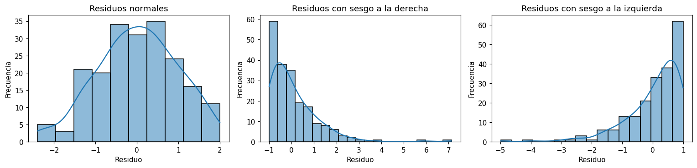

# Normalidad de los residuos

La [regresión lineal](regresion-lineal.md) supone que los [residuos](../glosario.md#residuo)
siguen una [distribución](../glosario.md#distribucion) normal. Este supuesto es necesario para
que los intervalos de confianza y los [valores p](../glosario.md#valor-p) de los coeficientes
sean válidos. Revíselo con un histograma y con una prueba estadística de
[normalidad](../glosario.md#normalidad).

## Histograma de los residuos

```python
import matplotlib.pyplot as plt
import seaborn as sns

residuos = y_test - y_pred

sns.histplot(residuos, kde=True)
plt.xlabel("Residuo")
plt.ylabel("Frecuencia")
plt.show()
```

`y_test` son los valores reales del [conjunto de prueba](../glosario.md#conjunto-prueba) y
`y_pred` las predicciones del modelo para ese conjunto. `kde=True` superpone una curva suavizada
de la distribución, que facilita ver su forma. Vea más opciones en
[histograma](histograma.md).

## Cómo interpretarlo

| Forma del histograma | Qué indica |
|----------------------|------------|
| Campana simétrica centrada en 0 | Residuos aproximadamente normales |
| Cola larga hacia la derecha | [Sesgo](../glosario.md#sesgo) a la derecha: hay errores grandes en la dirección positiva, es decir, el modelo subestima el valor real en algunos casos |
| Cola larga hacia la izquierda | [Sesgo](../glosario.md#sesgo) a la izquierda: hay errores grandes en la dirección negativa, es decir, el modelo sobreestima el valor real en algunos casos |
| Pico muy alto y colas largas en ambos lados | Colas pesadas: hay más errores extremos de los que permite la normal |
| Dos picos | Puede haber dos grupos de datos que el modelo trata igual (por ejemplo, una [variable categórica](../glosario.md#variable-categorica) que falta en el modelo) |
| Algunas barras aisladas lejos del resto | [Valores atípicos](../glosario.md#outlier) en los residuos |

Cuando los residuos tienen sesgo, transformar la
[variable objetivo](../glosario.md#variable-objetivo) (por ejemplo con `np.log1p`) suele
acercarlos a la normalidad.

## Ejemplo

Con tres conjuntos de 200 residuos sintéticos, uno normal, otro con sesgo a la derecha y otro con
sesgo a la izquierda:

```python
import numpy as np
import matplotlib.pyplot as plt
import seaborn as sns
from scipy import stats

rng = np.random.default_rng(0)
casos = {
    "Residuos normales": rng.normal(0, 1, 200),
    "Residuos con sesgo a la derecha": rng.exponential(1, 200) - 1,
    "Residuos con sesgo a la izquierda": 1 - rng.exponential(1, 200),
}

fig, axes = plt.subplots(1, 3, figsize=(14, 3.5))
for ax, (titulo, residuos) in zip(axes, casos.items()):
    sns.histplot(residuos, kde=True, ax=ax)
    ax.set_title(titulo)
    ax.set_xlabel("Residuo")
    ax.set_ylabel("Frecuencia")
    _, p_shapiro = stats.shapiro(residuos)
    _, p_dagostino = stats.normaltest(residuos)
    print(f"{titulo}: Shapiro-Wilk p = {p_shapiro:.4f} | D'Agostino-Pearson p = {p_dagostino:.4f}")
plt.tight_layout()
plt.show()
```

```text
Residuos normales: Shapiro-Wilk p = 0.1255 | D'Agostino-Pearson p = 0.2546
Residuos con sesgo a la derecha: Shapiro-Wilk p = 0.0000 | D'Agostino-Pearson p = 0.0000
Residuos con sesgo a la izquierda: Shapiro-Wilk p = 0.0000 | D'Agostino-Pearson p = 0.0000
```



El primer histograma tiene forma de campana alrededor de 0 y las dos pruebas dan
\( p \geq 0{,}05 \): no hay evidencia en contra de la normalidad. El segundo concentra los
residuos cerca de −1 y tiene una cola larga hacia la derecha: hay algunos errores grandes en la
dirección positiva, es decir, casos en los que el modelo subestima el valor real. El tercero es su
imagen en espejo: concentra los residuos cerca de 1 y tiene una cola larga hacia la izquierda, con
errores grandes en la dirección negativa, es decir, casos en los que el modelo sobreestima el valor
real. En los dos casos con sesgo las pruebas dan \( p < 0{,}05 \), así que se rechaza la
normalidad.
