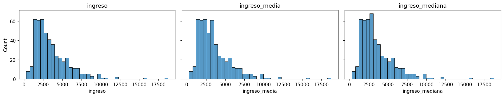

# Revisar y tratar nulos

**Dimensión de calidad: completitud.** Un [valor nulo](../glosario.md#valor-nulo) es un dato
faltante. En pandas aparece como `NaN`.

## Revisar

```python
df.isna().sum()            # cantidad de nulos por columna
df.isna().mean() * 100     # porcentaje de nulos por columna
df[df["columna"].isna()]   # filas con nulo en una columna
```

`columna` es el nombre de la columna que quiere revisar.

## Tratar

La estrategia depende de la proporción de nulos:

| Nulos en la columna | Estrategia |
|---------------------|------------|
| Menos del 5 % | **Imputar**: reemplazar cada nulo por un valor representativo |
| Demasiados (la columna aporta poca información) | **Eliminar** la columna o los registros |

### Imputar con la media o la mediana

```python
df["columna_media"] = df["columna"].fillna(df["columna"].mean())       # media
df["columna_mediana"] = df["columna"].fillna(df["columna"].median())   # mediana
df["columna_categorica"] = df["columna_categorica"].fillna(df["columna_categorica"].mode()[0])  # moda
```

- La **media** conserva el promedio de la columna, pero en distribuciones con
  [sesgo](../glosario.md#sesgo) cae lejos de la mayoría de los datos y desplaza la mediana.
- La **mediana** conserva el valor central y no se ve afectada por los
  [valores atípicos](../glosario.md#outlier), pero cambia el promedio.
- En las dos, todos los nulos reciben el mismo valor: la distribución gana un pico en ese
  punto y la desviación estándar disminuye.
- Las variables categóricas se imputan con la **moda** (la categoría más frecuente).

Guarde cada opción en una columna nueva y vuelva a graficar el [histograma](histograma.md) y el
[gráfico de cajas](grafico-cajas.md) para comparar el efecto antes de decidir.

### Eliminar

```python
df = df.drop(columns=["columna"])      # elimina la columna completa
df = df.dropna(subset=["columna"])     # elimina los registros con nulo en esa columna
```

## Ejemplo

Con un dataset de 500 ingresos en el que faltan 20 valores (4 %):

```python
import numpy as np
import pandas as pd
import matplotlib.pyplot as plt
import seaborn as sns

rng = np.random.default_rng(0)
df = pd.DataFrame({"ingreso": rng.lognormal(8, 0.6, 500)})
df.loc[rng.choice(500, 20, replace=False), "ingreso"] = np.nan   # 4 % de nulos

df["ingreso_media"] = df["ingreso"].fillna(df["ingreso"].mean())
df["ingreso_mediana"] = df["ingreso"].fillna(df["ingreso"].median())

fig, axes = plt.subplots(1, 3, figsize=(15, 3), sharey=True)
for ax, columna in zip(axes, ["ingreso", "ingreso_media", "ingreso_mediana"]):
    sns.histplot(df[columna], bins=40, ax=ax)
    ax.set_title(columna)
plt.tight_layout()
plt.show()
```



Cada imputación agrega un pico en un punto distinto: cerca de 3.500 con la media y cerca de
2.900 con la mediana. Como `ingreso` tiene sesgo a la derecha, la media queda por encima de la
mayoría de los datos. Compare también `df[["ingreso", "ingreso_media", "ingreso_mediana"]].describe()`.
