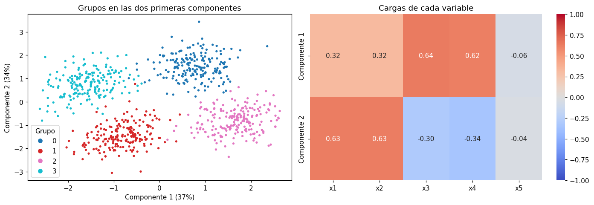

# Componentes principales (PCA)

El análisis de componentes principales (PCA, por sus siglas en inglés) resume muchas variables
en unas pocas variables nuevas, las **componentes principales**. Su uso más común es dibujar en
un plano datos que tienen muchas dimensiones, por ejemplo, para ver si los grupos de una
[agrupación](../glosario.md#agrupacion) se separan.

## Cómo funciona

- Cada componente es una **combinación lineal** de las variables originales: una suma ponderada
  de todas ellas.
- La **primera componente** es la dirección en la que los datos varían más; la **segunda**, la
  dirección de mayor variación que es perpendicular a la primera, y así sucesivamente.
- Al quedarse con las dos primeras, cada registro pasa a tener solo dos coordenadas y se puede
  graficar en un plano, conservando la mayor parte posible de la variación de los datos.

PCA depende de la escala de las variables: una variable con valores grandes dominaría las
componentes. Aplíquelo siempre sobre las variables [escaladas](escalar-variables.md).

## Cómo interpretarlo

- **Varianza explicada.** Cada componente explica un porcentaje de la variación total de los
  datos. Si las dos primeras explican, por ejemplo, el 50 %, el gráfico muestra la mitad de la
  información: lo que se ve es una aproximación.
- **Cercanía.** Los registros cercanos en el gráfico tienen valores parecidos en las variables
  originales; los lejanos, valores distintos.
- **Grupos.** Si los colores de los grupos ocupan zonas distintas del plano, los grupos están
  separados. Si se superponen, puede que no lo estén, o que se separen en dimensiones que el
  gráfico no muestra. Una superposición en dos dimensiones no prueba que los grupos sean malos.
- **Ejes.** Las componentes no tienen unidades ni un significado directo: son mezclas de todas las
  variables. Para describir los grupos use las variables originales, no las componentes.

## Cómo leer las componentes: las cargas

Cada componente tiene una **carga** por variable original: el peso con que esa variable entra en
la combinación lineal. Las cargas permiten darle un significado a cada eje:

- **Magnitud.** Las variables con cargas grandes en valor absoluto (por ejemplo, mayores que 0,3)
  son las que definen la componente. Las cargas cercanas a 0 casi no influyen.
- **Signo.** Las variables con el mismo signo se mueven juntas a lo largo de la componente; las
  de signo contrario se oponen. Un registro con un valor alto en la componente tiene valores
  altos en las variables de carga positiva y bajos en las de carga negativa.
- **Nombre.** Con las variables que más pesan, describa cada componente con una frase, por
  ejemplo, «valores altos de x3 y x4 frente a valores altos de x1». El signo global de una componente es arbitrario:
  invertir todas sus cargas no cambia su significado.

## Ejemplo del gráfico

Gráfico de una agrupación en cuatro grupos de un conjunto de datos sintético con cinco variables,
`x1` a `x5`. A la izquierda, los registros en las dos primeras componentes; a la derecha, las
cargas de cada variable:



- **Cuánta información muestra.** Las dos componentes explican el 37 % y el 34 % de la variación,
  un 71 % en total: el gráfico es una buena aproximación, pero deja fuera casi un tercio de la
  información.
- **Componente 1: sobre todo `x3` y `x4`.** Sus cargas más grandes son las de `x3` y `x4` (cerca de
  0,63), y `x1` y `x2` pesan menos (0,32). Los registros a la derecha tienen valores altos en
  `x3` y `x4`; los de la izquierda, valores bajos.
- **Componente 2: `x1` y `x2` frente a `x3` y `x4`.** Tiene cargas positivas en `x1` y `x2` (0,63) y
  negativas en `x3` y `x4` (cerca de −0,32). Los registros de arriba tienen valores altos en `x1`
  y `x2`; los de abajo, valores bajos en esas variables o altos en `x3` y `x4`.
- **`x5` no aporta.** Sus cargas son casi 0 en ambas componentes: esa variable no ayuda a separar
  los grupos.
- **Lectura de los grupos.** El grupo 0 (arriba a la derecha) tiene valores altos en `x1` y `x2`, y
  el grupo 1 (abajo a la izquierda), valores bajos en esas mismas variables. El grupo 2 (abajo a
  la derecha) tiene valores altos en `x3` y `x4`, y el grupo 3 (arriba a la izquierda), valores
  bajos. Los cuatro grupos ocupan zonas distintas, así que están bien separados.

## Código: graficar los grupos en dos dimensiones

```python
import matplotlib.pyplot as plt
from sklearn.decomposition import PCA

pca = PCA(n_components=2)
componentes = pca.fit_transform(X_esc)

print("Varianza explicada:", pca.explained_variance_ratio_.round(3))

plt.scatter(componentes[:, 0], componentes[:, 1], c=etiquetas, cmap="tab10", s=5)
plt.xlabel("Componente 1")
plt.ylabel("Componente 2")
plt.title("Grupos en las dos primeras componentes")
plt.show()
```

- `X_esc` son las variables ya escaladas, las mismas que usó para agrupar.
- `etiquetas` es el grupo de cada registro, el resultado del algoritmo de agrupación.
- `componentes` tiene una fila por registro y dos columnas: sus coordenadas en las dos primeras
  componentes.
- `explained_variance_ratio_` es la proporción de la variación que explica cada componente; su
  suma indica cuánta información conserva el gráfico.
- `c=etiquetas` colorea cada punto según su grupo y `s=5` reduce el tamaño de los puntos para que
  se vean mejor con muchos registros.

## Código: ver las cargas de cada componente

```python
import pandas as pd

cargas = pd.DataFrame(pca.components_, columns=columnas,
                      index=["Componente 1", "Componente 2"])
print(cargas.round(2))
```

- `pca` es el objeto ya ajustado en el código anterior.
- `pca.components_` tiene una fila por componente y una columna por variable: son las cargas.
- `columnas` es la lista con los nombres de las variables, en el mismo orden que las columnas de
  `X_esc`.
- Para verlas como en el ejemplo, grafique la tabla con
  `sns.heatmap(cargas, annot=True, cmap="coolwarm", center=0)`.
