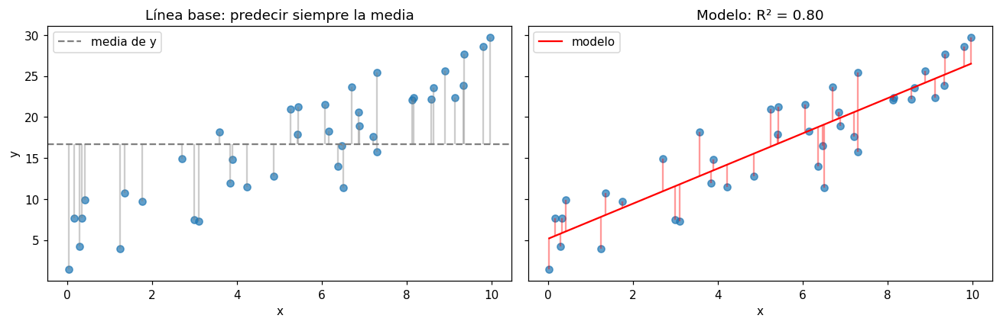

# Coeficiente de determinación (R²)

El [R²](../glosario.md#r2) mide qué proporción de la variabilidad de la
[variable objetivo](../glosario.md#variable-objetivo) explica el modelo. Compara los errores del
modelo con los de una línea base muy simple: predecir siempre la media \( \bar{y} \).

## Fórmula

\[
R^2 = 1 - \frac{\sum_i (y_i - \hat{y}_i)^2}{\sum_i (y_i - \bar{y})^2}
\]

\( y_i \) es el valor real, \( \hat{y}_i \) la predicción del modelo y \( \bar{y} \) la media de
los valores reales. El numerador es la suma de los [residuos](../glosario.md#residuo) al
cuadrado del modelo; el denominador, la misma suma si se predijera siempre la media.

## Calcularlo

```python
from sklearn.metrics import r2_score

r2 = r2_score(y_test, y_pred)
```

`y_test` son los valores reales del [conjunto de prueba](../glosario.md#conjunto-prueba) y
`y_pred` las predicciones del modelo para esos mismos registros, por ejemplo
`y_pred = modelo.predict(X_test)` (vea [regresión lineal](regresion-lineal.md)). El orden de los
argumentos importa: primero los valores reales y después las predicciones.

## Cómo interpretarlo

| Valor de R² | Interpretación |
|-------------|----------------|
| 1 | El modelo acierta exactamente todos los valores |
| Entre 0 y 1 | El modelo explica esa proporción de la variabilidad (0,8 = 80 %) |
| 0 | El modelo no es mejor que predecir siempre la media |
| Negativo | El modelo es **peor** que predecir siempre la media |

- **No tiene unidades**, así que permite comparar modelos sobre la misma variable objetivo, pero
  no dice cuánto se equivoca el modelo en las unidades de `y`. Para eso use el
  [MAE](mae.md) y el [RMSE](rmse.md).
- **Qué es un buen R² depende del problema**: en datos físicos o de ingeniería es común superar
  0,9; con datos de personas o de mercado, un R² de 0,5 puede ser razonable.
- Un R² alto en entrenamiento y bajo en prueba indica
  [sobreajuste](../glosario.md#sobreajuste) (vea [comparar métricas](comparar-metricas.md)).

!!! warning "El R² puede ser negativo"
    `r2_score` no está acotado por abajo. En el conjunto de prueba, un modelo que se ajustó mal o
    que memorizó los datos de entrenamiento puede tener R² negativo: sus predicciones están más
    lejos de los valores reales que la propia media.

!!! tip "El R² de entrenamiento siempre mejora al agregar variables"
    En una [regresión lineal](../glosario.md#regresion-lineal), agregar variables nunca reduce el
    R² de entrenamiento, aunque no aporten nada. Por eso el R² que importa es el del conjunto de
    prueba o de [validación](../glosario.md#conjunto-validacion).

## Ejemplo

Con 40 registros generados con una relación lineal y ruido, se compara el modelo con la línea
base de la media y con un modelo con la pendiente invertida:

```python
import numpy as np
import matplotlib.pyplot as plt
from sklearn.linear_model import LinearRegression
from sklearn.metrics import r2_score

rng = np.random.default_rng(0)
x = rng.uniform(0, 10, 40)
y = 5 + 2 * x + rng.normal(0, 3, 40)
X = x.reshape(-1, 1)

modelo = LinearRegression().fit(X, y)
y_pred = modelo.predict(X)
y_media = np.full_like(y, y.mean())         # línea base: siempre la media
y_malo = 30 - 2 * x                         # un modelo con la pendiente invertida

print(f"R² del modelo:      {r2_score(y, y_pred):.3f}")
print(f"R² de la media:     {r2_score(y, y_media):.3f}")
print(f"R² del modelo malo: {r2_score(y, y_malo):.3f}")

orden = np.argsort(x)
fig, axes = plt.subplots(1, 2, figsize=(12, 4), sharey=True)
axes[0].scatter(x, y, alpha=0.7)
axes[0].axhline(y.mean(), color="gray", linestyle="--", label="media de y")
axes[0].vlines(x, y.mean(), y, color="gray", alpha=0.4)
axes[0].set_title("Línea base: predecir siempre la media")
axes[1].scatter(x, y, alpha=0.7)
axes[1].plot(x[orden], y_pred[orden], color="red", label="modelo")
axes[1].vlines(x, y_pred, y, color="red", alpha=0.4)
axes[1].set_title(f"Modelo: R² = {r2_score(y, y_pred):.2f}")
for ax in axes:
    ax.set_xlabel("x")
    ax.legend()
axes[0].set_ylabel("y")
plt.tight_layout()
plt.show()
```

Salida:

```text
R² del modelo:      0.800
R² de la media:     0.000
R² del modelo malo: -2.327
```



`y_media` es la línea base que predice siempre la media y `y_malo` un modelo deliberadamente
equivocado. A la izquierda, las líneas grises son las distancias a la media (el denominador de
la fórmula); a la derecha, las líneas rojas son los residuos del modelo (el numerador). Los
residuos son mucho más cortos, por eso el modelo explica el 80 % de la variabilidad. La media
obtiene exactamente 0 y el modelo con la pendiente invertida obtiene un R² negativo, porque se
equivoca más que la media.
