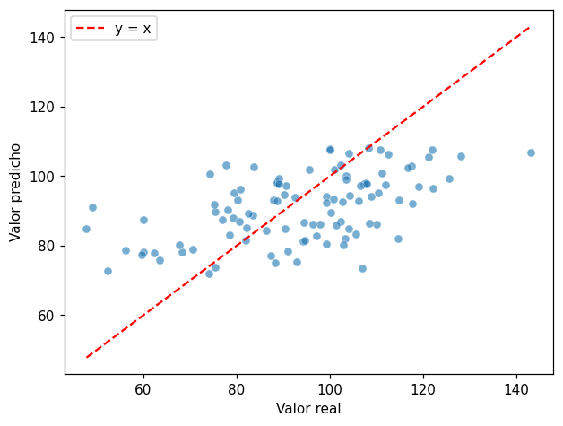
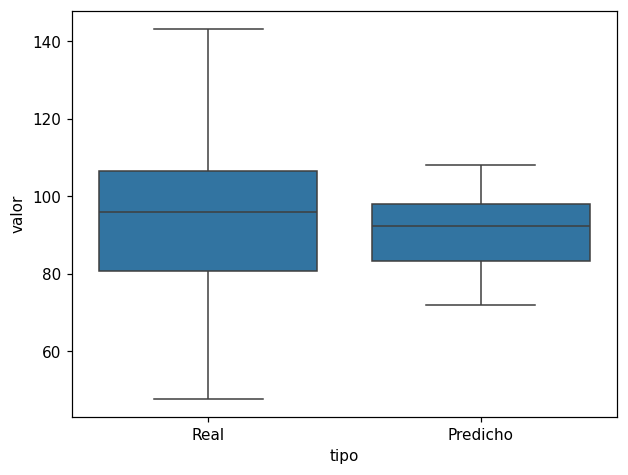

# Valores reales vs. predichos

Después de entrenar un modelo de [regresión lineal](regresion-lineal.md), compare los valores
reales del [conjunto de prueba](../glosario.md#conjunto-prueba) con las predicciones. Estos
gráficos muestran lo que resumen las métricas [R²](r2.md), [MAE](mae.md) y [RMSE](rmse.md):
dónde acierta el modelo y dónde se equivoca.

## Gráfico de dispersión con la diagonal

Cada punto es un registro del conjunto de prueba: en el eje horizontal está su valor real y en
el eje vertical el valor que predijo el modelo para ese registro.

- Sobre el gráfico se traza la línea \( y = x \) (la diagonal), que marca la predicción
  perfecta: un punto sobre ella es un registro en el que el modelo acertó exactamente.
- La distancia vertical de un punto a la diagonal es el error de esa predicción.

## Comparar las distribuciones

Un [gráfico de cajas](grafico-cajas.md) de los valores reales junto al de los predichos muestra
si el modelo reproduce el rango de la variable objetivo. Se dibujan dos cajas lado a lado, una
para los valores reales y otra para los predichos, sobre el mismo eje vertical.

## Cómo leerlo

- **Puntos cerca de la diagonal**: el modelo predice bien.
- **Puntos lejos de la diagonal**: errores grandes. Revise si se concentran en algún rango
  (por ejemplo, solo en los valores altos).
- **Nube más horizontal que la diagonal**: las predicciones están **comprimidas hacia la
  media**. El modelo explica poco de la variable y predice valores parecidos para todos los
  registros; en el gráfico de cajas, la caja de los predichos se ve mucho más angosta que la de
  los reales.

!!! tip "Complemente con los residuos"
    El gráfico de [residuos vs. predichos](residuos-vs-predichos.md) muestra los mismos errores
    de otra forma y facilita detectar patrones.

## Ejemplo

Considere un dataset de 500 registros en el que el precio depende de dos variables, x1 y x2,
pero el modelo se entrena solo con x1. Así, x1 explica apenas una parte del precio.

El primer gráfico muestra la dispersión de los precios reales frente a los predichos, con la
diagonal \( y = x \) como referencia:

El segundo muestra las cajas de los precios reales y de los predichos, una al lado de la otra:

Los puntos siguen la dirección de la diagonal, pero la nube es más horizontal: el modelo
predice valores demasiado altos para los precios bajos y demasiado bajos para los altos. La caja
de los predichos es más angosta que la de los reales. Al modelo le falta información (x2), por
eso sus predicciones quedan comprimidas hacia la media.
