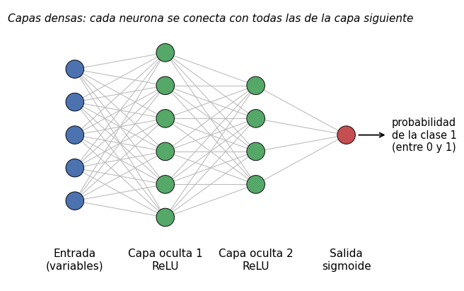

# Red neuronal densamente conectada

Una [red neuronal](../glosario.md#red-neuronal) densamente conectada (también llamada perceptrón
multicapa) encadena varias **capas** de neuronas: cada capa recibe las salidas de la anterior,
las combina y las transforma, y entrega el resultado a la siguiente. En
[clasificación](../glosario.md#clasificacion) binaria, la última capa entrega la probabilidad de
la clase positiva. Esta página usa [Keras](https://keras.io/), la interfaz de alto nivel de
TensorFlow.

{ width="560" }

## Neuronas y capas densas

Cada neurona calcula una combinación lineal de sus entradas y le aplica una
[función de activación](../glosario.md#funcion-activacion) \( g \):

\[
a = g\left( b + \sum_{j=1}^{p} w_j \, x_j \right)
\]

- \( x_1, \dots, x_p \) son las entradas de la neurona (las variables, en la primera capa oculta,
  o las salidas de la capa anterior, en las siguientes).
- \( w_j \) son los **pesos** y \( b \) el **sesgo** (*bias*); la red los aprende durante el
  entrenamiento.
- En una capa **densa** (`Dense`), cada neurona está conectada con **todas** las salidas de la
  capa anterior.

Las capas entre la entrada y la salida se llaman **capas ocultas**. Más capas y más neuronas
permiten representar relaciones más complejas, pero también aumentan el riesgo de
[sobreajuste](../glosario.md#sobreajuste).

### Funciones de activación

| Dónde | Activación | Fórmula | Por qué |
|-------|------------|---------|---------|
| Capas ocultas | ReLU | \( g(z) = \max(0, z) \) | Introduce no linealidad, es barata de calcular y entrena bien. Sin una activación no lineal, la red completa sería equivalente a un modelo lineal |
| Capa de salida (clasificación binaria) | Sigmoide | \( g(z) = \dfrac{1}{1 + e^{-z}} \) | Convierte la salida en un número entre 0 y 1 que se interpreta como la probabilidad de la clase 1, igual que en la [regresión logística](regresion-logistica.md) |

## Cómo aprende

- **Pérdida (`loss`).** Para clasificación binaria se usa la entropía cruzada binaria
  (`binary_crossentropy`), la misma *log loss* de la regresión logística:

    \[
    L = -\frac{1}{n} \sum_{i=1}^{n} \left[ y_i \log(\hat{p}_i) + (1 - y_i) \log(1 - \hat{p}_i) \right]
    \]

    donde \( y_i \) es la clase real (0 o 1) y \( \hat{p}_i \) la probabilidad predicha. Penaliza
    mucho las predicciones seguras y equivocadas.

- **Optimizador.** El entrenamiento ajusta los pesos en la dirección que reduce la pérdida
  (descenso de gradiente). `adam` es el optimizador más usado: adapta automáticamente el tamaño
  del paso de cada peso y funciona bien con sus valores por defecto (tasa de aprendizaje 0,001).
- **Lote (`batch_size`).** Los pesos no se actualizan con todos los registros a la vez, sino con
  lotes pequeños (por ejemplo, 32 registros). Cada lote produce una actualización.
- **Época (`epochs`).** Una [época](../glosario.md#epoca) es una pasada completa por todo el
  [conjunto de entrenamiento](../glosario.md#conjunto-entrenamiento). Con 1.000 registros y
  `batch_size=32`, cada época tiene 32 actualizaciones (31 lotes completos y uno parcial).

## Preparar los datos

La red solo recibe números y se entrena por descenso de gradiente, así que:

- Codifique las variables categóricas con [one-hot](one-hot.md).
- [Escale las variables](escalar-variables.md) continuas, por ejemplo con
  [estandarización](../glosario.md#estandarizacion) (`StandardScaler`). Sin escalar, el
  entrenamiento es más lento e inestable. Ajuste el escalador solo con `X_train` y transforme
  con él `X_val` y `X_test`.
- Keras recibe arreglos de NumPy (o DataFrames numéricos de pandas) con la variable objetivo
  codificada como 0 y 1.

## Código básico

### Definir y compilar el modelo

```python
import keras
from keras import layers

keras.utils.set_random_seed(42)

model = keras.Sequential([
    keras.Input(shape=(X_train.shape[1],)),
    layers.Dense(16, activation="relu"),
    layers.Dropout(0.2),
    layers.Dense(8, activation="relu"),
    layers.Dense(1, activation="sigmoid"),
])

model.compile(
    optimizer="adam",
    loss="binary_crossentropy",
    metrics=[keras.metrics.AUC(name="auc"), keras.metrics.Recall(name="recall")],
)
model.summary()
```

- `keras.utils.set_random_seed(42)` fija las semillas de Python, NumPy y TensorFlow. Los pesos
  iniciales y el orden de los lotes son aleatorios; sin semilla, cada ejecución da resultados
  algo distintos.
- `keras.Input(shape=(X_train.shape[1],))` indica cuántas variables recibe la red (el número de
  columnas de `X_train`, ya escalado y codificado).
- `layers.Dense(16, activation="relu")` es una capa oculta de 16 neuronas con ReLU; la segunda
  capa oculta tiene 8.
- `layers.Dropout(0.2)` apaga al azar el 20 % de las salidas de la capa anterior en cada paso de
  entrenamiento. Obliga a la red a no depender de unas pocas neuronas y reduce el sobreajuste.
  Al predecir, el *dropout* no se aplica.
- `layers.Dense(1, activation="sigmoid")` es la salida: una sola neurona con la probabilidad de
  la clase 1.
- `metrics` son métricas que Keras reporta en cada época, además de la pérdida. No intervienen en
  el entrenamiento; solo sirven para seguirlo. `name` define cómo aparecen en el historial
  (`"auc"`, `"val_auc"`, etc.).
- `model.summary()` muestra las capas y el número de pesos de cada una.

### Entrenar el modelo

```python
historia = model.fit(
    X_train, y_train,
    validation_data=(X_val, y_val),
    epochs=50,
    batch_size=32,
)
```

- `validation_data` es el [conjunto de validación](../glosario.md#conjunto-validacion). Keras
  calcula la pérdida y las métricas en él al final de cada época, pero **no** lo usa para
  ajustar los pesos.
- `epochs=50` es el número de pasadas completas por los datos de entrenamiento y `batch_size=32`,
  el número de registros por actualización de los pesos.
- `historia.history` es un diccionario con la pérdida y las métricas de cada época, en
  entrenamiento (`"loss"`, `"auc"`, ...) y en validación (`"val_loss"`, `"val_auc"`, ...). Vea
  cómo graficarlo en [curva de aprendizaje](curva-aprendizaje.md).

### Predecir y evaluar

```python
y_prob = model.predict(X_val).ravel()
y_pred = (y_prob >= 0.5).astype(int)
```

- `model.predict` devuelve un arreglo de forma `(n, 1)` con la probabilidad de la clase 1;
  `.ravel()` lo convierte en un vector de forma `(n,)`.
- `y_pred` aplica el [umbral de decisión](../glosario.md#umbral-decision) 0,5. A diferencia de
  scikit-learn, Keras no tiene un método `predict` que devuelva directamente la clase.
- Con `y_val`, `y_pred` y `y_prob` puede usar las mismas funciones de scikit-learn que con
  cualquier otro clasificador: la [matriz de confusión](matriz-confusion.md), el [F1](f1.md), la
  [curva ROC](curva-roc.md) y la
  [curva de precisión-sensibilidad](curva-precision-sensibilidad.md) (esta última también sirve
  para elegir un umbral distinto de 0,5).

## Hiperparámetros principales

| [Hiperparámetro](../glosario.md#hiperparametro) | Qué controla | Efecto |
|----------------|--------------|--------|
| Número de capas ocultas y de neuronas | Capacidad de la red | Más capas o neuronas: puede capturar relaciones más complejas, pero con pocos datos tiende al [sobreajuste](../glosario.md#sobreajuste). Muy pocas: [subajuste](../glosario.md#subajuste). En datos tabulares, 1 a 3 capas de 8 a 64 neuronas suelen bastar |
| `Dropout` | Fracción de salidas que se apagan en cada paso | Valores entre 0,1 y 0,5 reducen el sobreajuste. Demasiado alto: la red no logra aprender (subajuste) |
| Tasa de aprendizaje (`learning_rate` del optimizador) | Tamaño de cada actualización de los pesos | Muy alta: la pérdida oscila o no baja. Muy baja: el entrenamiento es lento y puede detenerse antes de aprender lo suficiente. El valor por defecto de Adam (0,001) es un buen punto de partida |
| `batch_size` | Registros por actualización | Lotes pequeños (16, 32): más actualizaciones por época y un entrenamiento más ruidoso, que a veces generaliza mejor. Lotes grandes (128, 256): épocas más rápidas y curvas más suaves |
| `epochs` y `patience` | Duración del entrenamiento | Demasiadas épocas sin *early stopping*: sobreajuste. Muy pocas, o `patience` muy baja: el entrenamiento se detiene antes de tiempo (subajuste) |

Para cambiar la tasa de aprendizaje, pase el optimizador como objeto:
`optimizer=keras.optimizers.Adam(learning_rate=0.0005)`.
