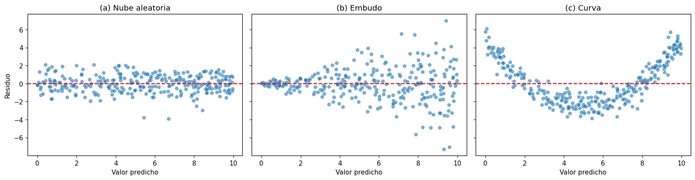

# Residuos vs. valores predichos

El [residuo](../glosario.md#residuo) de una observación es la diferencia entre el valor real y
el valor predicho, \( e = y - \hat{y} \). Graficar los residuos contra los valores predichos
permite revisar dos supuestos de la [regresión lineal](regresion-lineal.md): la
[homocedasticidad](../glosario.md#homocedasticidad) (varianza constante de los residuos) y la
**linealidad** de la relación.

```python
import matplotlib.pyplot as plt
import seaborn as sns

y_pred = modelo.predict(X_test)
residuos = y_test - y_pred

sns.scatterplot(x=y_pred, y=residuos, alpha=0.6)
plt.axhline(0, color="red", linestyle="--")
plt.xlabel("Valor predicho")
plt.ylabel("Residuo")
plt.show()
```

`modelo` es el modelo de regresión ya entrenado, `X_test` son las variables de entrada del
[conjunto de prueba](../glosario.md#conjunto-prueba), `y_test` son los valores reales de ese
conjunto y `y_pred` las predicciones del modelo. La línea roja en 0 marca dónde el residuo es
nulo: los puntos por encima son observaciones que el modelo subestima y los de abajo, las que
sobreestima.

## Cómo interpretarlo

| Patrón | Qué indica |
|--------|------------|
| Nube aleatoria y de ancho constante alrededor de 0 | Los supuestos de linealidad y homocedasticidad son razonables |
| Embudo o cono: la dispersión crece (o decrece) con el valor predicho | **Heterocedasticidad**: la varianza de los residuos no es constante |
| Curva o forma de U: los residuos son positivos en los extremos y negativos en el centro (o al revés) | La relación **no es lineal**: el modelo no captura parte de la estructura de los datos |

- Con **heterocedasticidad** las predicciones pueden seguir siendo útiles, pero los errores
  estándar, los intervalos de confianza y los [valores p](../glosario.md#valor-p) de los
  coeficientes dejan de ser confiables. Suele aparecer cuando la
  [variable objetivo](../glosario.md#variable-objetivo) tiene [sesgo](../glosario.md#sesgo) a
  la derecha; transformarla (por ejemplo con `np.log1p`) suele corregirlo.
- Con **no linealidad** el modelo comete errores sistemáticos. Revise el
  [gráfico de dispersión](grafico-dispersion.md) de cada variable contra la variable objetivo y
  considere agregar términos transformados (cuadrados, logaritmos) o interacciones.

!!! tip "Puntos aislados"
    Unos pocos residuos muy lejos de 0 no forman un patrón, pero son
    [valores atípicos](../glosario.md#outlier) que conviene revisar: pueden ser errores en los
    datos o casos que el modelo no representa bien.

## Prueba de Breusch–Pagan

La prueba de Breusch–Pagan complementa el gráfico con un resultado numérico sobre la
homocedasticidad:

```python
import statsmodels.api as sm
from statsmodels.stats.diagnostic import het_breuschpagan

estadistico, p_valor, _, _ = het_breuschpagan(residuos, sm.add_constant(X_test))
print(f"p-valor Breusch-Pagan: {p_valor:.4f}")
```

`sm.add_constant(X_test)` agrega la columna de intercepto que la prueba necesita. Las hipótesis
son:

- \( H_0 \): la varianza de los residuos es constante (homocedasticidad).
- \( H_1 \): la varianza de los residuos depende de las variables de entrada (heterocedasticidad).

Si \( p < 0{,}05 \), rechace \( H_0 \): hay evidencia de heterocedasticidad. Si
\( p \geq 0{,}05 \), no hay evidencia en contra de la varianza constante.

!!! warning "La prueba no detecta la no linealidad"
    Breusch–Pagan solo evalúa si la **dispersión** de los residuos cambia. Una curva como la
    del panel (c) del ejemplo puede pasar la prueba sin problema. Revise siempre el gráfico.

## Ejemplo

Con 300 predicciones sintéticas y tres conjuntos de residuos con patrones distintos:

```python
import numpy as np
import matplotlib.pyplot as plt
import seaborn as sns
import statsmodels.api as sm
from statsmodels.stats.diagnostic import het_breuschpagan

rng = np.random.default_rng(0)
n = 300
y_pred = rng.uniform(0, 10, n)
casos = {
    "(a) Nube aleatoria": rng.normal(0, 1, n),
    "(b) Embudo": rng.normal(0, 0.1 + 0.3 * y_pred),
    "(c) Curva": 0.3 * (y_pred - 5) ** 2 - 2.5 + rng.normal(0, 0.8, n),
}

fig, axes = plt.subplots(1, 3, figsize=(15, 4), sharey=True)
for ax, (titulo, residuos) in zip(axes, casos.items()):
    sns.scatterplot(x=y_pred, y=residuos, alpha=0.6, ax=ax)
    ax.axhline(0, color="red", linestyle="--")
    ax.set_title(titulo)
    ax.set_xlabel("Valor predicho")
    ax.set_ylabel("Residuo")
    _, p_valor, _, _ = het_breuschpagan(residuos, sm.add_constant(y_pred))
    print(f"{titulo}: p-valor Breusch-Pagan = {p_valor:.4f}")
plt.tight_layout()
plt.show()
```

```text
(a) Nube aleatoria: p-valor Breusch-Pagan = 0.7098
(b) Embudo: p-valor Breusch-Pagan = 0.0000
(c) Curva: p-valor Breusch-Pagan = 0.4453
```



- **(a)** Los residuos forman una banda de ancho constante alrededor de 0, sin forma: los
  supuestos se cumplen y la prueba no rechaza la homocedasticidad (\( p = 0{,}71 \)).
- **(b)** La dispersión crece con el valor predicho: el embudo indica heterocedasticidad y la
  prueba la confirma (\( p < 0{,}05 \)).
- **(c)** Los residuos dibujan una U: la relación no es lineal. La prueba no lo detecta
  (\( p = 0{,}45 \)) porque la dispersión alrededor de la curva es constante.

Después de revisar este gráfico, verifique la normalidad de los residuos con el
[histograma y las pruebas de normalidad](normalidad-residuos.md) y con el
[gráfico Q-Q](grafico-qq.md).
