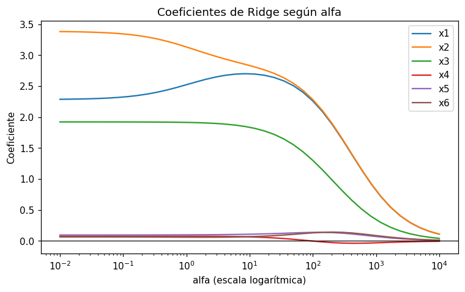

# Regresión Ridge

La regresión [Ridge](../glosario.md#ridge) es una [regresión lineal](regresion-lineal.md) con
[regularización](../glosario.md#regularizacion) L2: además de reducir el error, penaliza la suma
de los cuadrados de los [coeficientes](../glosario.md#coeficiente):

\[
\min_\beta \sum_{i=1}^{n} (y_i - \hat{y}_i)^2 + \alpha \sum_{j=1}^{p} \beta_j^2
\]

- El primer término es la suma de los [residuos](../glosario.md#residuo) al cuadrado, el mismo
  que minimiza la regresión lineal.
- El segundo término es la **penalización**: crece con el cuadrado de cada coeficiente. El
  intercepto \( \beta_0 \) no se penaliza.
- \( \alpha \) (alfa) es un [hiperparámetro](../glosario.md#hiperparametro) que controla cuánto
  pesa la penalización.

## Efecto de alfa

- **alfa = 0**: no hay penalización; el resultado es el de la regresión lineal.
- **alfa más grande**: todos los coeficientes se **encogen** hacia 0 de forma gradual, pero
  **nunca valen exactamente 0**. Ridge no elimina variables.
- Con [multicolinealidad](../glosario.md#multicolinealidad) (variables muy correlacionadas), la
  regresión lineal reparte el efecto entre ellas de forma inestable: los coeficientes pueden ser
  muy grandes, de signos opuestos o cambiar mucho con pocos datos. Ridge **estabiliza** esos
  coeficientes y tiende a repartir el efecto en partes parecidas.

Al reducir los coeficientes, Ridge disminuye la varianza del modelo y ayuda contra el
[sobreajuste](../glosario.md#sobreajuste), a cambio de algo de sesgo (vea el
[compromiso sesgo-varianza](../glosario.md#compromiso-sesgo-varianza)).

!!! warning "Alfa demasiado grande"
    Con un alfa muy grande todos los coeficientes quedan casi en 0 y el modelo predice casi la
    media de `y_train`: [subajuste](../glosario.md#subajuste). El [R²](r2.md) en prueba se acerca
    a 0.

!!! warning "Estandarice antes de usar Ridge"
    La penalización depende del tamaño de los coeficientes, y este depende de las unidades de
    cada variable. Sin [estandarizar](estandarizar.md), Ridge encoge más unas variables que
    otras solo por su escala.

## Entrenar el modelo

```python
from sklearn.pipeline import make_pipeline
from sklearn.preprocessing import StandardScaler
from sklearn.linear_model import Ridge

modelo = make_pipeline(StandardScaler(), Ridge(alpha=1))
modelo.fit(X_train, y_train)
y_pred = modelo.predict(X_test)
```

- `X_train`, `y_train` son las variables y la [variable objetivo](../glosario.md#variable-objetivo)
  del [conjunto de entrenamiento](../glosario.md#conjunto-entrenamiento), y `X_test` las variables
  del [conjunto de prueba](../glosario.md#conjunto-prueba).
- `alpha=1` es el valor de alfa (el valor por defecto); cámbielo para probar otros.
- `make_pipeline` estandariza con la media y la desviación de `X_train` antes de entrenar y
  antes de predecir.

## Ver los coeficientes

```python
import pandas as pd

coef = pd.Series(modelo[-1].coef_, index=X_train.columns)
print(coef.sort_values())
```

- `modelo[-1]` es el último paso del pipeline, el `Ridge` entrenado; `coef_` tiene un
  coeficiente por columna de `X_train`.
- Los coeficientes están en la escala **estandarizada**: cada uno es el cambio en la predicción
  por cada desviación estándar de su variable (vea
  [interpretar los coeficientes](interpretar-coeficientes.md)).

## Comparar varios valores de alfa

```python
import pandas as pd
from sklearn.metrics import r2_score, mean_absolute_error, mean_squared_error

alfas = [0.1, 1, 10, 100, 1000]
coeficientes = {}
resultados = []
for alfa in alfas:
    modelo = make_pipeline(StandardScaler(), Ridge(alpha=alfa))
    modelo.fit(X_train, y_train)
    y_pred = modelo.predict(X_test)
    coeficientes[alfa] = pd.Series(modelo[-1].coef_, index=X_train.columns)
    resultados.append({
        "alfa": alfa,
        "R2": r2_score(y_test, y_pred),
        "MAE": mean_absolute_error(y_test, y_pred),
        "RMSE": mean_squared_error(y_test, y_pred) ** 0.5,
    })

print(pd.DataFrame(coeficientes).round(3))   # una columna por alfa
print(pd.DataFrame(resultados).round(3))     # una fila por alfa
```

- `alfas` es la lista de valores que quiere probar; `y_test` es la variable objetivo del conjunto
  de prueba.
- `coeficientes` queda con una fila por variable y una columna por alfa.
- `resultados` guarda las métricas [R²](r2.md), [MAE](mae.md) y [RMSE](rmse.md) en prueba de
  cada alfa (vea [comparar métricas](comparar-metricas.md)). Con Ridge no tiene sentido contar
  ceros: no los hay.

!!! tip "Elija alfa con validación, no con el conjunto de prueba"
    Use un [conjunto de validación](../glosario.md#conjunto-validacion) o la
    [validación cruzada](validacion-cruzada.md) para elegir alfa, y evalúe en prueba solo el
    modelo final. Los valores útiles de alfa en Ridge suelen ser mayores que en Lasso; pruebe un
    rango amplio en escala logarítmica, por ejemplo `np.logspace(-2, 4, 20)`.

## Lasso o Ridge

| | [Lasso](lasso.md) | Ridge |
|---|---|---|
| Penalización | L1: \( \alpha \sum \lvert\beta_j\rvert \) | L2: \( \alpha \sum \beta_j^2 \) |
| Coeficientes en 0 | Sí, con alfa suficientemente grande | No, solo se acercan a 0 |
| Variables correlacionadas | Suele quedarse con una y reducir o eliminar las otras | Reparte el efecto entre ellas |
| Cuándo usarlo | Sospecha que muchas variables no aportan y quiere un modelo más simple | Muchas variables aportan un poco, o hay multicolinealidad |

Las dos necesitan estandarizar y las dos tienen un alfa que se elige con validación. Si no
tiene claro cuál usar, entrene ambas y compare sus métricas en validación.

## Ejemplo

Con 200 registros y 6 variables, en las que `x2` es casi igual a `x1` y solo `x1`, `x2` y `x3`
influyen en `y`:

```python
import numpy as np
import pandas as pd
import matplotlib.pyplot as plt
from sklearn.pipeline import make_pipeline
from sklearn.preprocessing import StandardScaler
from sklearn.linear_model import LinearRegression, Ridge, Lasso

rng = np.random.default_rng(0)
n = 200
X = pd.DataFrame(rng.normal(0, 1, (n, 6)), columns=[f"x{i}" for i in range(1, 7)])
X["x2"] = X["x1"] + rng.normal(0, 0.1, n)      # x2 casi igual a x1
y = 3 * X["x1"] + 3 * X["x2"] + 2 * X["x3"] + rng.normal(0, 1.5, n)
print("Correlación x1-x2:", round(X["x1"].corr(X["x2"]), 3))

alfas = np.logspace(-2, 4, 40)
coeficientes = {}
for alfa in alfas:
    modelo = make_pipeline(StandardScaler(), Ridge(alpha=alfa))
    modelo.fit(X, y)
    coeficientes[alfa] = pd.Series(modelo[-1].coef_, index=X.columns)
coeficientes = pd.DataFrame(coeficientes).T

comparacion = pd.DataFrame({
    "lineal": make_pipeline(StandardScaler(), LinearRegression()).fit(X, y)[-1].coef_,
    "ridge_10": make_pipeline(StandardScaler(), Ridge(alpha=10)).fit(X, y)[-1].coef_,
    "lasso_0.5": make_pipeline(StandardScaler(), Lasso(alpha=0.5, max_iter=10000)).fit(X, y)[-1].coef_,
}, index=X.columns)
print(comparacion.round(2))

coeficientes.plot(logx=True, figsize=(8, 4.5))
plt.axhline(0, color="black", linewidth=0.8)
plt.xlabel("alfa (escala logarítmica)")
plt.ylabel("Coeficiente")
plt.title("Coeficientes de Ridge según alfa")
plt.show()
```

Salida:

```text
Correlación x1-x2: 0.994
    lineal  ridge_10  lasso_0.5
x1    2.28      2.70       1.91
x2    3.39      2.83       3.28
x3    1.92      1.84       1.45
x4    0.08      0.07       0.00
x5    0.10      0.11       0.00
x6    0.07      0.07       0.00
```



- `x1` y `x2` tienen el mismo efecto real (3 cada una), pero como su correlación es 0,994 la
  regresión lineal los reparte de forma desigual: 2,28 y 3,39.
- Con Ridge (alfa = 10) los dos coeficientes se acercan entre sí (2,70 y 2,83). En el gráfico,
  a partir de alfa ≈ 100 las curvas de `x1` y `x2` quedan una encima de la otra.
- Todos los coeficientes bajan **suavemente** al aumentar alfa y ninguno llega a 0, ni siquiera
  los de `x4`, `x5` y `x6`, que no influyen en `y`. Con alfa = 10.000 todos son casi 0 (subajuste).
- Lasso (alfa = 0,5) sí deja en **exactamente 0** a `x4`, `x5` y `x6`, pero mantiene el reparto
  desigual entre `x1` y `x2` (1,91 y 3,28): entre variables muy correlacionadas tiende a
  favorecer a una de ellas.
