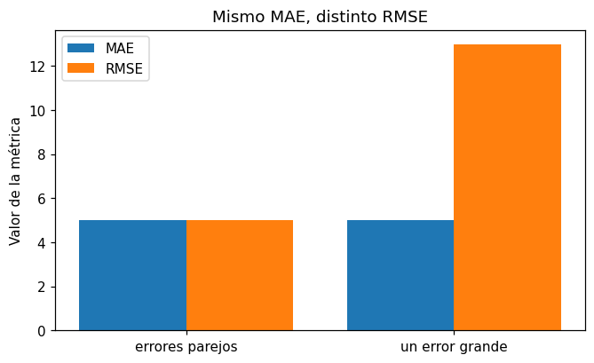

# Raíz del error cuadrático medio (RMSE)

El [RMSE](../glosario.md#rmse) mide cuánto se equivoca el modelo, igual que el [MAE](mae.md),
pero eleva cada error al cuadrado antes de promediar. Por eso **penaliza más los errores
grandes**.

## Fórmula

\[
\text{RMSE} = \sqrt{\frac{1}{n} \sum_i (y_i - \hat{y}_i)^2}
\]

\( y_i \) es el valor real, \( \hat{y}_i \) la predicción y \( n \) la cantidad de registros. El
promedio de los [residuos](../glosario.md#residuo) al cuadrado es el MSE (error cuadrático
medio); la raíz cuadrada lo devuelve a las unidades de la variable objetivo.

## Calcularlo

```python
import numpy as np
from sklearn.metrics import mean_squared_error

rmse = np.sqrt(mean_squared_error(y_test, y_pred))
```

`y_test` son los valores reales del [conjunto de prueba](../glosario.md#conjunto-prueba) y
`y_pred` las predicciones del modelo para esos mismos registros, por ejemplo
`y_pred = modelo.predict(X_test)` (vea [regresión lineal](regresion-lineal.md)).
`mean_squared_error` devuelve el MSE y `np.sqrt` le saca la raíz.

## Cómo interpretarlo

- **Rango**: va de 0 (predicciones perfectas) hacia arriba, sin límite. Menor es mejor.
- **Unidades**: las mismas de la [variable objetivo](../glosario.md#variable-objetivo), igual
  que el MAE.
- **Relación con el MAE**: siempre se cumple RMSE ≥ MAE. Son iguales solo si todos los errores
  tienen el mismo tamaño. Si el RMSE es mucho mayor que el MAE, hay unos pocos errores muy
  grandes; revíselos con el [gráfico de residuos](residuos-vs-predichos.md).
- **Comparación con el R²**: el [R²](r2.md) no tiene unidades; el RMSE dice cuánto se equivoca
  el modelo en unidades reales. Si el RMSE es parecido a la desviación estándar de `y`, el R²
  está cerca de 0.

!!! tip "Juzgue el error según el contexto"
    Compare el RMSE con la media, la desviación estándar o el rango de `y`, por ejemplo con
    `y.describe()`. Un RMSE de 10 no significa lo mismo si `y` vale miles que si vale entre 0
    y 20.

!!! warning "Sensible a valores atípicos"
    Un solo [valor atípico](../glosario.md#outlier) mal predicho puede inflar el RMSE. Si los
    errores grandes son especialmente costosos en su problema, el RMSE es la métrica adecuada;
    si no, el MAE describe mejor el error típico.

## Ejemplo

Dos conjuntos de predicciones con el mismo MAE: en el primero todos los errores valen 5; en el
segundo, nueve errores valen 1 y uno vale 41.

```python
import numpy as np
import matplotlib.pyplot as plt
from sklearn.metrics import mean_absolute_error, mean_squared_error

rng = np.random.default_rng(0)
y_test = rng.uniform(100, 200, 10)
errores_parejos = np.full(10, 5.0)                           # todos se equivocan en 5
errores_un_grande = np.array([1, 1, 1, 1, 1, 1, 1, 1, 1, 41.0])   # uno se equivoca en 41

resultados = {}
for nombre, errores in [("errores parejos", errores_parejos),
                        ("un error grande", errores_un_grande)]:
    y_pred = y_test + errores
    mae = mean_absolute_error(y_test, y_pred)
    rmse = np.sqrt(mean_squared_error(y_test, y_pred))
    resultados[nombre] = (mae, rmse)
    print(f"{nombre:16s} MAE = {mae:5.2f}   RMSE = {rmse:5.2f}")

posiciones = np.arange(2)
plt.figure(figsize=(7, 4))
plt.bar(posiciones - 0.2, [r[0] for r in resultados.values()], width=0.4, label="MAE")
plt.bar(posiciones + 0.2, [r[1] for r in resultados.values()], width=0.4, label="RMSE")
plt.xticks(posiciones, list(resultados.keys()))
plt.ylabel("Valor de la métrica")
plt.title("Mismo MAE, distinto RMSE")
plt.legend()
plt.show()
```

Salida:

```text
errores parejos  MAE =  5.00   RMSE =  5.00
un error grande  MAE =  5.00   RMSE = 13.00
```



`errores_parejos` y `errores_un_grande` son los errores que se suman a `y_test` para construir
cada `y_pred`. Los dos casos tienen MAE de 5, pero el RMSE pasa de 5 a 13: al elevar al cuadrado,
el error de 41 aporta 1.681 a la suma, mientras que los otros nueve aportan solo 9 en total.
Cuando el RMSE es mucho mayor que el MAE, busque los registros con errores grandes.
