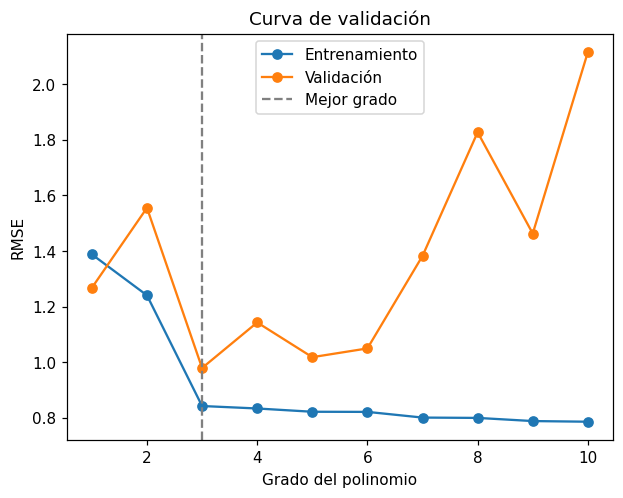

# Seleccionar hiperparámetros con validación

Un [hiperparámetro](../glosario.md#hiperparametro) es un valor que se fija **antes** de entrenar
y que el modelo no aprende de los datos, por ejemplo el grado de una
[regresión polinomial](regresion-polinomial.md). Para elegirlo se entrenan varios modelos, uno
por cada valor, y se comparan en un
[conjunto de validación](../glosario.md#conjunto-validacion): datos que el modelo no usó para
entrenar, pero que tampoco son los de prueba.

## Dividir en entrenamiento, validación y prueba

```python
from sklearn.model_selection import train_test_split

X_train, X_temp, y_train, y_temp = train_test_split(X, y, test_size=0.4, random_state=42)
X_val, X_test, y_val, y_test = train_test_split(X_temp, y_temp, test_size=0.5, random_state=42)
```

La primera división separa el 60 % para entrenamiento y deja el 40 % en `X_temp`; la segunda
divide ese 40 % por la mitad: 20 % para validación (`X_val`, `y_val`) y 20 % para prueba
(`X_test`, `y_test`). Vea [división de datos](division-datos.md#validacion).

!!! warning "No elija con el conjunto de prueba"
    Si compara los grados con el conjunto de prueba, el modelo elegido queda ajustado a esos
    datos y su métrica de prueba deja de ser una estimación honesta del error con datos nuevos.
    El conjunto de prueba se usa **una sola vez**, al final.

## Recorrer los valores del hiperparámetro

```python
import numpy as np
import pandas as pd
from sklearn.pipeline import make_pipeline
from sklearn.preprocessing import PolynomialFeatures, StandardScaler
from sklearn.linear_model import LinearRegression
from sklearn.metrics import mean_squared_error, r2_score

resultados = []
for grado in [1, 2, 3, 4, 5]:
    modelo = make_pipeline(StandardScaler(),
                           PolynomialFeatures(degree=grado, include_bias=False),
                           LinearRegression())
    modelo.fit(X_train, y_train)
    y_pred_train = modelo.predict(X_train)
    y_pred_val = modelo.predict(X_val)
    resultados.append({
        "grado": grado,
        "R2_train": r2_score(y_train, y_pred_train),
        "R2_val": r2_score(y_val, y_pred_val),
        "RMSE_train": np.sqrt(mean_squared_error(y_train, y_pred_train)),
        "RMSE_val": np.sqrt(mean_squared_error(y_val, y_pred_val)),
    })

tabla = pd.DataFrame(resultados)
print(tabla.round(3))
```

- En cada vuelta se crea un modelo nuevo con el `grado` correspondiente, se entrena **solo** con
  `X_train` y se evalúa en entrenamiento y en validación.
- `resultados` es una lista de diccionarios, uno por grado; `pd.DataFrame` la convierte en una
  tabla con una fila por grado.
- Puede agregar otras métricas, como el [MAE](mae.md) con `mean_absolute_error`. Vea
  [R²](r2.md), [RMSE](rmse.md) y [comparar métricas](comparar-metricas.md).

Si aplica el polinomio solo a las variables continuas, reemplace el `make_pipeline` por el de
la sección *Aplicar el polinomio solo a las variables continuas* de
[regresión polinomial](regresion-polinomial.md).

## Graficar la curva de validación

```python
import matplotlib.pyplot as plt

plt.plot(tabla["grado"], tabla["RMSE_train"], marker="o", label="Entrenamiento")
plt.plot(tabla["grado"], tabla["RMSE_val"], marker="o", label="Validación")
plt.xlabel("Grado del polinomio")
plt.ylabel("RMSE")
plt.legend()
plt.show()
```

La curva de validación muestra el error de entrenamiento y el de validación para cada valor del
hiperparámetro. Si los valores de validación crecen mucho, agregue `plt.yscale("log")` antes de
`plt.show()` para ver mejor la zona de errores pequeños.

## Elegir el mejor valor

```python
mejor_grado = tabla.loc[tabla["RMSE_val"].idxmin(), "grado"]
```

`idxmin()` devuelve la fila con el menor RMSE de validación y `.loc[..., "grado"]` toma su grado.
Si prefiere usar el R², elija el máximo: `tabla.loc[tabla["R2_val"].idxmax(), "grado"]`. Si dos
grados tienen errores de validación muy parecidos, prefiera el más simple (el de menor grado).

## Leer la curva: compromiso sesgo-varianza

| Zona de la curva | Entrenamiento | Validación | Diagnóstico |
|------------------|---------------|------------|-------------|
| Grados bajos | Error alto | Error alto, parecido al de entrenamiento | [Subajuste](../glosario.md#subajuste): **alto sesgo**, el modelo es demasiado simple para la forma de los datos |
| Grado intermedio | Error bajo | Error mínimo | Equilibrio entre sesgo y varianza |
| Grados altos | Error cada vez más bajo | Error que sube y se aleja del de entrenamiento | [Sobreajuste](../glosario.md#sobreajuste): **alta varianza**, el modelo memoriza el ruido de los datos de entrenamiento |

Este equilibrio se conoce como
[compromiso sesgo-varianza](../glosario.md#compromiso-sesgo-varianza): al aumentar la
complejidad del modelo baja el sesgo, pero sube la varianza. El error de entrenamiento casi
siempre baja al subir el grado; por eso **no sirve** para elegirlo. El que importa es el de
validación.

## Evaluar el modelo elegido en prueba

```python
mejor = make_pipeline(StandardScaler(),
                      PolynomialFeatures(degree=mejor_grado, include_bias=False),
                      LinearRegression())
mejor.fit(X_train, y_train)
y_pred = mejor.predict(X_test)

print("R² prueba:", r2_score(y_test, y_pred))
print("RMSE prueba:", np.sqrt(mean_squared_error(y_test, y_pred)))
```

Se entrena el modelo con el grado elegido y se evalúa **una vez** en el
[conjunto de prueba](../glosario.md#conjunto-prueba). Esa es la métrica que se reporta como
desempeño esperado con datos nunca vistos.

!!! tip "Reentrenar con entrenamiento y validación"
    Una vez elegido el grado, también puede entrenar el modelo final con
    `pd.concat([X_train, X_val])` y `pd.concat([y_train, y_val])` para aprovechar más datos, y
    luego evaluarlo en prueba.

## Ejemplo

Con 50 registros que siguen una curva seno con ruido, se prueban los grados 1 a 10:

```python
import numpy as np
import pandas as pd
import matplotlib.pyplot as plt
from sklearn.model_selection import train_test_split
from sklearn.pipeline import make_pipeline
from sklearn.preprocessing import PolynomialFeatures, StandardScaler
from sklearn.linear_model import LinearRegression
from sklearn.metrics import mean_squared_error, r2_score

rng = np.random.default_rng(4)
n = 50
df = pd.DataFrame({"x": rng.uniform(0, 6, n)})
df["y"] = np.sin(df["x"]) * 3 + rng.normal(0, 0.8, n)

X = df[["x"]]
y = df["y"]
X_train, X_temp, y_train, y_temp = train_test_split(X, y, test_size=0.4, random_state=42)
X_val, X_test, y_val, y_test = train_test_split(X_temp, y_temp, test_size=0.5, random_state=42)

resultados = []
for grado in range(1, 11):
    modelo = make_pipeline(StandardScaler(),
                           PolynomialFeatures(degree=grado, include_bias=False),
                           LinearRegression())
    modelo.fit(X_train, y_train)
    resultados.append({
        "grado": grado,
        "RMSE_train": np.sqrt(mean_squared_error(y_train, modelo.predict(X_train))),
        "RMSE_val": np.sqrt(mean_squared_error(y_val, modelo.predict(X_val))),
    })
tabla = pd.DataFrame(resultados)
print(tabla.round(3).to_string(index=False))

mejor_grado = tabla.loc[tabla["RMSE_val"].idxmin(), "grado"]
print("Mejor grado:", mejor_grado)

plt.plot(tabla["grado"], tabla["RMSE_train"], marker="o", label="Entrenamiento")
plt.plot(tabla["grado"], tabla["RMSE_val"], marker="o", label="Validación")
plt.axvline(mejor_grado, color="gray", linestyle="--", label="Mejor grado")
plt.xlabel("Grado del polinomio")
plt.ylabel("RMSE")
plt.title("Curva de validación")
plt.legend()
plt.show()

mejor = make_pipeline(StandardScaler(),
                      PolynomialFeatures(degree=mejor_grado, include_bias=False),
                      LinearRegression())
mejor.fit(X_train, y_train)
y_pred = mejor.predict(X_test)
print("RMSE prueba:", round(np.sqrt(mean_squared_error(y_test, y_pred)), 3))
print("R² prueba:", round(r2_score(y_test, y_pred), 3))
```

Salida:

```text
 grado  RMSE_train  RMSE_val
     1       1.388     1.267
     2       1.240     1.555
     3       0.842     0.979
     4       0.834     1.143
     5       0.822     1.018
     6       0.821     1.050
     7       0.801     1.382
     8       0.800     1.827
     9       0.788     1.463
    10       0.786     2.115
Mejor grado: 3
RMSE prueba: 0.671
R² prueba: 0.935
```



- **Grados 1 y 2:** los dos errores son altos. Una recta o una parábola no pueden seguir la forma
  de la curva seno (subajuste, alto sesgo).
- **Grado 3:** el error de validación llega a su mínimo (0,98) y queda cerca del de
  entrenamiento (0,84). Es el grado elegido.
- **Grados 4 a 10:** el error de entrenamiento sigue bajando un poco, pero el de validación sube
  y oscila hasta 2,1. Con solo 30 registros de entrenamiento, los polinomios de grado alto se
  doblan para pasar cerca de cada punto y fallan con datos nuevos (sobreajuste, alta varianza).

En el conjunto de prueba, el modelo de grado 3 obtiene un RMSE de 0,67 y un R² de 0,94: el
modelo elegido generaliza bien a datos que no participaron ni en el entrenamiento ni en la
elección del grado.
