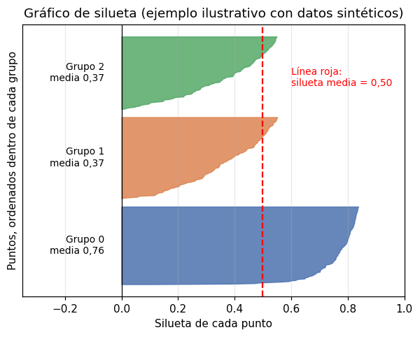

# Coeficiente de silueta

El [coeficiente de silueta](../glosario.md#silueta) mide, para cada punto, si está más cerca de
los puntos de su propio grupo que de los del grupo vecino. A diferencia de la
[inercia](inercia.md), tiene en cuenta dos cosas a la vez: qué tan compacto es cada grupo y qué
tan separado está de los demás. Su promedio sobre todos los puntos resume la calidad de una
[agrupación](../glosario.md#agrupacion) en un solo número.

Sirve para cualquier algoritmo que entregue una etiqueta de grupo por punto: K-medias,
K-medianas, K-medoides, DBSCAN, MeanShift, HDBSCAN o agrupamiento aglomerativo.

## Fórmula

Para cada punto \( i \):

\[
s(i) = \frac{b(i) - a(i)}{\max\{a(i),\, b(i)\}}
\]

- \( a(i) \) es la distancia promedio entre el punto \( i \) y los demás puntos de **su propio
  grupo**. Mide qué tan bien encaja en su grupo: cuanto más pequeña, mejor.
- \( b(i) \) es la distancia promedio entre el punto \( i \) y los puntos del **grupo vecino**,
  es decir, el grupo más cercano al que no pertenece. Cuanto más grande, mejor separado está.

La **silueta media** es el promedio de \( s(i) \) sobre todos los puntos:

\[
\bar{s} = \frac{1}{n} \sum_{i=1}^{n} s(i)
\]

## Cómo interpretarla

Tanto \( s(i) \) como la silueta media toman valores entre −1 y 1:

| Valor | Interpretación |
|-------|----------------|
| Cerca de 1 | El punto está mucho más cerca de su grupo que del vecino: grupos bien separados |
| Cerca de 0 | El punto está en la frontera entre dos grupos: los grupos se solapan |
| Negativo | El punto está más cerca del grupo vecino que del suyo: probablemente está en el grupo equivocado |

Como referencia aproximada para la silueta media: por encima de 0,5 suele indicar una estructura
clara; entre 0,25 y 0,5, una estructura moderada con grupos que se solapan en parte; por debajo
de 0,25, una estructura débil. Son guías, no reglas: lo importante es comparar resultados sobre
los mismos datos.

- **Calcúlela sobre los datos escalados** (vea [escalar variables](escalar-variables.md)); las
  distancias dependen de la escala de las variables.
- **Favorece grupos redondeados y bien separados**. Con grupos alargados o de formas irregulares,
  como los que encuentran DBSCAN o HDBSCAN, la silueta puede ser baja aunque la agrupación sea
  buena.
- **Necesita al menos dos grupos** y menos grupos que puntos; con un solo grupo no hay grupo
  vecino.

## El gráfico de silueta

La silueta media puede ocultar problemas: un valor aceptable puede combinar un grupo excelente
con otro muy débil. El gráfico de silueta muestra el valor \( s(i) \) de **cada punto**, con los
puntos de cada grupo juntos y ordenados de mayor a menor:

{ width="520" }

En este ejemplo ilustrativo con datos sintéticos, el grupo 0 está bien separado (silueta media
0,76), mientras que los grupos 1 y 2 tienen valores más bajos (0,37) porque se solapan entre
sí. La línea roja es la silueta media de todos los puntos.

Al leer el gráfico, fíjese en:

- **Grupos que no alcanzan la línea roja**: son los grupos débiles, poco separados de su vecino.
- **Barras negativas**: puntos que probablemente están en el grupo equivocado. Muchas barras
  negativas indican que el número de grupos no es adecuado.
- **El grosor de cada grupo**: es su número de puntos. Grupos de tamaños muy desiguales pueden
  indicar que el algoritmo partió un grupo real o juntó dos.

## Puntos de ruido

DBSCAN y HDBSCAN marcan con la etiqueta −1 los puntos de [ruido](../glosario.md#ruido).
`silhouette_score` trataría la etiqueta −1 como un grupo más, lo que no tiene sentido, así que
**excluya esos puntos** antes de calcular la silueta. Como al quitar el ruido se quitan los
puntos más difíciles, reporte siempre cuántos puntos quedaron fuera.

## Costo de cálculo

La silueta necesita la distancia entre cada par de puntos, así que su costo crece con el
cuadrado del número de puntos, \( O(n^2) \): con el doble de registros tarda unas cuatro veces
más. Con decenas de miles de registros puede ser muy lenta o quedarse sin memoria. En ese caso,
use el argumento `sample_size=` de `silhouette_score`, que calcula la silueta sobre una muestra
aleatoria de los puntos.

## Cómo usarla para elegir

1. Agrupe los datos con varios números de grupos (por ejemplo \( K = 2, \dots, 10 \)) o varios
   valores de los [hiperparámetros](../glosario.md#hiperparametro).
2. Calcule la silueta media de cada resultado y elija el que tenga la **silueta media más alta**.
3. Revise el gráfico de silueta del resultado elegido para detectar grupos débiles.
4. Contraste la elección con el [método del codo](metodo-codo.md) y el
   [índice de Davies-Bouldin](davies-bouldin.md).

## Código: silueta media

```python
from sklearn.metrics import silhouette_score

mascara = etiquetas != -1
silueta = silhouette_score(X_esc[mascara], etiquetas[mascara])
print(f"Silueta media: {silueta:.3f}")
```

- `X_esc` son los datos ya escalados y `etiquetas` el grupo asignado a cada registro, por
  ejemplo `modelo.labels_` o `modelo.fit_predict(X_esc)`, como arreglo de NumPy.
- `mascara` vale `True` para los puntos que no son ruido. En algoritmos sin ruido, como
  K-medias, todos los valores son `True` y no cambia nada.
- `silueta` es la silueta media de los puntos agrupados.


## Código: gráfico de silueta por clúster


```python
from sklearn.metrics import silhouette_score, silhouette_samples

fig, ax = plt.subplots()
labels = modelo.fit_predict(X_esc)
sil_vals = silhouette_samples(X_esc, labels)
sil_avg = silhouette_score(X_esc, labels)
n_clusters = modelo.n_clusters
y_lower = 10
for j in range(n_clusters):
    ith_sil_vals = sil_vals[labels == j]
    ith_sil_vals.sort()
    size_j = ith_sil_vals.shape[0]
    y_upper = y_lower + size_j
    color = plt.cm.nipy_spectral(float(j) / n_clusters)
    ax.fill_betweenx(np.arange(y_lower, y_upper),
                        0, ith_sil_vals,
                        facecolor=color, edgecolor=color, alpha=0.7)
    y_lower = y_upper + 10  # separation between clusters

ax.set_title(f"Silhouette Plot for k = {n_clusters}")
ax.axvline(x=sil_avg, color="red", linestyle="--")
ax.set_xlabel("Silhouette Coefficient")
if i == 0:
    ax.set_ylabel("Cluster Label")
ax.set_xlim([-0.1, 1])
ax.set_ylim([0, len(X_est) + (n_clusters + 1) * 10])
 
plt.tight_layout()
plt.show()
```
- `modelo` es el modelo de agrupación ya entrenado.
- `X_esc` son los datos ya escalados y `etiquetas` el grupo asignado a cada registro, por
  ejemplo `modelo.labels_` o `modelo.fit_predict(X_esc)`, como arreglo de NumPy.


Si usa [DBSCAN](dbscan.md) o [HDBSCAN](hdbscan.md), recuerde excluir el ruido como se muestra
arriba. Con muchos registros, agregue `sample_size=` (y `random_state=` para que la muestra sea
reproducible) a `silhouette_score`, como se explica en [Costo de cálculo](#costo-de-calculo).
