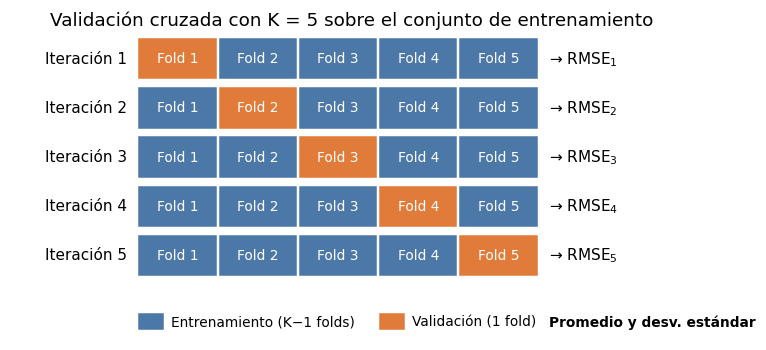

# Validación cruzada K-fold

Con un solo [conjunto de validación](../glosario.md#conjunto-validacion) (vea
[división de datos](division-datos.md#validacion)), la elección de los
[hiperparámetros](../glosario.md#hiperparametro) depende de **qué registros** cayeron en ese
conjunto: con otra división aleatoria el mejor valor puede cambiar. Además, esos registros no se
usan para entrenar. La [validación cruzada](../glosario.md#validacion-cruzada) K-fold resuelve
los dos problemas.

## Qué es la validación cruzada K-fold

1. Se divide el [conjunto de entrenamiento](../glosario.md#conjunto-entrenamiento) en **K partes
   del mismo tamaño** (los *folds*).
2. Se entrena el modelo con K−1 folds y se calcula la métrica en el fold restante, que hace de
   validación.
3. Se repite el paso 2 **K veces**, cada vez con un fold distinto como validación.
4. Se promedian las K métricas. Ese promedio es la estimación del error con datos nuevos.



Frente a una sola división en entrenamiento y validación:

- **Usa todos los datos de entrenamiento:** cada registro sirve para validar una vez y para
  entrenar K−1 veces. No hace falta apartar un 20 % fijo solo para validación.
- **Depende menos de una división:** el resultado es un promedio de K evaluaciones, no de una
  sola, así que una división "afortunada" o "desafortunada" pesa mucho menos.
- **Indica la variabilidad:** la desviación estándar de las K métricas muestra qué tan estable es
  el resultado.

El costo es entrenar el modelo K veces por cada combinación de hiperparámetros. Los valores más
usados son K = 5 y K = 10.

!!! warning "La prueba queda fuera"
    La validación cruzada se hace **solo con el conjunto de entrenamiento**. El
    [conjunto de prueba](../glosario.md#conjunto-prueba) se separa antes con
    `train_test_split` y se usa una sola vez, al final, con el modelo ya elegido.

## Evaluar un modelo con `cross_val_score`

```python
import numpy as np
from sklearn.model_selection import KFold, cross_val_score

kf = KFold(n_splits=5, shuffle=True, random_state=42)
scores = cross_val_score(modelo, X_train, y_train, cv=kf,
                         scoring="neg_root_mean_squared_error")

rmse = -scores
print("RMSE por fold:", rmse.round(3))
print("RMSE promedio:", rmse.mean().round(3))
print("Desviación estándar:", rmse.std().round(3))
```

- `KFold` define cómo se parten los datos: `n_splits=5` es el número de folds (K),
  `shuffle=True` mezcla los registros antes de partirlos y `random_state=42` fija la semilla
  para que la partición sea reproducible.
- `cross_val_score` entrena una copia de `modelo` en cada iteración y devuelve un arreglo con
  las K métricas, una por fold. `modelo` puede ser un modelo simple o un pipeline completo.
- `scoring="neg_root_mean_squared_error"` indica que la métrica es el [RMSE](rmse.md).
- `rmse.mean()` es la estimación del error; `rmse.std()` indica cuánto varía entre folds.

!!! tip "Por qué el RMSE sale negativo"
    scikit-learn siempre **maximiza** el *score*: un valor más grande significa un modelo mejor.
    Como en el RMSE y el [MAE](mae.md) un valor más pequeño es mejor, se usan con signo
    cambiado: `"neg_root_mean_squared_error"` y `"neg_mean_absolute_error"` devuelven
    \( -\text{RMSE} \) y \( -\text{MAE} \). Multiplique por −1 (`-scores`) para volver a la
    escala original. Con `scoring="r2"` no hace falta cambiar el signo, porque en el [R²](r2.md)
    un valor más grande ya es mejor.

## Ejemplo

Con 200 registros que siguen una relación lineal con tres variables, se compara con validación
cruzada de 5 folds un modelo [Ridge](ridge.md) con `alpha = 1` y otro con `alpha = 100`:

```python
import numpy as np
import pandas as pd
from sklearn.model_selection import train_test_split, KFold, cross_val_score
from sklearn.pipeline import make_pipeline
from sklearn.preprocessing import StandardScaler
from sklearn.linear_model import Ridge

rng = np.random.default_rng(0)
n = 200
df = pd.DataFrame({
    "x1": rng.uniform(0, 10, n),
    "x2": rng.uniform(0, 10, n),
    "x3": rng.uniform(0, 10, n),
})
df["y"] = 4 + 2 * df["x1"] - 1.5 * df["x2"] + 0.5 * df["x3"] + rng.normal(0, 1, n)

X = df[["x1", "x2", "x3"]]
y = df["y"]
X_train, X_test, y_train, y_test = train_test_split(X, y, test_size=0.2, random_state=42)

kf = KFold(n_splits=5, shuffle=True, random_state=42)
for alpha in [1, 100]:
    modelo = make_pipeline(StandardScaler(), Ridge(alpha=alpha))
    scores = cross_val_score(modelo, X_train, y_train, cv=kf,
                             scoring="neg_root_mean_squared_error")
    rmse = -scores
    print(f"alpha = {alpha}")
    print("  RMSE por fold:", rmse.round(3))
    print("  RMSE promedio:", rmse.mean().round(3))
    print("  Desviación estándar:", rmse.std().round(3))
```

- `modelo` es un pipeline que [estandariza](estandarizar.md) las variables y ajusta Ridge. Al
  pasarlo completo a `cross_val_score`, el escalador se ajusta en cada iteración solo con los
  folds de entrenamiento.
- El ciclo `for` repite la validación cruzada para cada valor de `alpha`, siempre con la misma
  partición `kf`, para que la comparación sea justa.

Salida:

```text
alpha = 1
  RMSE por fold: [1.122 0.991 1.158 1.196 0.898]
  RMSE promedio: 1.073
  Desviación estándar: 0.112
alpha = 100
  RMSE por fold: [3.634 3.625 3.887 2.913 3.543]
  RMSE promedio: 3.521
  Desviación estándar: 0.325
```

- **`alpha = 1`:** el RMSE promedio es 1,073, cercano a la desviación estándar del ruido que se
  agregó a los datos (1). Los folds varían poco (desviación estándar de 0,112), así que la
  estimación es estable.
- **`alpha = 100`:** el RMSE promedio sube a 3,521. La penalización es tan fuerte que encoge
  demasiado los coeficientes ([subajuste](../glosario.md#subajuste)).
- Con estos resultados se elige `alpha = 1`. El conjunto de prueba (`X_test`) no se usó: queda
  reservado para evaluar una sola vez el modelo final.

Para optimizar varios hiperparámetros a la vez, vea
[Optimizar hiperparámetros con GridSearchCV](gridsearchcv.md).
