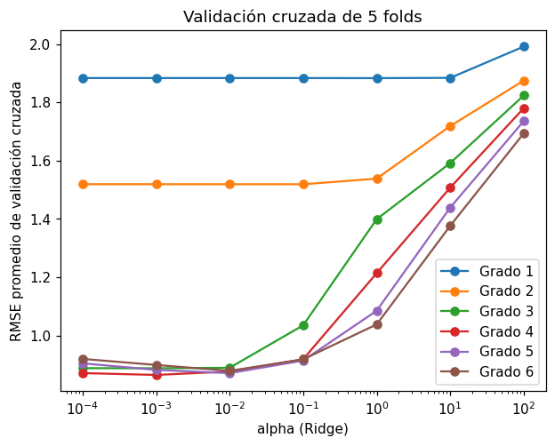

# Validación cruzada K-fold

Con un solo [conjunto de validación](../glosario.md#conjunto-validacion) (vea
[división de datos](division-datos.md#validacion)), la elección de los
[hiperparámetros](../glosario.md#hiperparametro) depende de **qué registros** cayeron en ese
conjunto: con otra división aleatoria el mejor valor puede cambiar. Además, esos registros no se
usan para entrenar. La [validación cruzada](../glosario.md#validacion-cruzada) K-fold resuelve
los dos problemas.

## Qué es la validación cruzada K-fold

1. Se divide el [conjunto de entrenamiento](../glosario.md#conjunto-entrenamiento) en **K partes
   del mismo tamaño** (los *folds*).
2. Se entrena el modelo con K−1 folds y se calcula la métrica en el fold restante, que hace de
   validación.
3. Se repite el paso 2 **K veces**, cada vez con un fold distinto como validación.
4. Se promedian las K métricas. Ese promedio es la estimación del error con datos nuevos.


Frente a una sola división en entrenamiento y validación:

- **Usa todos los datos de entrenamiento:** cada registro sirve para validar una vez y para
  entrenar K−1 veces. No hace falta apartar un 20 % fijo solo para validación.
- **Depende menos de una división:** el resultado es un promedio de K evaluaciones, no de una
  sola, así que una división "afortunada" o "desafortunada" pesa mucho menos.
- **Indica la variabilidad:** la desviación estándar de las K métricas muestra qué tan estable es
  el resultado.

El costo es entrenar el modelo K veces por cada combinación de hiperparámetros. Los valores más
usados son K = 5 y K = 10.

!!! warning "La prueba queda fuera"
    La validación cruzada se hace **solo con el conjunto de entrenamiento**. El
    [conjunto de prueba](../glosario.md#conjunto-prueba) se separa antes con
    `train_test_split` y se usa una sola vez, al final, con el modelo ya elegido.

## Evaluar un modelo con `cross_val_score`

```python
import numpy as np
from sklearn.model_selection import KFold, cross_val_score

kf = KFold(n_splits=5, shuffle=True, random_state=42)
scores = cross_val_score(modelo, X_train, y_train, cv=kf,
                         scoring="neg_root_mean_squared_error")

rmse = -scores
print("RMSE por fold:", rmse.round(3))
print("RMSE promedio:", rmse.mean().round(3))
print("Desviación estándar:", rmse.std().round(3))
```

- `KFold` define cómo se parten los datos: `n_splits=5` es el número de folds (K),
  `shuffle=True` mezcla los registros antes de partirlos y `random_state=42` fija la semilla
  para que la partición sea reproducible.
- `cross_val_score` entrena una copia de `modelo` en cada iteración y devuelve un arreglo con
  las K métricas, una por fold. `modelo` puede ser un modelo simple o un pipeline completo.
- `scoring="neg_root_mean_squared_error"` indica que la métrica es el [RMSE](rmse.md).
- `rmse.mean()` es la estimación del error; `rmse.std()` indica cuánto varía entre folds.

!!! tip "Por qué el RMSE sale negativo"
    scikit-learn siempre **maximiza** el *score*: un valor más grande significa un modelo mejor.
    Como en el RMSE y el [MAE](mae.md) un valor más pequeño es mejor, se usan con signo
    cambiado: `"neg_root_mean_squared_error"` y `"neg_mean_absolute_error"` devuelven
    \( -\text{RMSE} \) y \( -\text{MAE} \). Multiplique por −1 (`-scores`) para volver a la
    escala original. Con `scoring="r2"` no hace falta cambiar el signo, porque en el [R²](r2.md)
    un valor más grande ya es mejor.

## Optimizar varios hiperparámetros con `GridSearchCV`

`GridSearchCV` prueba **todas las combinaciones** de una grilla de valores y evalúa cada una con
validación cruzada. Por ejemplo, el grado de una
[regresión polinomial](regresion-polinomial.md) junto con la fuerza de la
[regularización](../glosario.md#regularizacion) de [Ridge](ridge.md):

```python
import pandas as pd
from sklearn.model_selection import KFold, GridSearchCV
from sklearn.pipeline import make_pipeline
from sklearn.preprocessing import PolynomialFeatures, StandardScaler
from sklearn.linear_model import Ridge

modelo = make_pipeline(PolynomialFeatures(include_bias=False), StandardScaler(), Ridge())
param_grid = {
    "polynomialfeatures__degree": [1, 2, 3],
    "ridge__alpha": [0.1, 1, 10, 100],
}
kf = KFold(n_splits=5, shuffle=True, random_state=42)
busqueda = GridSearchCV(modelo, param_grid, cv=kf, scoring="neg_root_mean_squared_error")
busqueda.fit(X_train, y_train)

print("Mejores hiperparámetros:", busqueda.best_params_)
print("RMSE de validación cruzada:", -busqueda.best_score_)
```

- `modelo` es un pipeline: genera los términos polinomiales, los
  [estandariza](estandarizar.md) (Ridge penaliza el tamaño de los coeficientes, así que las
  variables deben estar en la misma escala) y ajusta Ridge.
- `param_grid` es un diccionario: cada clave es un hiperparámetro y cada valor, la lista de
  valores a probar. Aquí hay 3 × 4 = 12 combinaciones; con 5 folds se entrenan 60 modelos.
- `busqueda` es el objeto `GridSearchCV`. Al llamar `fit`, recorre las combinaciones, hace la
  validación cruzada de cada una y guarda los resultados.
- `busqueda.best_params_` es el diccionario con la mejor combinación, y `busqueda.best_score_`
  su *score* promedio de validación cruzada (negativo; con `-` se obtiene el RMSE).

### Nombres `paso__parametro`

Dentro de un pipeline, cada hiperparámetro se nombra con el **nombre del paso**, dos guiones
bajos y el **nombre del parámetro**. `make_pipeline` nombra cada paso con el nombre de su clase
en minúsculas:

| Paso del pipeline | Nombre del paso | Hiperparámetro en la grilla |
|-------------------|-----------------|-----------------------------|
| `PolynomialFeatures(...)` | `polynomialfeatures` | `"polynomialfeatures__degree"` |
| `Ridge()` | `ridge` | `"ridge__alpha"` |
| `Lasso()` | `lasso` | `"lasso__alpha"` |

Si no recuerda un nombre, `modelo.get_params().keys()` lista todos los hiperparámetros
disponibles del pipeline.

### Revisar todos los resultados

```python
resultados = pd.DataFrame(busqueda.cv_results_)
columnas = ["param_polynomialfeatures__degree", "param_ridge__alpha",
            "mean_test_score", "std_test_score", "rank_test_score"]
print(resultados[columnas].sort_values("rank_test_score").head(10))
```

`busqueda.cv_results_` tiene una fila por combinación. Las columnas de interés son:

| Columna | Contenido |
|---------|-----------|
| `param_<hiperparámetro>` | Valor de cada hiperparámetro en esa combinación |
| `params` | La combinación completa, como diccionario |
| `mean_test_score` | Promedio del *score* en los K folds de validación (negativo para el RMSE) |
| `std_test_score` | Desviación estándar del *score* entre los folds |
| `rank_test_score` | Posición de la combinación: 1 es la mejor |
| `split0_test_score`, `split1_test_score`, ... | *Score* de cada fold por separado |

### Evaluar una sola vez en prueba

Con `refit=True` (valor por defecto), al terminar la búsqueda `GridSearchCV` **reentrena la mejor
combinación con todo `X_train`**. Por eso `busqueda` se usa directamente como modelo final:

```python
from sklearn.metrics import mean_squared_error, mean_absolute_error, r2_score

y_pred = busqueda.predict(X_test)
print("RMSE prueba:", np.sqrt(mean_squared_error(y_test, y_pred)))
print("MAE prueba:", mean_absolute_error(y_test, y_pred))
print("R² prueba:", r2_score(y_test, y_pred))
```

Este es el único momento en que se usa `X_test`. Vea [R²](r2.md), [MAE](mae.md), [RMSE](rmse.md)
y [comparar métricas](comparar-metricas.md). El modelo final reentrenado también está disponible
en `busqueda.best_estimator_`.

### Lasso y columnas mixtas

Con [Lasso](lasso.md) el procedimiento es el mismo; solo cambian el último paso y el nombre del
hiperparámetro:

```python
from sklearn.linear_model import Lasso

modelo = make_pipeline(PolynomialFeatures(include_bias=False), StandardScaler(),
                       Lasso(max_iter=10000))
param_grid = {
    "polynomialfeatures__degree": [1, 2, 3],
    "lasso__alpha": [0.001, 0.01, 0.1, 1],
}
```

`max_iter=10000` le da a Lasso más iteraciones para converger cuando hay muchos términos.

Si `X_train` tiene variables continuas y columnas de [codificación one-hot](one-hot.md), puede
aplicar el polinomio solo a las continuas con `ColumnTransformer` (vea
[regresión polinomial](regresion-polinomial.md)). El nombre del hiperparámetro encadena todos
los niveles:

```python
from sklearn.compose import ColumnTransformer

continuas = ["columna1", "columna2"]
transformador = ColumnTransformer(
    [("poly", make_pipeline(PolynomialFeatures(include_bias=False), StandardScaler()),
      continuas)],
    remainder="passthrough",
)
modelo = make_pipeline(transformador, Ridge())
param_grid = {
    "columntransformer__poly__polynomialfeatures__degree": [1, 2, 3],
    "ridge__alpha": [0.1, 1, 10, 100],
}
```

`columntransformer` es el nombre del paso que crea `make_pipeline`, `poly` es el nombre que se le
dio a la transformación dentro de `ColumnTransformer` y `polynomialfeatures` es el paso del
pipeline interno. `remainder="passthrough"` deja pasar las columnas one-hot sin cambios.

## Graficar los resultados de la validación cruzada

**Opción 1: una curva por grado**

```python
import matplotlib.pyplot as plt

resultados = pd.DataFrame(busqueda.cv_results_)
resultados["rmse_cv"] = -resultados["mean_test_score"]

for grado, grupo in resultados.groupby("param_polynomialfeatures__degree"):
    alphas = grupo["param_ridge__alpha"].astype(float)
    plt.plot(alphas, grupo["rmse_cv"], marker="o", label=f"Grado {grado}")
    plt.fill_between(alphas, grupo["rmse_cv"] - grupo["std_test_score"],
                     grupo["rmse_cv"] + grupo["std_test_score"], alpha=0.15)
plt.xscale("log")
plt.xlabel("alpha (Ridge)")
plt.ylabel("RMSE promedio de validación cruzada")
plt.legend()
plt.show()
```

- `resultados["rmse_cv"]` es el RMSE promedio de cada combinación, ya con el signo corregido.
- `groupby` separa las filas por grado; cada grupo se dibuja como una línea con su RMSE promedio
  para cada `alpha`.
- `plt.xscale("log")` pone el eje x en escala logarítmica, porque los valores de `alpha` crecen
  de 10 en 10.
- `fill_between` (opcional) sombrea una banda de ± una desviación estándar entre folds. Si las
  bandas se tapan unas a otras, quite esa instrucción.

**Opción 2: mapa de calor grado × alpha**

```python
import seaborn as sns

tabla = resultados.pivot(index="param_polynomialfeatures__degree",
                         columns="param_ridge__alpha", values="rmse_cv")
sns.heatmap(tabla, annot=True, fmt=".3f", cmap="viridis_r")
plt.xlabel("alpha (Ridge)")
plt.ylabel("Grado del polinomio")
plt.show()
```

`pivot` arma una tabla con un grado por fila y un `alpha` por columna; `annot=True` escribe el
RMSE en cada celda y `cmap="viridis_r"` pinta más claras las celdas de menor error.

### Cómo leer el gráfico

| Zona | Qué se ve | Diagnóstico |
|------|-----------|-------------|
| Mínimo del gráfico | La combinación con el menor RMSE de validación cruzada | Mejor equilibrio entre sesgo y varianza |
| `alpha` grande | El error sube para todos los grados | [Subajuste](../glosario.md#subajuste): la penalización es tan fuerte que los coeficientes quedan casi en cero |
| Grado bajo | El error es alto con cualquier `alpha` | Subajuste: el polinomio es demasiado simple para la forma de los datos |
| Grado alto y `alpha` pequeño | El error vuelve a subir | [Sobreajuste](../glosario.md#sobreajuste): muchos términos y poca penalización, el modelo sigue el ruido |

El grado y `alpha` actúan en sentidos opuestos sobre la complejidad: subir el grado la aumenta y
subir `alpha` la reduce. Por eso un grado alto puede funcionar bien si se acompaña de un `alpha`
mayor. Vea [compromiso sesgo-varianza](../glosario.md#compromiso-sesgo-varianza) y
[seleccionar hiperparámetros](seleccion-hiperparametros.md). Si varias combinaciones tienen
errores muy parecidos (diferencias menores que `std_test_score`), prefiera la más simple.

!!! warning "Si el mejor valor está en el borde de la grilla, amplíela"
    Si el mejor `alpha` es el más pequeño o el más grande de la lista, o el mejor grado es el
    máximo probado, el verdadero óptimo puede estar **fuera** de la grilla. Agregue valores más
    allá de ese extremo (por ejemplo, `0.0001` si el mejor fue `0.001`) y repita la búsqueda
    hasta que el mejor valor quede rodeado por valores con más error.

## Ejemplo

Con 200 registros que siguen una función no lineal de dos variables, se buscan el grado (1 a 6)
y el `alpha` de Ridge (0,0001 a 100) con validación cruzada de 5 folds:

```python
import numpy as np
import pandas as pd
import matplotlib.pyplot as plt
from sklearn.model_selection import train_test_split, KFold, GridSearchCV
from sklearn.pipeline import make_pipeline
from sklearn.preprocessing import PolynomialFeatures, StandardScaler
from sklearn.linear_model import Ridge
from sklearn.metrics import mean_squared_error, mean_absolute_error, r2_score

rng = np.random.default_rng(0)
n = 200
df = pd.DataFrame({
    "x1": rng.uniform(0, 6, n),
    "x2": rng.uniform(0, 6, n),
})
df["y"] = 3 * np.sin(df["x1"]) + 2 * np.cos(df["x2"]) + rng.normal(0, 0.8, n)

X = df[["x1", "x2"]]
y = df["y"]
X_train, X_test, y_train, y_test = train_test_split(X, y, test_size=0.2, random_state=42)

modelo = make_pipeline(PolynomialFeatures(include_bias=False), StandardScaler(), Ridge())
param_grid = {
    "polynomialfeatures__degree": [1, 2, 3, 4, 5, 6],
    "ridge__alpha": [0.0001, 0.001, 0.01, 0.1, 1, 10, 100],
}
kf = KFold(n_splits=5, shuffle=True, random_state=42)
busqueda = GridSearchCV(modelo, param_grid, cv=kf, scoring="neg_root_mean_squared_error")
busqueda.fit(X_train, y_train)

print("Mejores hiperparámetros:", busqueda.best_params_)
print("RMSE de validación cruzada:", round(-busqueda.best_score_, 3))

resultados = pd.DataFrame(busqueda.cv_results_)
resultados["rmse_cv"] = -resultados["mean_test_score"]
tabla = resultados.pivot(index="param_polynomialfeatures__degree",
                         columns="param_ridge__alpha", values="rmse_cv")
print(tabla.round(3).to_string())

for grado, grupo in resultados.groupby("param_polynomialfeatures__degree"):
    plt.plot(grupo["param_ridge__alpha"], grupo["rmse_cv"], marker="o", label=f"Grado {grado}")
plt.xscale("log")
plt.xlabel("alpha (Ridge)")
plt.ylabel("RMSE promedio de validación cruzada")
plt.title("Validación cruzada de 5 folds")
plt.legend()
plt.show()

y_pred = busqueda.predict(X_test)
print("RMSE prueba:", round(np.sqrt(mean_squared_error(y_test, y_pred)), 3))
print("MAE prueba:", round(mean_absolute_error(y_test, y_pred), 3))
print("R² prueba:", round(r2_score(y_test, y_pred), 3))
```

Salida:

```text
Mejores hiperparámetros: {'polynomialfeatures__degree': 4, 'ridge__alpha': 0.001}
RMSE de validación cruzada: 0.865
param_ridge__alpha                0.0001    0.0010    0.0100    0.1000    1.0000    10.0000   100.0000
param_polynomialfeatures__degree                                                                      
1                                    1.883     1.883     1.883     1.883     1.883     1.884     1.991
2                                    1.519     1.519     1.519     1.519     1.538     1.718     1.875
3                                    0.888     0.888     0.889     1.035     1.399     1.592     1.823
4                                    0.871     0.865     0.876     0.918     1.214     1.507     1.780
5                                    0.905     0.882     0.871     0.914     1.085     1.439     1.736
6                                    0.920     0.899     0.879     0.918     1.038     1.376     1.694
RMSE prueba: 0.861
MAE prueba: 0.687
R² prueba: 0.89
```



- **Mejor combinación:** grado 4 con `alpha = 0.001`, con un RMSE de validación cruzada de
  0,865. Está cerca de la desviación estándar del ruido que se agregó a los datos (0,8), un error
  que ningún modelo puede eliminar.
- **Grados 1 y 2:** el error se queda en 1,88 y 1,52 con cualquier `alpha`. Una recta o una
  parábola no pueden seguir la forma del seno y el coseno (subajuste).
- **`alpha` de 1 a 100:** todas las curvas suben, hasta 1,7–2,0 con `alpha = 100`. La
  penalización es tan fuerte que aplana el modelo (subajuste por exceso de regularización).
- **Grados 5 y 6 con `alpha` muy pequeño:** con `alpha = 0.0001` el error sube a 0,905 y 0,920
  (sobreajuste). Al aumentar `alpha` a 0,01 baja a 0,871 y 0,879: la regularización compensa el
  exceso de términos.
- **El mejor valor no está en el borde:** `alpha = 0.001` está rodeado por 0,0001 y 0,01, que dan
  errores mayores, y el grado 4 está entre el 3 y el 6. No hace falta ampliar la grilla.
- Los grados 3 a 6 con `alpha` de hasta 0,01 quedan todos entre 0,87 y 0,92: las diferencias son
  pequeñas, así que el grado 3 también sería una elección razonable si se prefiere un modelo
  más simple.

En el conjunto de prueba, el modelo elegido (reentrenado con todo `X_train`) obtiene un RMSE de
0,861, un MAE de 0,687 y un R² de 0,89. El RMSE de prueba es casi igual al de validación
cruzada (0,865): la validación cruzada estimó bien el error con datos nuevos.
