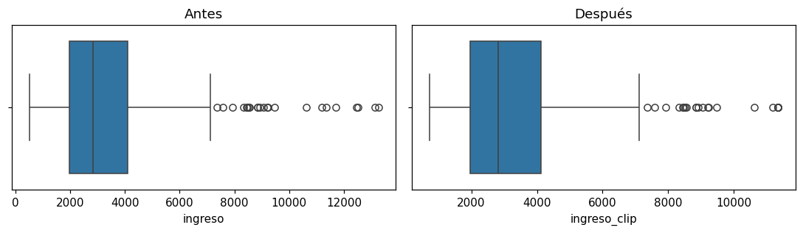

# Revisar y tratar valores atípicos

Un [valor atípico](../glosario.md#outlier) (_outlier_) es un valor posible pero muy alejado del
resto. Puede ser real o un error de registro, y puede distorsionar las estadísticas y los modelos.
No es una [dimensión de calidad](dimensiones-calidad.md), pero se revisa junto con ellas.

## Revisar

Con el [gráfico de cajas](grafico-cajas.md) se ven los atípicos como puntos fuera de los bigotes.
Para contarlos con la regla del rango intercuartílico (IQR):

```python
q1, q3 = df["columna"].quantile([0.25, 0.75])
iqr = q3 - q1
inferior, superior = q1 - 1.5 * iqr, q3 + 1.5 * iqr

((df["columna"] < inferior) | (df["columna"] > superior)).sum()
```

`columna` es el nombre de la variable continua que quiere revisar.

## Tratar con clipping

El [clipping](../glosario.md#clipping) limita los valores a un rango: lo que está por debajo del
límite inferior toma ese límite y lo que está por encima toma el límite superior. A diferencia de
eliminar filas, no se pierden registros.

```python
inferior, superior = df["columna"].quantile([0.01, 0.99])   # percentiles 1 y 99
df["columna_clip"] = df["columna"].clip(lower=inferior, upper=superior)
```

Los percentiles definen cuánto se recorta. Con `[0.05, 0.95]` el recorte es más agresivo.
También puede usar los límites del IQR calculados arriba.

## Ejemplo

Con un dataset de 500 personas y su ingreso:

```python
import numpy as np
import pandas as pd
import matplotlib.pyplot as plt
import seaborn as sns

rng = np.random.default_rng(0)
df = pd.DataFrame({"ingreso": rng.lognormal(8, 0.6, 500)})

inferior, superior = df["ingreso"].quantile([0.01, 0.99])
df["ingreso_clip"] = df["ingreso"].clip(lower=inferior, upper=superior)

fig, axes = plt.subplots(1, 2, figsize=(10, 3))
sns.boxplot(x=df["ingreso"], ax=axes[0]).set_title("Antes")
sns.boxplot(x=df["ingreso_clip"], ax=axes[1]).set_title("Después")
plt.tight_layout()
plt.show()
```



Después del clipping el máximo baja y desaparecen los valores más extremos. La caja (la mitad
central de los datos) no cambia. Compare también las estadísticas con
`df[["ingreso", "ingreso_clip"]].describe()`.

!!! warning "Guarde la columna original"
    Cree una columna nueva en vez de sobrescribir la original: así puede comparar
    y, si cambia de criterio, repetir el tratamiento.
